# __Análisis bibliométrico empleando SPARK y técnicas de HPC para la búsqueda de moléculas con potencial inhibitorio de la proteasa principal del SARS-CoV-2__

---

Estudio de enfoque cuantitativo y bibliométrica en el que se recolectaron todas las publicaciones científicas relacionadas a moléculas con potencial inhibitorio de la proteasa principal del SARS-CoV-2 y disponibles en el dataset CORD-19. Se utilizó el framework PySpark el lenguaje de programación Phyton. Los archivos JSON del CORD-19 se cargaron en un Jupyter Notebook con el uso de la librería glob, para luego ser leído por medio de la función spark.read.json
https://www.kaggle.com/allen-institute-for-ai/CORD-19-research-challenge

__Asesor:__

* Juan Sebastian Mejia

__Integrantes:__

* Moises Stevend Meza Rodriguez
* Jesus Antonio Alvarado Huayhuaz
* William Javier Araujo Banchón


```python
!pip install graphviz
```

    Defaulting to user installation because normal site-packages is not writeable
    Collecting graphviz
      Downloading graphviz-0.17-py3-none-any.whl (18 kB)
    Installing collected packages: graphviz
    Successfully installed graphviz-0.17


* * *

## Importación de librerias


```python
from pyspark import SparkContext
from pyspark.sql import SparkSession
from pyspark.sql.functions import *
from pyspark.sql.types import *
import pandas as pd
import glob
import json
import matplotlib.pyplot as plt
from pathlib import Path
```

## Creación de sesión en spark y lectura de base de datos


```python
spark = (
    SparkSession.builder.appName("covid-grupo5")
    .master("local[*]")
    .config("spark.driver.memory", "32g")
    .config("spark.executor.memory", "32g")
    .config("spark.driver.maxResultSize", "16g")

    .getOrCreate()
)
```

    21/08/27 02:16:32 WARN Utils: Your hostname, stevend-System-Product-Name resolves to a loopback address: 127.0.1.1; using 192.168.0.9 instead (on interface enp7s0)
    21/08/27 02:16:32 WARN Utils: Set SPARK_LOCAL_IP if you need to bind to another address
    WARNING: An illegal reflective access operation has occurred
    WARNING: Illegal reflective access by org.apache.spark.unsafe.Platform (file:/usr/local/lib/python3.8/dist-packages/pyspark/jars/spark-unsafe_2.12-3.1.1.jar) to constructor java.nio.DirectByteBuffer(long,int)
    WARNING: Please consider reporting this to the maintainers of org.apache.spark.unsafe.Platform
    WARNING: Use --illegal-access=warn to enable warnings of further illegal reflective access operations
    WARNING: All illegal access operations will be denied in a future release
    21/08/27 02:16:33 WARN NativeCodeLoader: Unable to load native-hadoop library for your platform... using builtin-java classes where applicable
    Using Spark's default log4j profile: org/apache/spark/log4j-defaults.properties
    Setting default log level to "WARN".
    To adjust logging level use sc.setLogLevel(newLevel). For SparkR, use setLogLevel(newLevel).
    21/08/27 02:16:34 WARN Utils: Service 'SparkUI' could not bind on port 4040. Attempting port 4041.


```python
path="/home/stevend/Documents/proyecto_spark_grupo5/dataset/"
root_path = Path(path)

all_json = glob.glob( str(root_path) + '/**/*.json', recursive=True) # path
```


```python
papers = spark.read.json(all_json, multiLine=True)
```

    21/08/27 02:17:02 WARN package: Truncated the string representation of a plan since it was too large. This behavior can be adjusted by setting 'spark.sql.debug.maxToStringFields'.


```python
def concatenate_text(j):
    txt_all = ""
    try:
        for a in j:
            txt_all = txt_all + " " + a['text']
        return txt_all
    except:
        return ""

udf_concatenate_text = udf(concatenate_text)

papers_s = papers.select(papers['Paper_ID'], papers['metadata']['title'],  papers['metadata']['authors'],udf_concatenate_text(papers['body_text']))
```


```python
papers_s.printSchema()
```

    root
     |-- Paper_ID: string (nullable = true)
     |-- metadata.title: string (nullable = true)
     |-- metadata.authors: array (nullable = true)
     |    |-- element: struct (containsNull = true)
     |    |    |-- affiliation: struct (nullable = true)
     |    |    |    |-- institution: string (nullable = true)
     |    |    |    |-- laboratory: string (nullable = true)
     |    |    |    |-- location: struct (nullable = true)
     |    |    |    |    |-- addrLine: string (nullable = true)
     |    |    |    |    |-- country: string (nullable = true)
     |    |    |    |    |-- postBox: string (nullable = true)
     |    |    |    |    |-- postCode: string (nullable = true)
     |    |    |    |    |-- region: string (nullable = true)
     |    |    |    |    |-- settlement: string (nullable = true)
     |    |    |-- email: string (nullable = true)
     |    |    |-- first: string (nullable = true)
     |    |    |-- last: string (nullable = true)
     |    |    |-- middle: array (nullable = true)
     |    |    |    |-- element: string (containsNull = true)
     |    |    |-- suffix: string (nullable = true)
     |-- concatenate_text(body_text): string (nullable = true)


```python
papers_s.show()
```

    [Stage 2:>                                                          (0 + 1) / 1]

    +--------------------+--------------------+--------------------+---------------------------+
    |            Paper_ID|      metadata.title|    metadata.authors|concatenate_text(body_text)|
    +--------------------+--------------------+--------------------+---------------------------+
    |          PMC2799006|21st ESICM Annual...|                  []|        After subarachno...|
    |          PMC2799007|21st ESICM Annual...|                  []|        Cardiac Arrest (...|
    |021fb6e79ff9c699f...|Designing Novel S...|[{{null, null, nu...|        Therapeutic prin...|
    |02243452115108248...|Endogenous Opiate...|[{{University of ...|        ALMOST 20 years ...|
    |02e359329ec030452...|The 15th Congress...|[{{null, null, nu...|        All sessions wil...|
    |01377d0ab2e78372b...|Developing Recomb...|[{{null, null, nu...|        Antibodies are i...|
    |011d10dc7d0696923...| Infectious diseases|                  []|        Many viruses inf...|
    |          PMC1215526|Macrophages and c...|[{{null, null, nu...|        Virus-host inter...|
    |01d00b9170a73c234...|Interplay of Good...|[{{null, null, nu...|        It has long been...|
    |02261260ea6b46d08...|Clinical Medicine...|[{{National Unive...|        Gestational diab...|
    |0036b28fddf7e93da...|The fecal microbi...|[{{University of ...|        human type 1 DM....|
    |00faf3c13ba7ab95f...|Journal Pre-proof...|[{{University of ...|        SARS-CoV-2 was i...|
    |026639e1e95ff2df6...|Responses of Mast...|[{{Universidad Au...|        Described by Pau...|
    |01f7b8953eb236e31...|pathogens Role of...|[{{The University...|        Apoptosis (progr...|
    |          PMC1847402|Display technolog...|[{{null, null, nu...|        Strategies for i...|
    |01d985de3be48744c...|Journal Pre-proof...|[{{University of ...|        There are curren...|
    |01dc0612abf7a6b95...|Acute Radiation S...|[{{National Insti...|        Understanding th...|
    |00a0ab182dc01b6c2...|Middle East respi...|[{{The University...|        The world was ma...|
    |01536fd55248e273f...|Journal Pre-proof...|[{{State Universi...|        The outbreak of ...|
    |01574892f1a57f3d2...|Suidae and Tayass...|[{{Complutense Un...|        The suids, Suida...|
    +--------------------+--------------------+--------------------+---------------------------+
    only showing top 20 rows


```python
papers_s = papers_s.withColumnRenamed('metadata.title', 'title')\
        .withColumnRenamed('metadata.authors', 'authors_info')\
        .withColumnRenamed('concatenate_text(body_text)', 'body')
```


```python
papers_s.show()
```

    +--------------------+--------------------+--------------------+--------------------+
    |            Paper_ID|               title|        authors_info|                body|
    +--------------------+--------------------+--------------------+--------------------+
    |          PMC2799006|21st ESICM Annual...|                  []| After subarachno...|
    |          PMC2799007|21st ESICM Annual...|                  []| Cardiac Arrest (...|
    |021fb6e79ff9c699f...|Designing Novel S...|[{{null, null, nu...| Therapeutic prin...|
    |02243452115108248...|Endogenous Opiate...|[{{University of ...| ALMOST 20 years ...|
    |02e359329ec030452...|The 15th Congress...|[{{null, null, nu...| All sessions wil...|
    |01377d0ab2e78372b...|Developing Recomb...|[{{null, null, nu...| Antibodies are i...|
    |011d10dc7d0696923...| Infectious diseases|                  []| Many viruses inf...|
    |          PMC1215526|Macrophages and c...|[{{null, null, nu...| Virus-host inter...|
    |01d00b9170a73c234...|Interplay of Good...|[{{null, null, nu...| It has long been...|
    |02261260ea6b46d08...|Clinical Medicine...|[{{National Unive...| Gestational diab...|
    |0036b28fddf7e93da...|The fecal microbi...|[{{University of ...| human type 1 DM....|
    |00faf3c13ba7ab95f...|Journal Pre-proof...|[{{University of ...| SARS-CoV-2 was i...|
    |026639e1e95ff2df6...|Responses of Mast...|[{{Universidad Au...| Described by Pau...|
    |01f7b8953eb236e31...|pathogens Role of...|[{{The University...| Apoptosis (progr...|
    |          PMC1847402|Display technolog...|[{{null, null, nu...| Strategies for i...|
    |01d985de3be48744c...|Journal Pre-proof...|[{{University of ...| There are curren...|
    |01dc0612abf7a6b95...|Acute Radiation S...|[{{National Insti...| Understanding th...|
    |00a0ab182dc01b6c2...|Middle East respi...|[{{The University...| The world was ma...|
    |01536fd55248e273f...|Journal Pre-proof...|[{{State Universi...| The outbreak of ...|
    |01574892f1a57f3d2...|Suidae and Tayass...|[{{Complutense Un...| The suids, Suida...|
    +--------------------+--------------------+--------------------+--------------------+
    only showing top 20 rows


## __Busqueda de Palabras en la base de datos de CORD-19__


```python
filtros = {
    "corona_proteasa": [
        "Coronavirus 3C Proteases",
        "M(pro) Protein, Coronavirus",
        "Chymotrypsin-Like Main Protease, Coronavirus",
        "Chymotrypsin Like Main Protease, Coronavirus",
        "Coronavirus 3C-Like Proteinase",
        "Coronavirus 3C Proteinases",
        "Coronavirus 3CLpro Proteinase",
        "Coronavirus 3CLpro Proteases",
        "Coronavirus Mpro Protein",
        "Coronavirus Main Proteinase"
    ],
    "molecular_docking_simulation":[
        "Molecular Docking Simulation",
        "Molecular Docking Simulations",
        "Molecular Docking",
        "Molecular Dockings",
        "Molecular Docking Analysis",
        "Molecular Docking Analyses"
    ],
    "molecular_dynamics_simulation":[
        "Molecular Dynamics Simulation",
        "Molecular Dynamics Simulations",
        "Molecular Dynamics",
        "Molecular Dynamic"
    ],
    "machine_learning":[
        "Machine Learning",
        "Transfer Learning"
    ],
    "deep_learning":[
        "Deep Learning",
        "Hierarchical Learning",
        "deep neuronal networks",
        "neuronal networks"
    ],
    "pharmacokinetics":[
        "Pharmacokinetics",
        "Drug Kinetics",
        "ADMET",
        "ADME-Tox",
        "Absorption, Distribution, Metabolism, Elimination, and Toxicology",
        "LADMER",
        #"potential"
    ]
}
```

__conversión a minusculas de los filtros para CORD-19__


```python
for i,j in zip(filtros.keys(),list(map(lambda x: [i.lower() for i in x] , filtros.values()))):
    filtros[i]=j
```


```python
orden_filtros = {
    0:"corona_proteasa",
    1:"molecular_docking_simulation",
    2:"molecular_dynamics_simulation",
    3:"machine_learning",
    4:"deep_learning",
    5:"pharmacokinetics"
}
```

#### Ordenamiento de los filtros a aplicar

Orden de ejecución:

__Filtro1 :__
* corona_proteasa
* molecular_docking_simulation
* molecular_dynamics_simulation
* pharmacokinetics

__Filtro2:__

* machine_learning
* deep_learning


```python
filtro1 = [0,1,2,5]
filtro2 = [3,4]
```

### Función de busqueda de palabras en los datasets


```python
states_body = papers_s.select(papers_s.body).toPandas()['body']
states_Paper_ID = papers_s.select(papers_s.Paper_ID).toPandas()['Paper_ID']
```


```python
def funcion_filtro(states_title_, states_Paper_ID_, sord_orden_filtros):
    #global states_title
    #global states_Paper_ID
    global orden_filtros
    global filtros

    for cuenta, articulo in enumerate(zip(states_title_, states_Paper_ID_)):
        #for j in range(len(orden_filtros.keys())):
        for j in sord_orden_filtros:
            for z in filtros[orden_filtros[j]]:
                if z in articulo[0].lower():
                    yield articulo[0],articulo[1]
                    break
```

## Aplicación de los filtros solo para los bodys


```python
filtro1_list = list(funcion_filtro(states_body, states_Paper_ID, filtro1))  

#print("BODY: Se encontro ",len(filtro1_list), "articulos en el filtro1")

filtro1_list_unzip = list(zip(*filtro1_list))

df1 = dict()

df1["body"] = filtro1_list_unzip[0]
df1["ID"] = filtro1_list_unzip[1]

#pd.DataFrame(df1).to_csv(f"./body_filtro1_{n}.csv", index=False)
```


```python
tabla_merge = pd.DataFrame(df1)
tabla_merge.head()
```


<div>
<style scoped>
    .dataframe tbody tr th:only-of-type {
        vertical-align: middle;
    }

    .dataframe tbody tr th {
        vertical-align: top;
    }

    .dataframe thead th {
        text-align: right;
    }
</style>
<table border="1" class="dataframe">
  <thead>
    <tr style="text-align: right;">
      <th></th>
      <th>body</th>
      <th>ID</th>
    </tr>
  </thead>
  <tbody>
    <tr>
      <th>0</th>
      <td>Therapeutic principles established in non-hum...</td>
      <td>021fb6e79ff9c699f5f7e1b59f722297252870c9</td>
    </tr>
    <tr>
      <th>1</th>
      <td>All sessions will take place at the Hilton Ne...</td>
      <td>02e359329ec03045275aaf6a153b97dc4e0866af</td>
    </tr>
    <tr>
      <th>2</th>
      <td>SARS-CoV-2 was initially recognized and desig...</td>
      <td>00faf3c13ba7ab95fbd7e8751c1570e26f5975f3</td>
    </tr>
    <tr>
      <th>3</th>
      <td>There are currently about 132 therapeutic age...</td>
      <td>01d985de3be48744c128a1710dfdafdad99af84d</td>
    </tr>
    <tr>
      <th>4</th>
      <td>There are currently about 132 therapeutic age...</td>
      <td>01d985de3be48744c128a1710dfdafdad99af84d</td>
    </tr>
  </tbody>
</table>
</div>


# Tratamiento de metadatos


```python
tabla = pd.read_csv("./metadata.csv")
tabla.head()
```

    /home/stevend/.local/lib/python3.8/site-packages/IPython/core/interactiveshell.py:3169: DtypeWarning: Columns (1,4,5,6,13,14,15,16) have mixed types.Specify dtype option on import or set low_memory=False.
      has_raised = await self.run_ast_nodes(code_ast.body, cell_name,


<div>
<style scoped>
    .dataframe tbody tr th:only-of-type {
        vertical-align: middle;
    }

    .dataframe tbody tr th {
        vertical-align: top;
    }

    .dataframe thead th {
        text-align: right;
    }
</style>
<table border="1" class="dataframe">
  <thead>
    <tr style="text-align: right;">
      <th></th>
      <th>cord_uid</th>
      <th>sha</th>
      <th>source_x</th>
      <th>title</th>
      <th>doi</th>
      <th>pmcid</th>
      <th>pubmed_id</th>
      <th>license</th>
      <th>abstract</th>
      <th>publish_time</th>
      <th>authors</th>
      <th>journal</th>
      <th>mag_id</th>
      <th>who_covidence_id</th>
      <th>arxiv_id</th>
      <th>pdf_json_files</th>
      <th>pmc_json_files</th>
      <th>url</th>
      <th>s2_id</th>
    </tr>
  </thead>
  <tbody>
    <tr>
      <th>0</th>
      <td>ug7v899j</td>
      <td>d1aafb70c066a2068b02786f8929fd9c900897fb</td>
      <td>PMC</td>
      <td>Clinical features of culture-proven Mycoplasma...</td>
      <td>10.1186/1471-2334-1-6</td>
      <td>PMC35282</td>
      <td>11472636</td>
      <td>no-cc</td>
      <td>OBJECTIVE: This retrospective chart review des...</td>
      <td>2001-07-04</td>
      <td>Madani, Tariq A; Al-Ghamdi, Aisha A</td>
      <td>BMC Infect Dis</td>
      <td>NaN</td>
      <td>NaN</td>
      <td>NaN</td>
      <td>document_parses/pdf_json/d1aafb70c066a2068b027...</td>
      <td>document_parses/pmc_json/PMC35282.xml.json</td>
      <td>https://www.ncbi.nlm.nih.gov/pmc/articles/PMC3...</td>
      <td>NaN</td>
    </tr>
    <tr>
      <th>1</th>
      <td>02tnwd4m</td>
      <td>6b0567729c2143a66d737eb0a2f63f2dce2e5a7d</td>
      <td>PMC</td>
      <td>Nitric oxide: a pro-inflammatory mediator in l...</td>
      <td>10.1186/rr14</td>
      <td>PMC59543</td>
      <td>11667967</td>
      <td>no-cc</td>
      <td>Inflammatory diseases of the respiratory tract...</td>
      <td>2000-08-15</td>
      <td>Vliet, Albert van der; Eiserich, Jason P; Cros...</td>
      <td>Respir Res</td>
      <td>NaN</td>
      <td>NaN</td>
      <td>NaN</td>
      <td>document_parses/pdf_json/6b0567729c2143a66d737...</td>
      <td>document_parses/pmc_json/PMC59543.xml.json</td>
      <td>https://www.ncbi.nlm.nih.gov/pmc/articles/PMC5...</td>
      <td>NaN</td>
    </tr>
    <tr>
      <th>2</th>
      <td>ejv2xln0</td>
      <td>06ced00a5fc04215949aa72528f2eeaae1d58927</td>
      <td>PMC</td>
      <td>Surfactant protein-D and pulmonary host defense</td>
      <td>10.1186/rr19</td>
      <td>PMC59549</td>
      <td>11667972</td>
      <td>no-cc</td>
      <td>Surfactant protein-D (SP-D) participates in th...</td>
      <td>2000-08-25</td>
      <td>Crouch, Erika C</td>
      <td>Respir Res</td>
      <td>NaN</td>
      <td>NaN</td>
      <td>NaN</td>
      <td>document_parses/pdf_json/06ced00a5fc04215949aa...</td>
      <td>document_parses/pmc_json/PMC59549.xml.json</td>
      <td>https://www.ncbi.nlm.nih.gov/pmc/articles/PMC5...</td>
      <td>NaN</td>
    </tr>
    <tr>
      <th>3</th>
      <td>2b73a28n</td>
      <td>348055649b6b8cf2b9a376498df9bf41f7123605</td>
      <td>PMC</td>
      <td>Role of endothelin-1 in lung disease</td>
      <td>10.1186/rr44</td>
      <td>PMC59574</td>
      <td>11686871</td>
      <td>no-cc</td>
      <td>Endothelin-1 (ET-1) is a 21 amino acid peptide...</td>
      <td>2001-02-22</td>
      <td>Fagan, Karen A; McMurtry, Ivan F; Rodman, David M</td>
      <td>Respir Res</td>
      <td>NaN</td>
      <td>NaN</td>
      <td>NaN</td>
      <td>document_parses/pdf_json/348055649b6b8cf2b9a37...</td>
      <td>document_parses/pmc_json/PMC59574.xml.json</td>
      <td>https://www.ncbi.nlm.nih.gov/pmc/articles/PMC5...</td>
      <td>NaN</td>
    </tr>
    <tr>
      <th>4</th>
      <td>9785vg6d</td>
      <td>5f48792a5fa08bed9f56016f4981ae2ca6031b32</td>
      <td>PMC</td>
      <td>Gene expression in epithelial cells in respons...</td>
      <td>10.1186/rr61</td>
      <td>PMC59580</td>
      <td>11686888</td>
      <td>no-cc</td>
      <td>Respiratory syncytial virus (RSV) and pneumoni...</td>
      <td>2001-05-11</td>
      <td>Domachowske, Joseph B; Bonville, Cynthia A; Ro...</td>
      <td>Respir Res</td>
      <td>NaN</td>
      <td>NaN</td>
      <td>NaN</td>
      <td>document_parses/pdf_json/5f48792a5fa08bed9f560...</td>
      <td>document_parses/pmc_json/PMC59580.xml.json</td>
      <td>https://www.ncbi.nlm.nih.gov/pmc/articles/PMC5...</td>
      <td>NaN</td>
    </tr>
  </tbody>
</table>
</div>


```python
columnas_importantes = ["sha", "source_x", "title", "pmcid","license","publish_time","journal"]
```


```python
tabla_f =  tabla[columnas_importantes]
```


```python
tabla_f.publish_time = tabla_f.publish_time.astype('datetime64[ns]')
```

    /usr/local/lib/python3.8/dist-packages/pandas/core/generic.py:5489: SettingWithCopyWarning:
    A value is trying to be set on a copy of a slice from a DataFrame.
    Try using .loc[row_indexer,col_indexer] = value instead

    See the caveats in the documentation: https://pandas.pydata.org/pandas-docs/stable/user_guide/indexing.html#returning-a-view-versus-a-copy
      self[name] = value


```python
!pip install missingno
```

    Defaulting to user installation because normal site-packages is not writeable
    Collecting missingno
      Downloading missingno-0.5.0-py3-none-any.whl (8.8 kB)
    Requirement already satisfied: matplotlib in /usr/local/lib/python3.8/dist-packages (from missingno) (3.3.3)
    Requirement already satisfied: scipy in /usr/local/lib/python3.8/dist-packages (from missingno) (1.6.0)
    Requirement already satisfied: numpy in /usr/local/lib/python3.8/dist-packages (from missingno) (1.19.4)
    Requirement already satisfied: seaborn in /home/stevend/.local/lib/python3.8/site-packages (from missingno) (0.11.1)
    Requirement already satisfied: cycler>=0.10 in /usr/local/lib/python3.8/dist-packages (from matplotlib->missingno) (0.10.0)
    Requirement already satisfied: pillow>=6.2.0 in /usr/lib/python3/dist-packages (from matplotlib->missingno) (7.0.0)
    Requirement already satisfied: python-dateutil>=2.1 in /usr/local/lib/python3.8/dist-packages (from matplotlib->missingno) (2.8.1)
    Requirement already satisfied: kiwisolver>=1.0.1 in /usr/local/lib/python3.8/dist-packages (from matplotlib->missingno) (1.3.1)
    Requirement already satisfied: pyparsing!=2.0.4,!=2.1.2,!=2.1.6,>=2.0.3 in /usr/local/lib/python3.8/dist-packages (from matplotlib->missingno) (2.4.7)
    Requirement already satisfied: six in /usr/local/lib/python3.8/dist-packages (from cycler>=0.10->matplotlib->missingno) (1.15.0)
    Requirement already satisfied: pandas>=0.23 in /usr/local/lib/python3.8/dist-packages (from seaborn->missingno) (1.2.0)
    Requirement already satisfied: pytz>=2017.3 in /usr/local/lib/python3.8/dist-packages (from pandas>=0.23->seaborn->missingno) (2020.5)
    Installing collected packages: missingno
    Successfully installed missingno-0.5.0


```python
import missingno as msno
```


```python
msno.matrix(tabla_f)
```


    <AxesSubplot:>


```python
tabla_f.head()
```


<div>
<style scoped>
    .dataframe tbody tr th:only-of-type {
        vertical-align: middle;
    }

    .dataframe tbody tr th {
        vertical-align: top;
    }

    .dataframe thead th {
        text-align: right;
    }
</style>
<table border="1" class="dataframe">
  <thead>
    <tr style="text-align: right;">
      <th></th>
      <th>sha</th>
      <th>source_x</th>
      <th>title</th>
      <th>pmcid</th>
      <th>license</th>
      <th>publish_time</th>
      <th>journal</th>
    </tr>
  </thead>
  <tbody>
    <tr>
      <th>0</th>
      <td>d1aafb70c066a2068b02786f8929fd9c900897fb</td>
      <td>PMC</td>
      <td>Clinical features of culture-proven Mycoplasma...</td>
      <td>PMC35282</td>
      <td>no-cc</td>
      <td>2001-07-04</td>
      <td>BMC Infect Dis</td>
    </tr>
    <tr>
      <th>1</th>
      <td>6b0567729c2143a66d737eb0a2f63f2dce2e5a7d</td>
      <td>PMC</td>
      <td>Nitric oxide: a pro-inflammatory mediator in l...</td>
      <td>PMC59543</td>
      <td>no-cc</td>
      <td>2000-08-15</td>
      <td>Respir Res</td>
    </tr>
    <tr>
      <th>2</th>
      <td>06ced00a5fc04215949aa72528f2eeaae1d58927</td>
      <td>PMC</td>
      <td>Surfactant protein-D and pulmonary host defense</td>
      <td>PMC59549</td>
      <td>no-cc</td>
      <td>2000-08-25</td>
      <td>Respir Res</td>
    </tr>
    <tr>
      <th>3</th>
      <td>348055649b6b8cf2b9a376498df9bf41f7123605</td>
      <td>PMC</td>
      <td>Role of endothelin-1 in lung disease</td>
      <td>PMC59574</td>
      <td>no-cc</td>
      <td>2001-02-22</td>
      <td>Respir Res</td>
    </tr>
    <tr>
      <th>4</th>
      <td>5f48792a5fa08bed9f56016f4981ae2ca6031b32</td>
      <td>PMC</td>
      <td>Gene expression in epithelial cells in respons...</td>
      <td>PMC59580</td>
      <td>no-cc</td>
      <td>2001-05-11</td>
      <td>Respir Res</td>
    </tr>
  </tbody>
</table>
</div>


```python
tabla_metadatos_f1 = tabla_f[(tabla_f["sha"].notnull()) | (tabla_f["pmcid"].notnull())]
```


```python
tabla_metadatos_f1.head()
```


<div>
<style scoped>
    .dataframe tbody tr th:only-of-type {
        vertical-align: middle;
    }

    .dataframe tbody tr th {
        vertical-align: top;
    }

    .dataframe thead th {
        text-align: right;
    }
</style>
<table border="1" class="dataframe">
  <thead>
    <tr style="text-align: right;">
      <th></th>
      <th>sha</th>
      <th>source_x</th>
      <th>title</th>
      <th>pmcid</th>
      <th>license</th>
      <th>publish_time</th>
      <th>journal</th>
    </tr>
  </thead>
  <tbody>
    <tr>
      <th>0</th>
      <td>d1aafb70c066a2068b02786f8929fd9c900897fb</td>
      <td>PMC</td>
      <td>Clinical features of culture-proven Mycoplasma...</td>
      <td>PMC35282</td>
      <td>no-cc</td>
      <td>2001-07-04</td>
      <td>BMC Infect Dis</td>
    </tr>
    <tr>
      <th>1</th>
      <td>6b0567729c2143a66d737eb0a2f63f2dce2e5a7d</td>
      <td>PMC</td>
      <td>Nitric oxide: a pro-inflammatory mediator in l...</td>
      <td>PMC59543</td>
      <td>no-cc</td>
      <td>2000-08-15</td>
      <td>Respir Res</td>
    </tr>
    <tr>
      <th>2</th>
      <td>06ced00a5fc04215949aa72528f2eeaae1d58927</td>
      <td>PMC</td>
      <td>Surfactant protein-D and pulmonary host defense</td>
      <td>PMC59549</td>
      <td>no-cc</td>
      <td>2000-08-25</td>
      <td>Respir Res</td>
    </tr>
    <tr>
      <th>3</th>
      <td>348055649b6b8cf2b9a376498df9bf41f7123605</td>
      <td>PMC</td>
      <td>Role of endothelin-1 in lung disease</td>
      <td>PMC59574</td>
      <td>no-cc</td>
      <td>2001-02-22</td>
      <td>Respir Res</td>
    </tr>
    <tr>
      <th>4</th>
      <td>5f48792a5fa08bed9f56016f4981ae2ca6031b32</td>
      <td>PMC</td>
      <td>Gene expression in epithelial cells in respons...</td>
      <td>PMC59580</td>
      <td>no-cc</td>
      <td>2001-05-11</td>
      <td>Respir Res</td>
    </tr>
  </tbody>
</table>
</div>


# Combinación de dataset CORD-19 y metadatos


```python
tabla_merge["sha"]=tabla_merge.ID
```


```python
tabla_sha = pd.merge(tabla_metadatos_f1, tabla_merge, on="sha", how="inner")
```


```python
tabla_merge["pmcid"]=tabla_merge.ID
```


```python
tabla_pmcid = pd.merge(tabla_metadatos_f1, tabla_merge, on="pmcid", how="inner")
```


```python
tabla_sha
```


<div>
<style scoped>
    .dataframe tbody tr th:only-of-type {
        vertical-align: middle;
    }

    .dataframe tbody tr th {
        vertical-align: top;
    }

    .dataframe thead th {
        text-align: right;
    }
</style>
<table border="1" class="dataframe">
  <thead>
    <tr style="text-align: right;">
      <th></th>
      <th>sha</th>
      <th>source_x</th>
      <th>title</th>
      <th>pmcid</th>
      <th>license</th>
      <th>publish_time</th>
      <th>journal</th>
      <th>body</th>
      <th>ID</th>
    </tr>
  </thead>
  <tbody>
    <tr>
      <th>0</th>
      <td>0304ed96b29c38014a17bacefcc294a02c04d0a0</td>
      <td>PMC</td>
      <td>Statistical Evaluation of HTS Assays for Enzym...</td>
      <td>PMC4711668</td>
      <td>cc-by</td>
      <td>2016-01-05</td>
      <td>PLoS One</td>
      <td>Introduction β-amino acids are intermediates ...</td>
      <td>0304ed96b29c38014a17bacefcc294a02c04d0a0</td>
    </tr>
    <tr>
      <th>1</th>
      <td>0231e91dbdf6a9e93b6816f535331328e54982ed</td>
      <td>PMC</td>
      <td>Clinical Pharmacological and Therapeutic Consi...</td>
      <td>PMC7101565</td>
      <td>no-cc</td>
      <td>2012-10-23</td>
      <td>Drugs</td>
      <td>of prophylactic and therapeutic drug treatmen...</td>
      <td>0231e91dbdf6a9e93b6816f535331328e54982ed</td>
    </tr>
    <tr>
      <th>2</th>
      <td>00a92808a365d7f1fb9cbf7f64ac953e71e9d71b</td>
      <td>PMC</td>
      <td>Computational target-based drug repurposing of...</td>
      <td>PMC7263767</td>
      <td>cc-by-nc-nd</td>
      <td>2020-04-08</td>
      <td>ChemRxiv</td>
      <td>The COVID-19 pandemic has created an urgent n...</td>
      <td>00a92808a365d7f1fb9cbf7f64ac953e71e9d71b</td>
    </tr>
    <tr>
      <th>3</th>
      <td>029f6edcb4c385ef03923e35119d99c08c43497c</td>
      <td>PMC</td>
      <td>Ansuvimab: First Approval</td>
      <td>PMC7983082</td>
      <td>no-cc</td>
      <td>2021-03-22</td>
      <td>Drugs</td>
      <td>Ebola virus disease is a potentially fatal di...</td>
      <td>029f6edcb4c385ef03923e35119d99c08c43497c</td>
    </tr>
    <tr>
      <th>4</th>
      <td>0005d592db6946c5e2612c29420f3fe7cd53c952</td>
      <td>PMC</td>
      <td>Berberine in Human Oncogenic Herpesvirus Infec...</td>
      <td>PMC8229678</td>
      <td>cc-by</td>
      <td>2021-05-28</td>
      <td>Viruses</td>
      <td>Herpesviruses are a diverse group of large do...</td>
      <td>0005d592db6946c5e2612c29420f3fe7cd53c952</td>
    </tr>
    <tr>
      <th>...</th>
      <td>...</td>
      <td>...</td>
      <td>...</td>
      <td>...</td>
      <td>...</td>
      <td>...</td>
      <td>...</td>
      <td>...</td>
      <td>...</td>
    </tr>
    <tr>
      <th>87</th>
      <td>020d0dce89fe3475e56a42dffa61476d1588c7f4</td>
      <td>Elsevier; Medline; PMC</td>
      <td>Molecular docking, molecular dynamics, and in ...</td>
      <td>PMC7713577</td>
      <td>no-cc</td>
      <td>2020-12-03</td>
      <td>Heliyon</td>
      <td>By December 2019, a novel coronavirus, SARS-C...</td>
      <td>020d0dce89fe3475e56a42dffa61476d1588c7f4</td>
    </tr>
    <tr>
      <th>88</th>
      <td>021cd9318b74a2b61788a04f7c6f3da88adde21f</td>
      <td>BioRxiv; WHO</td>
      <td>S-acylation controls SARS-Cov-2 membrane lipid...</td>
      <td>NaN</td>
      <td>biorxiv</td>
      <td>2021-03-15</td>
      <td>bioRxiv</td>
      <td>β-Coronaviruses (CoVs) belong to a family of ...</td>
      <td>021cd9318b74a2b61788a04f7c6f3da88adde21f</td>
    </tr>
    <tr>
      <th>89</th>
      <td>008fd0d0ac89ab53db8c65f2385b8857600b2a3a</td>
      <td>Medline; PMC</td>
      <td>Application of Fragment-Based Drug Discovery t...</td>
      <td>PMC7419598</td>
      <td>cc-by</td>
      <td>2020-08-05</td>
      <td>Front Mol Biosci</td>
      <td>Fragment-based drug design (FBDD) is an appro...</td>
      <td>008fd0d0ac89ab53db8c65f2385b8857600b2a3a</td>
    </tr>
    <tr>
      <th>90</th>
      <td>01f1cdd9bf4b6c1e5c768931071b6aca44399b29</td>
      <td>Medline; PMC</td>
      <td>Targeting the glycan of receptor binding domai...</td>
      <td>PMC7540766</td>
      <td>cc-by</td>
      <td>2020-09-23</td>
      <td>R Soc Open Sci</td>
      <td>Coronavirus (CoV) belongs to a family of enve...</td>
      <td>01f1cdd9bf4b6c1e5c768931071b6aca44399b29</td>
    </tr>
    <tr>
      <th>91</th>
      <td>01f1cdd9bf4b6c1e5c768931071b6aca44399b29</td>
      <td>Medline; PMC</td>
      <td>Targeting the glycan of receptor binding domai...</td>
      <td>PMC7540766</td>
      <td>cc-by</td>
      <td>2020-09-23</td>
      <td>R Soc Open Sci</td>
      <td>Coronavirus (CoV) belongs to a family of enve...</td>
      <td>01f1cdd9bf4b6c1e5c768931071b6aca44399b29</td>
    </tr>
  </tbody>
</table>
<p>92 rows × 9 columns</p>
</div>


```python
tabla_pmcid
```


<div>
<style scoped>
    .dataframe tbody tr th:only-of-type {
        vertical-align: middle;
    }

    .dataframe tbody tr th {
        vertical-align: top;
    }

    .dataframe thead th {
        text-align: right;
    }
</style>
<table border="1" class="dataframe">
  <thead>
    <tr style="text-align: right;">
      <th></th>
      <th>sha_x</th>
      <th>source_x</th>
      <th>title</th>
      <th>pmcid</th>
      <th>license</th>
      <th>publish_time</th>
      <th>journal</th>
      <th>body</th>
      <th>ID</th>
      <th>sha_y</th>
    </tr>
  </thead>
  <tbody>
    <tr>
      <th>0</th>
      <td>c1ad13d83e926979dbf2bbe52e4944082f28dfea</td>
      <td>PMC</td>
      <td>Antisense-induced ribosomal frameshifting</td>
      <td>PMC1616946</td>
      <td>cc-by-nc</td>
      <td>2006-08-18</td>
      <td>Nucleic Acids Res</td>
      <td>The standard triplet readout of the genetic c...</td>
      <td>PMC1616946</td>
      <td>PMC1616946</td>
    </tr>
    <tr>
      <th>1</th>
      <td>ad9ac0ac5e7da097253fd545b56e2b15ee9de34f; daee...</td>
      <td>PMC</td>
      <td>Molecular dynamics simulations of human [Formu...</td>
      <td>PMC1636460</td>
      <td>cc-by-nc</td>
      <td>2006-09-29</td>
      <td>Nucleic Acids Res</td>
      <td>Nonstandard bases are most prevalently found ...</td>
      <td>PMC1636460</td>
      <td>PMC1636460</td>
    </tr>
    <tr>
      <th>2</th>
      <td>b3ab47699907f78c2ac478d06f682f56fa0cf351</td>
      <td>PMC</td>
      <td>Bench-to-bedside review: Critical illness-asso...</td>
      <td>PMC1794449</td>
      <td>no-cc</td>
      <td>2006-11-15</td>
      <td>Crit Care</td>
      <td>Since its advent more than 40 years ago, the ...</td>
      <td>PMC1794449</td>
      <td>PMC1794449</td>
    </tr>
    <tr>
      <th>3</th>
      <td>fcbb20fc325656ad86d5ed3e810cd0f4639ada77</td>
      <td>PMC</td>
      <td>Apoptotic signals induce specific degradation ...</td>
      <td>PMC2396418</td>
      <td>cc-by-nc</td>
      <td>2008-04-01</td>
      <td>Nucleic Acids Res</td>
      <td>Gene expression in all organisms is regulated...</td>
      <td>PMC2396418</td>
      <td>PMC2396418</td>
    </tr>
    <tr>
      <th>4</th>
      <td>c60e9faaf8d025d3cf00b275de051fc9bc3b5bd4</td>
      <td>PMC</td>
      <td>Early transcriptional response in the jejunum ...</td>
      <td>PMC2441536</td>
      <td>no-cc</td>
      <td>2008-06-04</td>
      <td>Arch Virol</td>
      <td>With an estimated death rate of more than 400...</td>
      <td>PMC2441536</td>
      <td>PMC2441536</td>
    </tr>
    <tr>
      <th>5</th>
      <td>9171d275fc9e9737e66cddd44c988e793270ff7c</td>
      <td>PMC</td>
      <td>Discovery and Development of Toll-Like Recepto...</td>
      <td>PMC2469272</td>
      <td>no-cc</td>
      <td>2008-05-21</td>
      <td>Pharm Res</td>
      <td>Bacteria are classified into two groups based...</td>
      <td>PMC2469272</td>
      <td>PMC2469272</td>
    </tr>
    <tr>
      <th>6</th>
      <td>eb627ab77c71445ccc0b05f2193fe9289ac142ee</td>
      <td>PMC</td>
      <td>Protein Domain Boundary Predictions: A Structu...</td>
      <td>PMC2669640</td>
      <td>cc-by-nc</td>
      <td>2009-01-21</td>
      <td>Open Biochem J</td>
      <td>Computational/mathematical approaches, such a...</td>
      <td>PMC2669640</td>
      <td>PMC2669640</td>
    </tr>
    <tr>
      <th>7</th>
      <td>ec3316b6d33659c1070099a4395a1c25eeacc446</td>
      <td>PMC</td>
      <td>Triple Combination of Amantadine, Ribavirin, a...</td>
      <td>PMC2825274</td>
      <td>cc0</td>
      <td>2010-02-22</td>
      <td>PLoS One</td>
      <td>Globally, influenza viruses cause substantial...</td>
      <td>PMC2825274</td>
      <td>PMC2825274</td>
    </tr>
    <tr>
      <th>8</th>
      <td>a4ee99345c99a1f9806c8d17dc7e6accaf5309d6</td>
      <td>PMC</td>
      <td>Peptide-Mediated Liposomal Drug Delivery Syste...</td>
      <td>PMC2864512</td>
      <td>cc-by</td>
      <td>2010-05-05</td>
      <td>J Oncol</td>
      <td>One of the primary goals of a successful canc...</td>
      <td>PMC2864512</td>
      <td>PMC2864512</td>
    </tr>
    <tr>
      <th>9</th>
      <td>bc7b2271acba0248f021e9e11cb91cec6358d924</td>
      <td>PMC</td>
      <td>Assessing the human immune system through bloo...</td>
      <td>PMC2895587</td>
      <td>cc-by</td>
      <td>2010-07-01</td>
      <td>BMC Biol</td>
      <td>The immune system plays a central role not on...</td>
      <td>PMC2895587</td>
      <td>PMC2895587</td>
    </tr>
    <tr>
      <th>10</th>
      <td>05ce56760c5dbdfc362b4f6a8c261ebd453b4893</td>
      <td>PMC</td>
      <td>Enhancement of toxin- and virus-neutralizing c...</td>
      <td>PMC2755796</td>
      <td>no-cc</td>
      <td>2009-05-12</td>
      <td>Appl Microbiol Biotechnol</td>
      <td>Camelids produce antibodies that are naturall...</td>
      <td>PMC2755796</td>
      <td>PMC2755796</td>
    </tr>
    <tr>
      <th>11</th>
      <td>c7aa6180e9f2df08b1b07b8705a17bcc526aee11</td>
      <td>Elsevier; Medline; PMC</td>
      <td>Dynamics: the missing link between structure a...</td>
      <td>PMC2787719</td>
      <td>no-cc</td>
      <td>2009-11-10</td>
      <td>Curr Opin Struct Biol</td>
      <td>RNA viruses represent the largest class of ex...</td>
      <td>PMC2787719</td>
      <td>PMC2787719</td>
    </tr>
    <tr>
      <th>12</th>
      <td>2bcd8f253aeaeee05b09ba5d06e7a3ff1cd809b9; 162e...</td>
      <td>Elsevier; Medline; PMC</td>
      <td>Model of a Putative Pore: The Pentameric α-Hel...</td>
      <td>PMC1563757</td>
      <td>hybrid-oa</td>
      <td>2006-08-01</td>
      <td>Biophysical Journal</td>
      <td>The causative agent of the severe acute respi...</td>
      <td>PMC1563757</td>
      <td>PMC1563757</td>
    </tr>
    <tr>
      <th>13</th>
      <td>0663481b2eb5194d2a48d2ca2adec6fef3f2ec85</td>
      <td>Medline; PMC</td>
      <td>Immunopathogenesis of polymicrobial otitis media</td>
      <td>PMC2812561</td>
      <td>cc-by-nc</td>
      <td>2009-10-20</td>
      <td>J Leukoc Biol</td>
      <td>OM is a term used broadly to describe AOM as ...</td>
      <td>PMC2812561</td>
      <td>PMC2812561</td>
    </tr>
    <tr>
      <th>14</th>
      <td>b1093639bd917d2a3c64c7dd955d1fad1c94e6cb</td>
      <td>Elsevier; Medline; PMC</td>
      <td>CD154 Blockade and Donor-Specific Transfusions...</td>
      <td>PMC1831459</td>
      <td>hybrid-oa</td>
      <td>2007-02-01</td>
      <td>Biology of Blood and Marrow Transplantation</td>
      <td>Sustained engraftment of dog leukocyte antige...</td>
      <td>PMC1831459</td>
      <td>PMC1831459</td>
    </tr>
    <tr>
      <th>15</th>
      <td>8c78151fa23bf78cc20b2e2c5c0b47d79d12a1a6</td>
      <td>Medline; PMC</td>
      <td>An effective docking strategy for virtual scre...</td>
      <td>PMC2753843</td>
      <td>cc-by</td>
      <td>2009-02-11</td>
      <td>BMC Bioinformatics</td>
      <td>With the thriving development and confirmativ...</td>
      <td>PMC2753843</td>
      <td>PMC2753843</td>
    </tr>
    <tr>
      <th>16</th>
      <td>b4853f827169f210739166083741a7be37a66003</td>
      <td>Medline; PMC</td>
      <td>Towards a small animal model for hepatitis C</td>
      <td>PMC2775186</td>
      <td>green-oa</td>
      <td>2009-10-16</td>
      <td>EMBO reports</td>
      <td>Hepatitis C virus (HCV) is a hepatotropic pat...</td>
      <td>PMC2775186</td>
      <td>PMC2775186</td>
    </tr>
    <tr>
      <th>17</th>
      <td>910a5b6256028ed6f3d360a28f14f49488b56db4</td>
      <td>Medline; PMC</td>
      <td>Recent Developments in Peptide-Based Nucleic A...</td>
      <td>PMC2635728</td>
      <td>cc-by</td>
      <td>2008-07-16</td>
      <td>Int J Mol Sci</td>
      <td>Today there is a fast growing number of nucle...</td>
      <td>PMC2635728</td>
      <td>PMC2635728</td>
    </tr>
    <tr>
      <th>18</th>
      <td>26806c0f7e40767e8fb93dbbd2f1dc2566fb6a09; fc9d...</td>
      <td>Elsevier; Medline; PMC</td>
      <td>The Transmembrane Oligomers of Coronavirus Pro...</td>
      <td>PMC1305130</td>
      <td>hybrid-oa</td>
      <td>2005-02-01</td>
      <td>Biophysical Journal</td>
      <td>Coronaviruses, which belong to the family Cor...</td>
      <td>PMC1305130</td>
      <td>PMC1305130</td>
    </tr>
    <tr>
      <th>19</th>
      <td>6ceb4ffe07b5880b17ad034b4918b4b878bafd1f</td>
      <td>Elsevier; Medline; PMC</td>
      <td>Chemo-enzymatic synthesis of C-9 acetylated si...</td>
      <td>PMC2522311</td>
      <td>els-covid</td>
      <td>2008-07-21</td>
      <td>Carbohydrate Research</td>
      <td>Sialic acids are a family of approximately 50...</td>
      <td>PMC2522311</td>
      <td>PMC2522311</td>
    </tr>
    <tr>
      <th>20</th>
      <td>f938761c3d14ebb4d481f12ab3688ae479fd6425; b259...</td>
      <td>Elsevier; Medline; PMC</td>
      <td>Current and future antiviral therapy of severe...</td>
      <td>PMC2346583</td>
      <td>green-oa</td>
      <td>2008-04-01</td>
      <td>Antiviral Research</td>
      <td>Influenza viruses have a multipartite, negati...</td>
      <td>PMC2346583</td>
      <td>PMC2346583</td>
    </tr>
    <tr>
      <th>21</th>
      <td>98e85066186167e53509cadef5d5389f2087da2e</td>
      <td>Medline; PMC</td>
      <td>Mesodynamics in the SARS nucleocapsid measured...</td>
      <td>PMC2728245</td>
      <td>cc-by-nc</td>
      <td>2009-07-30</td>
      <td>J Biomol NMR</td>
      <td>The dynamic nature of proteins is one of the ...</td>
      <td>PMC2728245</td>
      <td>PMC2728245</td>
    </tr>
    <tr>
      <th>22</th>
      <td>c5fba70baa9eb738f6b004c5d8f4fd37a2afca94; 96b0...</td>
      <td>Elsevier; Medline; PMC</td>
      <td>Evidence for ribosomal frameshifting and a nov...</td>
      <td>PMC2830293</td>
      <td>green-oa</td>
      <td>2010-03-01</td>
      <td>Virology</td>
      <td>The genus Flavivirus (reviewed in Lindenbach ...</td>
      <td>PMC2830293</td>
      <td>PMC2830293</td>
    </tr>
    <tr>
      <th>23</th>
      <td>8cd6d7c2eeb732eeecb6b7618d02eafe82aa62a4</td>
      <td>Medline; PMC</td>
      <td>Viral Infection of Transgenic Mice Expressing ...</td>
      <td>PMC2196376</td>
      <td>cc-by-nc-sa</td>
      <td>1996-12-01</td>
      <td>J Exp Med</td>
      <td>The LCMV Armstrong NP cDNA was prepared by Ba...</td>
      <td>PMC2196376</td>
      <td>PMC2196376</td>
    </tr>
    <tr>
      <th>24</th>
      <td>75cc9a3d0d2fc4baea735c4090944046019c8d39</td>
      <td>Medline; PMC</td>
      <td>A Novel Enediynyl Peptide Inhibitor of Furin T...</td>
      <td>PMC2778948</td>
      <td>cc-by</td>
      <td>2009-11-26</td>
      <td>PLoS One</td>
      <td>Furin is a crucial member of Ca+2-dependent m...</td>
      <td>PMC2778948</td>
      <td>PMC2778948</td>
    </tr>
    <tr>
      <th>25</th>
      <td>2837a0ec1feef2c99b220fa8bd4f35872f8c95a2; bad8...</td>
      <td>Medline; PMC</td>
      <td>Emerging trends in plasma-free manufacturing o...</td>
      <td>PMC2699044</td>
      <td>cc-by</td>
      <td>2009-02-09</td>
      <td>Biotechnol J</td>
      <td>Serum and its components are routinely used i...</td>
      <td>PMC2699044</td>
      <td>PMC2699044</td>
    </tr>
    <tr>
      <th>26</th>
      <td>7266e2032c3645066c7ba0e7f9cfb389236b95ec; 16d2...</td>
      <td>Elsevier; Medline; PMC</td>
      <td>CCR5 Signaling Suppresses Inflammation and Red...</td>
      <td>PMC2861083</td>
      <td>hybrid-oa</td>
      <td>2010-05-01</td>
      <td>The American Journal of Pathology</td>
      <td>CCR5-null mice (KO, B6;129P2-Ccr5tm1Kuz/J) an...</td>
      <td>PMC2861083</td>
      <td>PMC2861083</td>
    </tr>
    <tr>
      <th>27</th>
      <td>5c1ef24c5f9786ce8dd587036cf1152390a83767; 8022...</td>
      <td>Elsevier; Medline; PMC</td>
      <td>SARS Coronavirus E Protein in Phospholipid Bil...</td>
      <td>PMC1386782</td>
      <td>hybrid-oa</td>
      <td>2006-03-01</td>
      <td>Biophysical Journal</td>
      <td>The severe acute respiratory syndrome (SARS) ...</td>
      <td>PMC1386782</td>
      <td>PMC1386782</td>
    </tr>
    <tr>
      <th>28</th>
      <td>741b4227809cd635e7f0f06cf4f70331a9764b5f</td>
      <td>Medline; PMC</td>
      <td>A computational analysis of SARS cysteine prot...</td>
      <td>PMC2648740</td>
      <td>cc-by</td>
      <td>2009-01-30</td>
      <td>BMC Bioinformatics</td>
      <td>The human coronavirus is a major cause of res...</td>
      <td>PMC2648740</td>
      <td>PMC2648740</td>
    </tr>
    <tr>
      <th>29</th>
      <td>741b4227809cd635e7f0f06cf4f70331a9764b5f</td>
      <td>Medline; PMC</td>
      <td>A computational analysis of SARS cysteine prot...</td>
      <td>PMC2648740</td>
      <td>cc-by</td>
      <td>2009-01-30</td>
      <td>BMC Bioinformatics</td>
      <td>The human coronavirus is a major cause of res...</td>
      <td>PMC2648740</td>
      <td>PMC2648740</td>
    </tr>
    <tr>
      <th>30</th>
      <td>741b4227809cd635e7f0f06cf4f70331a9764b5f</td>
      <td>Medline; PMC</td>
      <td>A computational analysis of SARS cysteine prot...</td>
      <td>PMC2648740</td>
      <td>cc-by</td>
      <td>2009-01-30</td>
      <td>BMC Bioinformatics</td>
      <td>The human coronavirus is a major cause of res...</td>
      <td>PMC2648740</td>
      <td>PMC2648740</td>
    </tr>
    <tr>
      <th>31</th>
      <td>4e3ff7f8c463e24675f722e3759f837287a53e27; 948b...</td>
      <td>Elsevier; Medline; PMC</td>
      <td>Design, Synthesis and Antiviral Efficacy of a ...</td>
      <td>PMC2745596</td>
      <td>bronze-oa</td>
      <td>2008-10-01</td>
      <td>Bioorganic &amp; Medicinal Chemistry Letters</td>
      <td>Since its first appearance in southern China ...</td>
      <td>PMC2745596</td>
      <td>PMC2745596</td>
    </tr>
    <tr>
      <th>32</th>
      <td>9940375ae218bef442080efc4b430cf27323a4a6</td>
      <td>Medline; PMC</td>
      <td>Co-lethality studied as an asset against viral...</td>
      <td>PMC2898770</td>
      <td>cc-by</td>
      <td>2010-06-17</td>
      <td>Biol Direct</td>
      <td>RNA viruses alone include 350 different human...</td>
      <td>PMC2898770</td>
      <td>PMC2898770</td>
    </tr>
    <tr>
      <th>33</th>
      <td>cf584e00f637cbd8f1bb35f3f09f5ed07b71aeb0</td>
      <td>Medline; PMC</td>
      <td>Structure of coronavirus main proteinase revea...</td>
      <td>PMC126080</td>
      <td>green-oa</td>
      <td>2002-07-01</td>
      <td>The EMBO Journal</td>
      <td>Transmissible gastroenteritis virus (TGEV) be...</td>
      <td>PMC126080</td>
      <td>PMC126080</td>
    </tr>
    <tr>
      <th>34</th>
      <td>73caa9dfad143230cc44af79f24b4d99194a848f; d81a...</td>
      <td>Elsevier; Medline; PMC</td>
      <td>Histidine Triad-Like Motif of the Rotavirus NS...</td>
      <td>PMC1924841</td>
      <td>green-oa</td>
      <td>2006-09-01</td>
      <td>Journal of Molecular Biology</td>
      <td>Rotaviruses, members of the Reoviridae family...</td>
      <td>PMC1924841</td>
      <td>PMC1924841</td>
    </tr>
    <tr>
      <th>35</th>
      <td>d09827278115fad7feb41c47b6da245f54ba1453; 610a...</td>
      <td>Medline; PMC</td>
      <td>Structure and Inhibition of the SARS Coronavir...</td>
      <td>PMC2702000</td>
      <td>cc-by</td>
      <td>2009-07-10</td>
      <td>PLoS Pathog</td>
      <td>Coronaviruses (family Coronaviridae, genus Co...</td>
      <td>PMC2702000</td>
      <td>PMC2702000</td>
    </tr>
    <tr>
      <th>36</th>
      <td>eb824213356f63dbaabe4c3f454914e24d6e6a71</td>
      <td>Medline; PMC</td>
      <td>DDESC: Dragon database for exploration of sodi...</td>
      <td>PMC2631582</td>
      <td>cc-by</td>
      <td>2008-12-20</td>
      <td>BMC Genomics</td>
      <td>Sodium channels are heteromultimeric, integra...</td>
      <td>PMC2631582</td>
      <td>PMC2631582</td>
    </tr>
    <tr>
      <th>37</th>
      <td>e5f97535c23541197cd2282bcc275ea6da57ab09; 118e...</td>
      <td>Elsevier; Medline; PMC</td>
      <td>Engineering RNA for Targeted siRNA Delivery an...</td>
      <td>PMC2906696</td>
      <td>green-oa</td>
      <td>2010-04-01</td>
      <td>Advanced Drug Delivery Reviews</td>
      <td>Following the decoding of the human genome, a...</td>
      <td>PMC2906696</td>
      <td>PMC2906696</td>
    </tr>
    <tr>
      <th>38</th>
      <td>3bd416cb6ace33b8879fa9e93778de31ae256773</td>
      <td>Medline; PMC</td>
      <td>What Is the Optimal Therapy for Patients with ...</td>
      <td>PMC2694988</td>
      <td>cc-by</td>
      <td>2009-06-23</td>
      <td>PLoS Med</td>
      <td>Rapidly fatal infections need urgent treatmen...</td>
      <td>PMC2694988</td>
      <td>PMC2694988</td>
    </tr>
    <tr>
      <th>39</th>
      <td>1fb8771c4defe74b3986b6558a0f02d737712269; 6a0b...</td>
      <td>Elsevier; Medline; PMC</td>
      <td>Human parainfluenza virus type 2 V protein inh...</td>
      <td>PMC2822077</td>
      <td>green-oa</td>
      <td>2010-02-01</td>
      <td>Virology</td>
      <td>Human parainfluenza virus serotypes 1, 2 and ...</td>
      <td>PMC2822077</td>
      <td>PMC2822077</td>
    </tr>
    <tr>
      <th>40</th>
      <td>bd9162d8379baef31b50aa17a7f553740aa28ba2</td>
      <td>Medline; PMC</td>
      <td>Curation of viral genomes: challenges, applica...</td>
      <td>PMC1764468</td>
      <td>cc-by</td>
      <td>2006-12-18</td>
      <td>BMC Bioinformatics</td>
      <td>The emergence of high throughput technologies...</td>
      <td>PMC1764468</td>
      <td>PMC1764468</td>
    </tr>
    <tr>
      <th>41</th>
      <td>65a29504e9fb777dea5b6642112095999a8892ec; fa94...</td>
      <td>Medline; PMC</td>
      <td>The Moraxella adhesin UspA1 binds to its human...</td>
      <td>PMC2396876</td>
      <td>cc-by-nc-nd</td>
      <td>2008-06-18</td>
      <td>EMBO J</td>
      <td>Initially, to probe the structural basis of t...</td>
      <td>PMC2396876</td>
      <td>PMC2396876</td>
    </tr>
    <tr>
      <th>42</th>
      <td>210a017c1867396ae38e39ad420311e3fadbb897; c748...</td>
      <td>Elsevier; Medline; PMC</td>
      <td>Growth restriction of an experimental live att...</td>
      <td>PMC2844349</td>
      <td>green-oa</td>
      <td>2010-03-01</td>
      <td>Vaccine</td>
      <td>Human parainfluenza virus type 2 (HPIV2) is a...</td>
      <td>PMC2844349</td>
      <td>PMC2844349</td>
    </tr>
    <tr>
      <th>43</th>
      <td>4894e8b3062d3304ef9cc17f72efcea7e66bbe4d; a9c6...</td>
      <td>Elsevier; Medline; PMC</td>
      <td>Reversible Unfolding of the Severe Acute Respi...</td>
      <td>PMC1783898</td>
      <td>hybrid-oa</td>
      <td>2007-02-01</td>
      <td>Biophysical Journal</td>
      <td>Severe acute respiratory syndrome (SARS) was ...</td>
      <td>PMC1783898</td>
      <td>PMC1783898</td>
    </tr>
    <tr>
      <th>44</th>
      <td>59a1ab84b37fa6475a377f4df329af8cb7521804</td>
      <td>Medline; PMC</td>
      <td>Rapid peptide-based screening on the substrate...</td>
      <td>PMC2242481</td>
      <td>bronze-oa</td>
      <td>2006-03-07</td>
      <td>Protein Science</td>
      <td>The PS01 peptide was amidated and acetylated ...</td>
      <td>PMC2242481</td>
      <td>PMC2242481</td>
    </tr>
    <tr>
      <th>45</th>
      <td>59a1ab84b37fa6475a377f4df329af8cb7521804</td>
      <td>Medline; PMC</td>
      <td>Rapid peptide-based screening on the substrate...</td>
      <td>PMC2242481</td>
      <td>bronze-oa</td>
      <td>2006-03-07</td>
      <td>Protein Science</td>
      <td>The PS01 peptide was amidated and acetylated ...</td>
      <td>PMC2242481</td>
      <td>PMC2242481</td>
    </tr>
    <tr>
      <th>46</th>
      <td>f0487c3f285a07a594aac45ed339968de0680c3f</td>
      <td>Medline; PMC</td>
      <td>Combining genetic and biochemical approaches t...</td>
      <td>PMC1592461</td>
      <td>no-cc</td>
      <td>2006-08-10</td>
      <td>Biol Proced Online</td>
      <td>Protein-protein interactions are essential fo...</td>
      <td>PMC1592461</td>
      <td>PMC1592461</td>
    </tr>
    <tr>
      <th>47</th>
      <td>6fea38758661f89b35ac1bba4b6f78d58994d5bd</td>
      <td>Medline; PMC</td>
      <td>Silencing Viral MicroRNA as a Novel Antiviral ...</td>
      <td>PMC2688686</td>
      <td>no-cc</td>
      <td>2009-05-28</td>
      <td>J Biomed Biotechnol</td>
      <td>Viruses are common habitants of the human po...</td>
      <td>PMC2688686</td>
      <td>PMC2688686</td>
    </tr>
    <tr>
      <th>48</th>
      <td>9595fbe91d963e27540ef134f19b8e3ab8b2bc05; 1eb6...</td>
      <td>Medline; PMC</td>
      <td>Discovery of Small-Molecule HIV-1 Fusion and I...</td>
      <td>PMC2790717</td>
      <td>green-oa</td>
      <td>2007-03-01</td>
      <td>Biochemical and Biophysical Research Communica...</td>
      <td>\nOleuropein (Ole) and hydroxytyrosol (HT). O...</td>
      <td>PMC2790717</td>
      <td>PMC2790717</td>
    </tr>
    <tr>
      <th>49</th>
      <td>9595fbe91d963e27540ef134f19b8e3ab8b2bc05; 1eb6...</td>
      <td>Medline; PMC</td>
      <td>Discovery of Small-Molecule HIV-1 Fusion and I...</td>
      <td>PMC2790717</td>
      <td>green-oa</td>
      <td>2007-03-01</td>
      <td>Biochemical and Biophysical Research Communica...</td>
      <td>\nOleuropein (Ole) and hydroxytyrosol (HT). O...</td>
      <td>PMC2790717</td>
      <td>PMC2790717</td>
    </tr>
    <tr>
      <th>50</th>
      <td>501a57b3b0e0a5154507b25e23a3f34bf6d2299d</td>
      <td>Medline; PMC</td>
      <td>Interaction of short modified peptides derivin...</td>
      <td>PMC2728064</td>
      <td>no-cc</td>
      <td>2009-05-05</td>
      <td>Eur Biophys J</td>
      <td>Both the human immunodeficiency virus (HIV) a...</td>
      <td>PMC2728064</td>
      <td>PMC2728064</td>
    </tr>
    <tr>
      <th>51</th>
      <td>ec024a8b9fd12921e71b8c384aba25365a623804</td>
      <td>Medline; PMC</td>
      <td>In silico pharmacology for drug discovery: app...</td>
      <td>PMC1978280</td>
      <td>green-oa</td>
      <td>2007-09-01</td>
      <td>British Journal of Pharmacology</td>
      <td>The first part of this review (Ekins et al., ...</td>
      <td>PMC1978280</td>
      <td>PMC1978280</td>
    </tr>
    <tr>
      <th>52</th>
      <td>ec024a8b9fd12921e71b8c384aba25365a623804</td>
      <td>Medline; PMC</td>
      <td>In silico pharmacology for drug discovery: app...</td>
      <td>PMC1978280</td>
      <td>green-oa</td>
      <td>2007-09-01</td>
      <td>British Journal of Pharmacology</td>
      <td>The first part of this review (Ekins et al., ...</td>
      <td>PMC1978280</td>
      <td>PMC1978280</td>
    </tr>
    <tr>
      <th>53</th>
      <td>ec024a8b9fd12921e71b8c384aba25365a623804</td>
      <td>Medline; PMC</td>
      <td>In silico pharmacology for drug discovery: app...</td>
      <td>PMC1978280</td>
      <td>green-oa</td>
      <td>2007-09-01</td>
      <td>British Journal of Pharmacology</td>
      <td>The first part of this review (Ekins et al., ...</td>
      <td>PMC1978280</td>
      <td>PMC1978280</td>
    </tr>
    <tr>
      <th>54</th>
      <td>77a8c567572cf005f58dc577dc44f711aabe3fd4</td>
      <td>Medline; PMC</td>
      <td>Three-Dimensional Analysis of a Viral RNA Repl...</td>
      <td>PMC1945040</td>
      <td>cc-by</td>
      <td>2007-08-14</td>
      <td>PLoS Biol</td>
      <td>Positive-strand RNA [(+)RNA] viruses contain ...</td>
      <td>PMC1945040</td>
      <td>PMC1945040</td>
    </tr>
    <tr>
      <th>55</th>
      <td>5722e1b167fe879fc2901ba8ea2fa69fec89a6f7</td>
      <td>Medline; PMC</td>
      <td>Gene-Specific Countermeasures against Ebola Vi...</td>
      <td>PMC1326218</td>
      <td>no-cc</td>
      <td>2006-01-13</td>
      <td>PLoS Pathog</td>
      <td>The development of effective countermeasures ...</td>
      <td>PMC1326218</td>
      <td>PMC1326218</td>
    </tr>
    <tr>
      <th>56</th>
      <td>6a3c7595bc8fa30e3f74fd3d350d7cb7e3a1668b</td>
      <td>Medline; PMC</td>
      <td>The three transfer RNAs occupying the A, P and...</td>
      <td>PMC2018615</td>
      <td>cc-by-nc</td>
      <td>2007-08-17</td>
      <td>Nucleic Acids Res</td>
      <td>The -1 programmed ribosomal frameshift (PRF) ...</td>
      <td>PMC2018615</td>
      <td>PMC2018615</td>
    </tr>
  </tbody>
</table>
</div>


```python
tabla_final = pd.merge(tabla_sha, tabla_pmcid, on="title", how="inner")
```


```python
tabla_sha.columns
```


    Index(['sha', 'source_x', 'title', 'pmcid', 'license', 'publish_time',
           'journal', 'body', 'ID'],
          dtype='object')


```python
tabla_final.to_csv("./dataset400k_filtrado.csv", index=False)
```

# Filtrado de tabla_final


```python
tabla = pd.read_csv("./dataset400k_filtrado.csv")
```


```python
tabla.shape
```


    (10749, 19)


```python
tabla.head(5)
```


<div>
<style scoped>
    .dataframe tbody tr th:only-of-type {
        vertical-align: middle;
    }

    .dataframe tbody tr th {
        vertical-align: top;
    }

    .dataframe thead th {
        text-align: right;
    }
</style>
<table border="1" class="dataframe">
  <thead>
    <tr style="text-align: right;">
      <th></th>
      <th>index_x</th>
      <th>sha_x</th>
      <th>source_x_x</th>
      <th>title</th>
      <th>pmcid_x</th>
      <th>license_x</th>
      <th>publish_time_x</th>
      <th>journal_x</th>
      <th>body_x</th>
      <th>ID_x</th>
      <th>index_y</th>
      <th>sha_y</th>
      <th>source_x_y</th>
      <th>pmcid_y</th>
      <th>license_y</th>
      <th>publish_time_y</th>
      <th>journal_y</th>
      <th>body_y</th>
      <th>ID_y</th>
    </tr>
  </thead>
  <tbody>
    <tr>
      <th>0</th>
      <td>106109</td>
      <td>4d71d3af9df364fb430ff69571ee354c3be7a3f6</td>
      <td>BioRxiv</td>
      <td>Structural basis of the activation of the CC c...</td>
      <td>NaN</td>
      <td>biorxiv</td>
      <td>2020-11-27</td>
      <td>bioRxiv</td>
      <td>The human CC chemokine receptor 5 (CCR5) is a...</td>
      <td>4d71d3af9df364fb430ff69571ee354c3be7a3f6</td>
      <td>158307</td>
      <td>e08aa7c2231fd68acad9e7f691193b286ce14b74</td>
      <td>Medline; PMC</td>
      <td>PMC8208711</td>
      <td>cc-by-nc</td>
      <td>2021-06-16</td>
      <td>Sci Adv</td>
      <td>The human CC chemokine receptor 5 (CCR5) is a...</td>
      <td>PMC8208711</td>
    </tr>
    <tr>
      <th>1</th>
      <td>158307</td>
      <td>e08aa7c2231fd68acad9e7f691193b286ce14b74</td>
      <td>Medline; PMC</td>
      <td>Structural basis of the activation of the CC c...</td>
      <td>PMC8208711</td>
      <td>cc-by-nc</td>
      <td>2021-06-16</td>
      <td>Sci Adv</td>
      <td>The human CC chemokine receptor 5 (CCR5) is a...</td>
      <td>e08aa7c2231fd68acad9e7f691193b286ce14b74</td>
      <td>158307</td>
      <td>e08aa7c2231fd68acad9e7f691193b286ce14b74</td>
      <td>Medline; PMC</td>
      <td>PMC8208711</td>
      <td>cc-by-nc</td>
      <td>2021-06-16</td>
      <td>Sci Adv</td>
      <td>The human CC chemokine receptor 5 (CCR5) is a...</td>
      <td>PMC8208711</td>
    </tr>
    <tr>
      <th>2</th>
      <td>106240</td>
      <td>299a7d86e207d2e4d3f3296fa7ff78f4cc2e6176</td>
      <td>BioRxiv</td>
      <td>Scalable Analysis of Authentic Viral Envelopes...</td>
      <td>NaN</td>
      <td>biorxiv</td>
      <td>2020-07-06</td>
      <td>bioRxiv</td>
      <td>V IRUSES are pathogens that cause infectious ...</td>
      <td>299a7d86e207d2e4d3f3296fa7ff78f4cc2e6176</td>
      <td>58423</td>
      <td>b3f50c7450c9cedd37ae913368741086f1b10d48</td>
      <td>Medline; PMC</td>
      <td>PMC7839976</td>
      <td>cc-by-nc-nd</td>
      <td>2020-08-31</td>
      <td>Comput Sci Eng</td>
      <td>MD simulations of membranes can be carried ou...</td>
      <td>PMC7839976</td>
    </tr>
    <tr>
      <th>3</th>
      <td>58423</td>
      <td>b3f50c7450c9cedd37ae913368741086f1b10d48</td>
      <td>Medline; PMC</td>
      <td>Scalable Analysis of Authentic Viral Envelopes...</td>
      <td>PMC7839976</td>
      <td>cc-by-nc-nd</td>
      <td>2020-08-31</td>
      <td>Comput Sci Eng</td>
      <td>encoded as RNA or as DNA. More complex virus ...</td>
      <td>b3f50c7450c9cedd37ae913368741086f1b10d48</td>
      <td>58423</td>
      <td>b3f50c7450c9cedd37ae913368741086f1b10d48</td>
      <td>Medline; PMC</td>
      <td>PMC7839976</td>
      <td>cc-by-nc-nd</td>
      <td>2020-08-31</td>
      <td>Comput Sci Eng</td>
      <td>MD simulations of membranes can be carried ou...</td>
      <td>PMC7839976</td>
    </tr>
    <tr>
      <th>4</th>
      <td>107014</td>
      <td>ecd49cc19bc2ce62c4ab06ec27b5e34757bd6e37</td>
      <td>BioRxiv</td>
      <td>PharmaNet: Pharmaceutical discovery with deep ...</td>
      <td>NaN</td>
      <td>biorxiv</td>
      <td>2021-02-22</td>
      <td>bioRxiv</td>
      <td>The development and subsequent market penetra...</td>
      <td>ecd49cc19bc2ce62c4ab06ec27b5e34757bd6e37</td>
      <td>88185</td>
      <td>92853bd47f44a640903d4c59659c2f56593b31f0</td>
      <td>Medline; PMC</td>
      <td>PMC8075191</td>
      <td>cc-by</td>
      <td>2021-04-26</td>
      <td>PLoS One</td>
      <td>The development and subsequent market penetra...</td>
      <td>PMC8075191</td>
    </tr>
  </tbody>
</table>
</div>


```python
tabla.columns
```


    Index(['index_x', 'sha_x', 'source_x_x', 'title', 'pmcid_x', 'license_x',
           'publish_time_x', 'journal_x', 'body_x', 'ID_x', 'index_y', 'sha_y',
           'source_x_y', 'pmcid_y', 'license_y', 'publish_time_y', 'journal_y',
           'body_y', 'ID_y'],
          dtype='object')


```python
tabla_title = tabla[["title"]].value_counts().to_frame().reset_index()
```


```python
tabla_title.head()
```


<div>
<style scoped>
    .dataframe tbody tr th:only-of-type {
        vertical-align: middle;
    }

    .dataframe tbody tr th {
        vertical-align: top;
    }

    .dataframe thead th {
        text-align: right;
    }
</style>
<table border="1" class="dataframe">
  <thead>
    <tr style="text-align: right;">
      <th></th>
      <th>title</th>
      <th>0</th>
    </tr>
  </thead>
  <tbody>
    <tr>
      <th>0</th>
      <td>Characterizing Eckol as a Therapeutic Aid: A S...</td>
      <td>16</td>
    </tr>
    <tr>
      <th>1</th>
      <td>Molecular modeling of potent novel sulfonamide...</td>
      <td>16</td>
    </tr>
    <tr>
      <th>2</th>
      <td>Virtual screening of anti-HIV1 compounds again...</td>
      <td>16</td>
    </tr>
    <tr>
      <th>3</th>
      <td>Posters</td>
      <td>16</td>
    </tr>
    <tr>
      <th>4</th>
      <td>Predictive modeling by deep learning, virtual ...</td>
      <td>16</td>
    </tr>
  </tbody>
</table>
</div>


```python
title_unique = []

for i in range(tabla_title.shape[0]):
    aux_tabla = tabla[tabla["title"]==tabla_title.iloc[i,0]]

    len_aux_tabla = aux_tabla.shape[0]
    aux_tabla_comp = aux_tabla.iloc[0,:]

    count = 0

    for i in range(len_aux_tabla-1):
        if aux_tabla.iloc[i,:].equals(aux_tabla_comp):
            count+=1

    if count==(len_aux_tabla-1):
        title_unique.append(aux_tabla_comp)

#title_unique_df = pd.DataFrame(title_unique, columns=tabla.columns)
```


```python
title_unique_df = pd.DataFrame(title_unique, columns=tabla.columns)
title_unique_df.head()
```


<div>
<style scoped>
    .dataframe tbody tr th:only-of-type {
        vertical-align: middle;
    }

    .dataframe tbody tr th {
        vertical-align: top;
    }

    .dataframe thead th {
        text-align: right;
    }
</style>
<table border="1" class="dataframe">
  <thead>
    <tr style="text-align: right;">
      <th></th>
      <th>index_x</th>
      <th>sha_x</th>
      <th>source_x_x</th>
      <th>title</th>
      <th>pmcid_x</th>
      <th>license_x</th>
      <th>publish_time_x</th>
      <th>journal_x</th>
      <th>body_x</th>
      <th>ID_x</th>
      <th>index_y</th>
      <th>sha_y</th>
      <th>source_x_y</th>
      <th>pmcid_y</th>
      <th>license_y</th>
      <th>publish_time_y</th>
      <th>journal_y</th>
      <th>body_y</th>
      <th>ID_y</th>
    </tr>
  </thead>
  <tbody>
    <tr>
      <th>7588</th>
      <td>168218</td>
      <td>99f61ec3a18d65b10e7df69531368c3afae01e45</td>
      <td>Medline; PMC</td>
      <td>Characterizing Eckol as a Therapeutic Aid: A S...</td>
      <td>PMC6627842</td>
      <td>cc-by</td>
      <td>2019-06-18</td>
      <td>Mar Drugs</td>
      <td>Seaweed refers to a diverse group of macrosco...</td>
      <td>99f61ec3a18d65b10e7df69531368c3afae01e45</td>
      <td>168218</td>
      <td>99f61ec3a18d65b10e7df69531368c3afae01e45</td>
      <td>Medline; PMC</td>
      <td>PMC6627842</td>
      <td>cc-by</td>
      <td>2019-06-18</td>
      <td>Mar Drugs</td>
      <td>Seaweed refers to a diverse group of macrosco...</td>
      <td>PMC6627842</td>
    </tr>
    <tr>
      <th>1330</th>
      <td>27320</td>
      <td>8870bf6cd845e0512d61f080b866dedf5d3ed25f</td>
      <td>Medline; PMC</td>
      <td>Molecular modeling of potent novel sulfonamide...</td>
      <td>PMC8171005</td>
      <td>no-cc</td>
      <td>2021-06-01</td>
      <td>Journal of biomolecular structure &amp; dynamics</td>
      <td>COVID19 has affected more than 15 million ind...</td>
      <td>8870bf6cd845e0512d61f080b866dedf5d3ed25f</td>
      <td>27320</td>
      <td>8870bf6cd845e0512d61f080b866dedf5d3ed25f</td>
      <td>Medline; PMC</td>
      <td>PMC8171005</td>
      <td>no-cc</td>
      <td>2021-06-01</td>
      <td>Journal of biomolecular structure &amp; dynamics</td>
      <td>COVID19 has affected more than 15 million ind...</td>
      <td>PMC8171005</td>
    </tr>
    <tr>
      <th>6476</th>
      <td>142751</td>
      <td>9fbf4a06040e536c54cc4ab8c2148a53b9cc7bd9</td>
      <td>Medline; PMC</td>
      <td>Virtual screening of anti-HIV1 compounds again...</td>
      <td>PMC7683650</td>
      <td>cc-by</td>
      <td>2020-11-23</td>
      <td>Sci Rep</td>
      <td>Sequence similarity analysis, screening by th...</td>
      <td>9fbf4a06040e536c54cc4ab8c2148a53b9cc7bd9</td>
      <td>142751</td>
      <td>9fbf4a06040e536c54cc4ab8c2148a53b9cc7bd9</td>
      <td>Medline; PMC</td>
      <td>PMC7683650</td>
      <td>cc-by</td>
      <td>2020-11-23</td>
      <td>Sci Rep</td>
      <td>Severe Acute Respiratory Syndrome Coronavirus...</td>
      <td>PMC7683650</td>
    </tr>
    <tr>
      <th>868</th>
      <td>18222</td>
      <td>1df4d00fc76da33658ae7e6920bc25371be655a9</td>
      <td>Medline; PMC</td>
      <td>Predictive modeling by deep learning, virtual ...</td>
      <td>PMC7484589</td>
      <td>no-cc</td>
      <td>2020-08-05</td>
      <td>Journal of biomolecular structure &amp; dynamics</td>
      <td>A novel respiratory pathogen, SARS-CoV-2 has ...</td>
      <td>1df4d00fc76da33658ae7e6920bc25371be655a9</td>
      <td>18222</td>
      <td>1df4d00fc76da33658ae7e6920bc25371be655a9</td>
      <td>Medline; PMC</td>
      <td>PMC7484589</td>
      <td>no-cc</td>
      <td>2020-08-05</td>
      <td>Journal of biomolecular structure &amp; dynamics</td>
      <td>A novel respiratory pathogen, SARS-CoV-2 has ...</td>
      <td>PMC7484589</td>
    </tr>
    <tr>
      <th>4892</th>
      <td>109022</td>
      <td>ad534a108cbc512e3b48b4786649cc595df7fa08</td>
      <td>Elsevier; PMC</td>
      <td>Prediction of Medicinal Properties Using Mathe...</td>
      <td>PMC7149595</td>
      <td>no-cc</td>
      <td>2018-05-04</td>
      <td>Computational Phytochemistry</td>
      <td>Use of plant-based materials dates back to ea...</td>
      <td>ad534a108cbc512e3b48b4786649cc595df7fa08</td>
      <td>109022</td>
      <td>ad534a108cbc512e3b48b4786649cc595df7fa08</td>
      <td>Elsevier; PMC</td>
      <td>PMC7149595</td>
      <td>no-cc</td>
      <td>2018-05-04</td>
      <td>Computational Phytochemistry</td>
      <td>Use of plant-based materials dates back to ea...</td>
      <td>PMC7149595</td>
    </tr>
  </tbody>
</table>
</div>


```python
title_unique_df = title_unique_df.reset_index()
```


```python
#title_unique_df.to_csv("data_final.csv", index=False)
```


```python
title_unique_df.title.value_counts()
```


    A Novel SARS-CoV-2 Viral Sequence Bioinformatic Pipeline Has Found Genetic Evidence That the Viral 3′ Untranslated Region (UTR) Is Evolving and Generating Increased Viral Diversity                  1
    Raltegravir, Indinavir, Tipranavir, Dolutegravir, and Etravirine against main protease and RNA-dependent RNA polymerase of SARS-CoV-2: A molecular docking and drug repurposing approach              1
    Single-Molecular Förster Resonance Energy Transfer Measurement on Structures and Interactions of Biomolecules                                                                                         1
    High-throughput screening of the ReFRAME, Pandemic Box, and COVID Box drug repurposing libraries against SARS-CoV-2 nsp15 endoribonuclease to identify small-molecule inhibitors of viral activity    1
    Scutellaria baicalensis extract and baicalein inhibit replication of SARS-CoV-2 and its 3C-like protease in vitro                                                                                     1
                                                                                                                                                                                                         ..
    Dynamically-Driven Inactivation of the Catalytic Machinery of the SARS 3C-Like Protease by the N214A Mutation on the Extra Domain                                                                     1
    The In Vitro Interaction of 12-Oxophytodienoic Acid and Related Conjugated Carbonyl Compounds with Thiol Antioxidants                                                                                 1
    gp41: HIV's shy protein                                                                                                                                                                               1
    Efficacy and safety of yinqiao powder combined with western medicine in the treatment of pneumonia: A systematic review and meta-analysis                                                             1
    BBIQ, a pure TLR7 agonist, is an effective influenza vaccine adjuvant                                                                                                                                 1
    Name: title, Length: 5470, dtype: int64


# Analisis de la base de datos final


```python
title_unique_df.columns
```


    Index(['index', 'index_x', 'sha_x', 'source_x_x', 'title', 'pmcid_x',
           'license_x', 'publish_time_x', 'journal_x', 'body_x', 'ID_x', 'index_y',
           'sha_y', 'source_x_y', 'pmcid_y', 'license_y', 'publish_time_y',
           'journal_y', 'body_y', 'ID_y'],
          dtype='object')


```python
try:
    l_title = ['title', 'license_x', 'publish_time_x', 'journal_x', 'body_x', 'source_x_y', ]
    data_final = title_unique_df[l_title]
except:
    l_title = ['title', 'license', 'publish_time', 'journal', 'body', 'source_x', ]
    data_final = title_unique_df[l_title]
```


```python
data_final = title_unique_df[l_title]
data_final.head()
```


<div>
<style scoped>
    .dataframe tbody tr th:only-of-type {
        vertical-align: middle;
    }

    .dataframe tbody tr th {
        vertical-align: top;
    }

    .dataframe thead th {
        text-align: right;
    }
</style>
<table border="1" class="dataframe">
  <thead>
    <tr style="text-align: right;">
      <th></th>
      <th>title</th>
      <th>license_x</th>
      <th>publish_time_x</th>
      <th>journal_x</th>
      <th>body_x</th>
      <th>source_x_y</th>
    </tr>
  </thead>
  <tbody>
    <tr>
      <th>0</th>
      <td>Characterizing Eckol as a Therapeutic Aid: A S...</td>
      <td>cc-by</td>
      <td>2019-06-18</td>
      <td>Mar Drugs</td>
      <td>Seaweed refers to a diverse group of macrosco...</td>
      <td>Medline; PMC</td>
    </tr>
    <tr>
      <th>1</th>
      <td>Molecular modeling of potent novel sulfonamide...</td>
      <td>no-cc</td>
      <td>2021-06-01</td>
      <td>Journal of biomolecular structure &amp; dynamics</td>
      <td>COVID19 has affected more than 15 million ind...</td>
      <td>Medline; PMC</td>
    </tr>
    <tr>
      <th>2</th>
      <td>Virtual screening of anti-HIV1 compounds again...</td>
      <td>cc-by</td>
      <td>2020-11-23</td>
      <td>Sci Rep</td>
      <td>Sequence similarity analysis, screening by th...</td>
      <td>Medline; PMC</td>
    </tr>
    <tr>
      <th>3</th>
      <td>Predictive modeling by deep learning, virtual ...</td>
      <td>no-cc</td>
      <td>2020-08-05</td>
      <td>Journal of biomolecular structure &amp; dynamics</td>
      <td>A novel respiratory pathogen, SARS-CoV-2 has ...</td>
      <td>Medline; PMC</td>
    </tr>
    <tr>
      <th>4</th>
      <td>Prediction of Medicinal Properties Using Mathe...</td>
      <td>no-cc</td>
      <td>2018-05-04</td>
      <td>Computational Phytochemistry</td>
      <td>Use of plant-based materials dates back to ea...</td>
      <td>Elsevier; PMC</td>
    </tr>
  </tbody>
</table>
</div>


```python
try:
    data_final["source_medline"] = data_final["source_x_y"].apply(lambda x: x.split(";")[0])
    l_aux2 = []

    for i in data_final.source_x_y:
        l_aux2.append(i)
    l_aux2_set =set(l_aux2)

except:
    data_final["source_medline"] = data_final["source_x"].apply(lambda x: x.split(";")[0])
    l_aux2 = []

    for i in data_final.source_x:
        l_aux2.append(i)
    l_aux2_set =set(l_aux2)
```

    /tmp/ipykernel_634230/3730457562.py:2: SettingWithCopyWarning:
    A value is trying to be set on a copy of a slice from a DataFrame.
    Try using .loc[row_indexer,col_indexer] = value instead

    See the caveats in the documentation: https://pandas.pydata.org/pandas-docs/stable/user_guide/indexing.html#returning-a-view-versus-a-copy
      data_final["source_medline"] = data_final["source_x_y"].apply(lambda x: x.split(";")[0])


```python
def split_text(ss):
    ss_aux = []
    for i in ss:
        ss_aux.extend(i.split(";"))

    return ss_aux
```


```python
columns_source = list(set(list(map(lambda x: x.replace(" ","").lower(), set(split_text(l_aux2_set))))))
columns_source
```


    ['elsevier', 'who', 'biorxiv', 'pmc', 'arxiv', 'medline']


```python
try:
    for i in columns_source:
        data_final[i] = data_final.source_x_y.apply(lambda x: 1 if (i in x.replace(" ","").lower()) else 0)
except:
    for i in columns_source:
        data_final[i] = data_final.source_x.apply(lambda x: 1 if (i in x.replace(" ","").lower()) else 0)
```

    /tmp/ipykernel_634230/2611572029.py:3: SettingWithCopyWarning:
    A value is trying to be set on a copy of a slice from a DataFrame.
    Try using .loc[row_indexer,col_indexer] = value instead

    See the caveats in the documentation: https://pandas.pydata.org/pandas-docs/stable/user_guide/indexing.html#returning-a-view-versus-a-copy
      data_final[i] = data_final.source_x_y.apply(lambda x: 1 if (i in x.replace(" ","").lower()) else 0)


```python
data_final.columns
```


    Index(['title', 'license_x', 'publish_time_x', 'journal_x', 'body_x',
           'source_x_y', 'source_medline', 'elsevier', 'who', 'biorxiv', 'pmc',
           'arxiv', 'medline'],
          dtype='object')


```python
data_final_final = data_final[data_final.columns]
```


```python
data_final_final.head()
```


<div>
<style scoped>
    .dataframe tbody tr th:only-of-type {
        vertical-align: middle;
    }

    .dataframe tbody tr th {
        vertical-align: top;
    }

    .dataframe thead th {
        text-align: right;
    }
</style>
<table border="1" class="dataframe">
  <thead>
    <tr style="text-align: right;">
      <th></th>
      <th>title</th>
      <th>license_x</th>
      <th>publish_time_x</th>
      <th>journal_x</th>
      <th>body_x</th>
      <th>source_x_y</th>
      <th>source_medline</th>
      <th>elsevier</th>
      <th>who</th>
      <th>biorxiv</th>
      <th>pmc</th>
      <th>arxiv</th>
      <th>medline</th>
    </tr>
  </thead>
  <tbody>
    <tr>
      <th>0</th>
      <td>Characterizing Eckol as a Therapeutic Aid: A S...</td>
      <td>cc-by</td>
      <td>2019-06-18</td>
      <td>Mar Drugs</td>
      <td>Seaweed refers to a diverse group of macrosco...</td>
      <td>Medline; PMC</td>
      <td>Medline</td>
      <td>0</td>
      <td>0</td>
      <td>0</td>
      <td>1</td>
      <td>0</td>
      <td>1</td>
    </tr>
    <tr>
      <th>1</th>
      <td>Molecular modeling of potent novel sulfonamide...</td>
      <td>no-cc</td>
      <td>2021-06-01</td>
      <td>Journal of biomolecular structure &amp; dynamics</td>
      <td>COVID19 has affected more than 15 million ind...</td>
      <td>Medline; PMC</td>
      <td>Medline</td>
      <td>0</td>
      <td>0</td>
      <td>0</td>
      <td>1</td>
      <td>0</td>
      <td>1</td>
    </tr>
    <tr>
      <th>2</th>
      <td>Virtual screening of anti-HIV1 compounds again...</td>
      <td>cc-by</td>
      <td>2020-11-23</td>
      <td>Sci Rep</td>
      <td>Sequence similarity analysis, screening by th...</td>
      <td>Medline; PMC</td>
      <td>Medline</td>
      <td>0</td>
      <td>0</td>
      <td>0</td>
      <td>1</td>
      <td>0</td>
      <td>1</td>
    </tr>
    <tr>
      <th>3</th>
      <td>Predictive modeling by deep learning, virtual ...</td>
      <td>no-cc</td>
      <td>2020-08-05</td>
      <td>Journal of biomolecular structure &amp; dynamics</td>
      <td>A novel respiratory pathogen, SARS-CoV-2 has ...</td>
      <td>Medline; PMC</td>
      <td>Medline</td>
      <td>0</td>
      <td>0</td>
      <td>0</td>
      <td>1</td>
      <td>0</td>
      <td>1</td>
    </tr>
    <tr>
      <th>4</th>
      <td>Prediction of Medicinal Properties Using Mathe...</td>
      <td>no-cc</td>
      <td>2018-05-04</td>
      <td>Computational Phytochemistry</td>
      <td>Use of plant-based materials dates back to ea...</td>
      <td>Elsevier; PMC</td>
      <td>Elsevier</td>
      <td>1</td>
      <td>0</td>
      <td>0</td>
      <td>1</td>
      <td>0</td>
      <td>0</td>
    </tr>
  </tbody>
</table>
</div>


```python
try:
    data_final_final["publish_time_x"] = data_final_final.publish_time_x.astype("datetime64[ns]")
except:
    data_final_final["publish_time"] = data_final_final.publish_time.astype("datetime64[ns]")
```

## Filtrado adicional

### filtros por fechas (>=2020)


```python
data_final_final.head()
```


<div>
<style scoped>
    .dataframe tbody tr th:only-of-type {
        vertical-align: middle;
    }

    .dataframe tbody tr th {
        vertical-align: top;
    }

    .dataframe thead th {
        text-align: right;
    }
</style>
<table border="1" class="dataframe">
  <thead>
    <tr style="text-align: right;">
      <th></th>
      <th>title</th>
      <th>license_x</th>
      <th>publish_time_x</th>
      <th>journal_x</th>
      <th>body_x</th>
      <th>source_x_y</th>
      <th>source_medline</th>
      <th>elsevier</th>
      <th>who</th>
      <th>biorxiv</th>
      <th>pmc</th>
      <th>arxiv</th>
      <th>medline</th>
    </tr>
  </thead>
  <tbody>
    <tr>
      <th>0</th>
      <td>Characterizing Eckol as a Therapeutic Aid: A S...</td>
      <td>cc-by</td>
      <td>2019-06-18</td>
      <td>Mar Drugs</td>
      <td>Seaweed refers to a diverse group of macrosco...</td>
      <td>Medline; PMC</td>
      <td>Medline</td>
      <td>0</td>
      <td>0</td>
      <td>0</td>
      <td>1</td>
      <td>0</td>
      <td>1</td>
    </tr>
    <tr>
      <th>1</th>
      <td>Molecular modeling of potent novel sulfonamide...</td>
      <td>no-cc</td>
      <td>2021-06-01</td>
      <td>Journal of biomolecular structure &amp; dynamics</td>
      <td>COVID19 has affected more than 15 million ind...</td>
      <td>Medline; PMC</td>
      <td>Medline</td>
      <td>0</td>
      <td>0</td>
      <td>0</td>
      <td>1</td>
      <td>0</td>
      <td>1</td>
    </tr>
    <tr>
      <th>2</th>
      <td>Virtual screening of anti-HIV1 compounds again...</td>
      <td>cc-by</td>
      <td>2020-11-23</td>
      <td>Sci Rep</td>
      <td>Sequence similarity analysis, screening by th...</td>
      <td>Medline; PMC</td>
      <td>Medline</td>
      <td>0</td>
      <td>0</td>
      <td>0</td>
      <td>1</td>
      <td>0</td>
      <td>1</td>
    </tr>
    <tr>
      <th>3</th>
      <td>Predictive modeling by deep learning, virtual ...</td>
      <td>no-cc</td>
      <td>2020-08-05</td>
      <td>Journal of biomolecular structure &amp; dynamics</td>
      <td>A novel respiratory pathogen, SARS-CoV-2 has ...</td>
      <td>Medline; PMC</td>
      <td>Medline</td>
      <td>0</td>
      <td>0</td>
      <td>0</td>
      <td>1</td>
      <td>0</td>
      <td>1</td>
    </tr>
    <tr>
      <th>4</th>
      <td>Prediction of Medicinal Properties Using Mathe...</td>
      <td>no-cc</td>
      <td>2018-05-04</td>
      <td>Computational Phytochemistry</td>
      <td>Use of plant-based materials dates back to ea...</td>
      <td>Elsevier; PMC</td>
      <td>Elsevier</td>
      <td>1</td>
      <td>0</td>
      <td>0</td>
      <td>1</td>
      <td>0</td>
      <td>0</td>
    </tr>
  </tbody>
</table>
</div>


```python
from datetime import datetime, date, time
```


```python
data_final_final["publish_time_x"]
```


    0      2019-06-18
    1      2021-06-01
    2      2020-11-23
    3      2020-08-05
    4      2018-05-04
              ...    
    5465   2020-09-02
    5466   2021-04-28
    5467   2021-05-22
    5468   2021-01-13
    5469   2016-02-02
    Name: publish_time_x, Length: 5470, dtype: datetime64[ns]


```python
data_final_final = data_final_final[data_final_final["publish_time_x"] > datetime(2019,11,30)]
data_final_final.head()
```


<div>
<style scoped>
    .dataframe tbody tr th:only-of-type {
        vertical-align: middle;
    }

    .dataframe tbody tr th {
        vertical-align: top;
    }

    .dataframe thead th {
        text-align: right;
    }
</style>
<table border="1" class="dataframe">
  <thead>
    <tr style="text-align: right;">
      <th></th>
      <th>title</th>
      <th>license_x</th>
      <th>publish_time_x</th>
      <th>journal_x</th>
      <th>body_x</th>
      <th>source_x_y</th>
      <th>source_medline</th>
      <th>elsevier</th>
      <th>who</th>
      <th>biorxiv</th>
      <th>pmc</th>
      <th>arxiv</th>
      <th>medline</th>
    </tr>
  </thead>
  <tbody>
    <tr>
      <th>1</th>
      <td>Molecular modeling of potent novel sulfonamide...</td>
      <td>no-cc</td>
      <td>2021-06-01</td>
      <td>Journal of biomolecular structure &amp; dynamics</td>
      <td>COVID19 has affected more than 15 million ind...</td>
      <td>Medline; PMC</td>
      <td>Medline</td>
      <td>0</td>
      <td>0</td>
      <td>0</td>
      <td>1</td>
      <td>0</td>
      <td>1</td>
    </tr>
    <tr>
      <th>2</th>
      <td>Virtual screening of anti-HIV1 compounds again...</td>
      <td>cc-by</td>
      <td>2020-11-23</td>
      <td>Sci Rep</td>
      <td>Sequence similarity analysis, screening by th...</td>
      <td>Medline; PMC</td>
      <td>Medline</td>
      <td>0</td>
      <td>0</td>
      <td>0</td>
      <td>1</td>
      <td>0</td>
      <td>1</td>
    </tr>
    <tr>
      <th>3</th>
      <td>Predictive modeling by deep learning, virtual ...</td>
      <td>no-cc</td>
      <td>2020-08-05</td>
      <td>Journal of biomolecular structure &amp; dynamics</td>
      <td>A novel respiratory pathogen, SARS-CoV-2 has ...</td>
      <td>Medline; PMC</td>
      <td>Medline</td>
      <td>0</td>
      <td>0</td>
      <td>0</td>
      <td>1</td>
      <td>0</td>
      <td>1</td>
    </tr>
    <tr>
      <th>5</th>
      <td>In silico Screening of Natural Compounds as Po...</td>
      <td>cc-by</td>
      <td>2021-01-19</td>
      <td>Front Mol Biosci</td>
      <td>The World Health Organization (2020) declared...</td>
      <td>Medline; PMC</td>
      <td>Medline</td>
      <td>0</td>
      <td>0</td>
      <td>0</td>
      <td>1</td>
      <td>0</td>
      <td>1</td>
    </tr>
    <tr>
      <th>6</th>
      <td>An insight into the inhibitory mechanism of ph...</td>
      <td>no-cc</td>
      <td>2021-05-08</td>
      <td>Chem Zvesti</td>
      <td>The severe acute respiratory syndrome coronav...</td>
      <td>Medline; PMC</td>
      <td>Medline</td>
      <td>0</td>
      <td>0</td>
      <td>0</td>
      <td>1</td>
      <td>0</td>
      <td>1</td>
    </tr>
  </tbody>
</table>
</div>


```python
data_final_final.shape
```


    (4356, 13)


## palabra de coincidencia en el body (>=2 de diferentes criterios de busqueda)

### Filtrado por dataset de contenido sobre el COVID-19


```python
data_final_final.head()
```


<div>
<style scoped>
    .dataframe tbody tr th:only-of-type {
        vertical-align: middle;
    }

    .dataframe tbody tr th {
        vertical-align: top;
    }

    .dataframe thead th {
        text-align: right;
    }
</style>
<table border="1" class="dataframe">
  <thead>
    <tr style="text-align: right;">
      <th></th>
      <th>title</th>
      <th>license_x</th>
      <th>publish_time_x</th>
      <th>journal_x</th>
      <th>body_x</th>
      <th>source_x_y</th>
      <th>source_medline</th>
      <th>elsevier</th>
      <th>who</th>
      <th>biorxiv</th>
      <th>pmc</th>
      <th>arxiv</th>
      <th>medline</th>
    </tr>
  </thead>
  <tbody>
    <tr>
      <th>1</th>
      <td>Molecular modeling of potent novel sulfonamide...</td>
      <td>no-cc</td>
      <td>2021-06-01</td>
      <td>Journal of biomolecular structure &amp; dynamics</td>
      <td>COVID19 has affected more than 15 million ind...</td>
      <td>Medline; PMC</td>
      <td>Medline</td>
      <td>0</td>
      <td>0</td>
      <td>0</td>
      <td>1</td>
      <td>0</td>
      <td>1</td>
    </tr>
    <tr>
      <th>2</th>
      <td>Virtual screening of anti-HIV1 compounds again...</td>
      <td>cc-by</td>
      <td>2020-11-23</td>
      <td>Sci Rep</td>
      <td>Sequence similarity analysis, screening by th...</td>
      <td>Medline; PMC</td>
      <td>Medline</td>
      <td>0</td>
      <td>0</td>
      <td>0</td>
      <td>1</td>
      <td>0</td>
      <td>1</td>
    </tr>
    <tr>
      <th>3</th>
      <td>Predictive modeling by deep learning, virtual ...</td>
      <td>no-cc</td>
      <td>2020-08-05</td>
      <td>Journal of biomolecular structure &amp; dynamics</td>
      <td>A novel respiratory pathogen, SARS-CoV-2 has ...</td>
      <td>Medline; PMC</td>
      <td>Medline</td>
      <td>0</td>
      <td>0</td>
      <td>0</td>
      <td>1</td>
      <td>0</td>
      <td>1</td>
    </tr>
    <tr>
      <th>5</th>
      <td>In silico Screening of Natural Compounds as Po...</td>
      <td>cc-by</td>
      <td>2021-01-19</td>
      <td>Front Mol Biosci</td>
      <td>The World Health Organization (2020) declared...</td>
      <td>Medline; PMC</td>
      <td>Medline</td>
      <td>0</td>
      <td>0</td>
      <td>0</td>
      <td>1</td>
      <td>0</td>
      <td>1</td>
    </tr>
    <tr>
      <th>6</th>
      <td>An insight into the inhibitory mechanism of ph...</td>
      <td>no-cc</td>
      <td>2021-05-08</td>
      <td>Chem Zvesti</td>
      <td>The severe acute respiratory syndrome coronav...</td>
      <td>Medline; PMC</td>
      <td>Medline</td>
      <td>0</td>
      <td>0</td>
      <td>0</td>
      <td>1</td>
      <td>0</td>
      <td>1</td>
    </tr>
  </tbody>
</table>
</div>


```python
data_final_final.shape
```


    (4356, 13)


```python
filtros_data_final = {
    "corona_proteasa": [
        "Coronavirus 3C Proteases",
        "M(pro) Protein, Coronavirus",
        "Chymotrypsin-Like Main Protease, Coronavirus",
        "Chymotrypsin Like Main Protease, Coronavirus",
        "Coronavirus 3C-Like Proteinase",
        "Coronavirus 3C Proteinases",
        "Coronavirus 3CLpro Proteinase",
        "Coronavirus 3CLpro Proteases",
        "Coronavirus Mpro Protein",
        "Coronavirus Main Proteinase"
    ],
    "covid":[
        "covid-19",
        "covid19",
        "sars-cov-2",
        "sars",
        "coronavirus",
        "coronavirus deseasse",
        "pandemic",
        "covid"
    ],
}
```


```python
orden_filtros = {
    0:"corona_proteasa",
    1:"covid",

}

filtro1 = [0,1]

```


```python
for i,j in zip(filtros_data_final.keys(),list(map(lambda x: [i.lower() for i in x] , filtros_data_final.values()))):
    filtros_data_final[i]=j
```


```python
def funcion_filtro_covid(states_body_, states_Paper_title_, sord_orden_filtros):
    #global states_title
    #global states_Paper_ID
    global orden_filtros
    global filtros

    for cuenta, articulo in enumerate(zip(states_body_, states_Paper_title_)):
        #for j in range(len(orden_filtros.keys())):
        for j in sord_orden_filtros:
            for z in filtros_data_final[orden_filtros[j]]:
                if z in articulo[0].lower():
                    yield articulo[0],articulo[1]
                    break
```


```python
filtro_covid_list = list(funcion_filtro_covid(data_final_final.body_x, data_final_final.title, filtro1))  
```


```python
print("TITLE: Se encontro ",len(filtro_covid_list), "articulos en el filtro1")
```

    TITLE: Se encontro  3818 articulos en el filtro1


```python
filtro1_list_unzip = list(zip(*filtro_covid_list))
```


```python
df1 = dict()

df1["title"] = filtro1_list_unzip[1]
```


```python
df_t = pd.DataFrame(df1)["title"]
df_t.head()
```


    0    Molecular modeling of potent novel sulfonamide...
    1    Molecular modeling of potent novel sulfonamide...
    2    Virtual screening of anti-HIV1 compounds again...
    3    Virtual screening of anti-HIV1 compounds again...
    4    Predictive modeling by deep learning, virtual ...
    Name: title, dtype: object


```python
df_filtro_covid = pd.merge(df_t, data_final_final)
df_filtro_covid.head()
```


<div>
<style scoped>
    .dataframe tbody tr th:only-of-type {
        vertical-align: middle;
    }

    .dataframe tbody tr th {
        vertical-align: top;
    }

    .dataframe thead th {
        text-align: right;
    }
</style>
<table border="1" class="dataframe">
  <thead>
    <tr style="text-align: right;">
      <th></th>
      <th>title</th>
      <th>license_x</th>
      <th>publish_time_x</th>
      <th>journal_x</th>
      <th>body_x</th>
      <th>source_x_y</th>
      <th>source_medline</th>
      <th>elsevier</th>
      <th>who</th>
      <th>biorxiv</th>
      <th>pmc</th>
      <th>arxiv</th>
      <th>medline</th>
    </tr>
  </thead>
  <tbody>
    <tr>
      <th>0</th>
      <td>Molecular modeling of potent novel sulfonamide...</td>
      <td>no-cc</td>
      <td>2021-06-01</td>
      <td>Journal of biomolecular structure &amp; dynamics</td>
      <td>COVID19 has affected more than 15 million ind...</td>
      <td>Medline; PMC</td>
      <td>Medline</td>
      <td>0</td>
      <td>0</td>
      <td>0</td>
      <td>1</td>
      <td>0</td>
      <td>1</td>
    </tr>
    <tr>
      <th>1</th>
      <td>Molecular modeling of potent novel sulfonamide...</td>
      <td>no-cc</td>
      <td>2021-06-01</td>
      <td>Journal of biomolecular structure &amp; dynamics</td>
      <td>COVID19 has affected more than 15 million ind...</td>
      <td>Medline; PMC</td>
      <td>Medline</td>
      <td>0</td>
      <td>0</td>
      <td>0</td>
      <td>1</td>
      <td>0</td>
      <td>1</td>
    </tr>
    <tr>
      <th>2</th>
      <td>Virtual screening of anti-HIV1 compounds again...</td>
      <td>cc-by</td>
      <td>2020-11-23</td>
      <td>Sci Rep</td>
      <td>Sequence similarity analysis, screening by th...</td>
      <td>Medline; PMC</td>
      <td>Medline</td>
      <td>0</td>
      <td>0</td>
      <td>0</td>
      <td>1</td>
      <td>0</td>
      <td>1</td>
    </tr>
    <tr>
      <th>3</th>
      <td>Virtual screening of anti-HIV1 compounds again...</td>
      <td>cc-by</td>
      <td>2020-11-23</td>
      <td>Sci Rep</td>
      <td>Sequence similarity analysis, screening by th...</td>
      <td>Medline; PMC</td>
      <td>Medline</td>
      <td>0</td>
      <td>0</td>
      <td>0</td>
      <td>1</td>
      <td>0</td>
      <td>1</td>
    </tr>
    <tr>
      <th>4</th>
      <td>Predictive modeling by deep learning, virtual ...</td>
      <td>no-cc</td>
      <td>2020-08-05</td>
      <td>Journal of biomolecular structure &amp; dynamics</td>
      <td>A novel respiratory pathogen, SARS-CoV-2 has ...</td>
      <td>Medline; PMC</td>
      <td>Medline</td>
      <td>0</td>
      <td>0</td>
      <td>0</td>
      <td>1</td>
      <td>0</td>
      <td>1</td>
    </tr>
  </tbody>
</table>
</div>


```python
tabla = df_filtro_covid
```


```python
tabla_title = tabla[["title"]].value_counts().to_frame().reset_index()
```


```python
title_unique = []

for i in range(tabla_title.shape[0]):
    aux_tabla = tabla[tabla["title"]==tabla_title.iloc[i,0]]

    len_aux_tabla = aux_tabla.shape[0]
    aux_tabla_comp = aux_tabla.iloc[0,:]

    count = 0

    for i in range(len_aux_tabla-1):
        if aux_tabla.iloc[i,:].equals(aux_tabla_comp):
            count+=1

    if count==(len_aux_tabla-1):
        title_unique.append(aux_tabla_comp)

df_filtro_covid = pd.DataFrame(title_unique, columns=tabla.columns)
```


```python
df_filtro_covid.shape
```


    (3790, 13)


### Filtrado por tematica del estudio


```python
filtros_estudio = {
    "molecular_docking_simulation":[
        "Molecular Docking Simulation",
        "Molecular Docking Simulations",
        "Molecular Docking",
        "Molecular Dockings",
        "Molecular Docking Analysis",
        "Molecular Docking Analyses"
    ],
    "molecular_dynamics_simulation":[
        "Molecular Dynamics Simulation",
        "Molecular Dynamics Simulations",
        "Molecular Dynamics",
        "Molecular Dynamic"
    ],
    "pharmacokinetics":[
        "Pharmacokinetics",
        "Drug Kinetics",
        "ADMET",
        "ADME-Tox",
        "Absorption, Distribution, Metabolism, Elimination, and Toxicology",
        "LADMER",
        #"potential"
    ]
}

```


```python
orden_filtros = {
    0:"molecular_docking_simulation",
    1:"molecular_dynamics_simulation",
    2:"pharmacokinetics"
}

filtro1_estudio = [0,1,2]

```


```python
for i,j in zip(filtros_estudio.keys(),list(map(lambda x: [i.lower() for i in x] , filtros_estudio.values()))):
    filtros_estudio[i]=j
```


```python
def funcion_filtro_estudio(states_body_, states_Paper_title_, sord_orden_filtros):
    #global states_title
    #global states_Paper_ID
    global orden_filtros
    global filtros

    for cuenta, articulo in enumerate(zip(states_body_, states_Paper_title_)):
        #for j in range(len(orden_filtros.keys())):
        for j in sord_orden_filtros:
            for z in filtros_estudio[orden_filtros[j]]:
                if z in articulo[0].lower():
                    yield articulo[0],articulo[1]
                    break
```


```python
filtro_estudio_list = list(funcion_filtro_estudio(df_filtro_covid.body_x, df_filtro_covid.title, filtro1_estudio))  
```


```python
print("TITLE: Se encontro ",len(filtro_estudio_list), "articulos en el filtro1")
```

    TITLE: Se encontro  5031 articulos en el filtro1


```python

```


```python
filtro1_list_unzip = list(zip(*filtro_estudio_list))
```


```python
df1 = dict()

df1["title"] = filtro1_list_unzip[1]
```


```python
df_t = pd.DataFrame(df1)["title"]
df_t.head()
```


    0    Potential therapeutic target identification in...
    1    Potential therapeutic target identification in...
    2    Molecular targets for COVID-19 drug developmen...
    3    Molecular scaffolds from mother nature as poss...
    4    Predictive modeling by deep learning, virtual ...
    Name: title, dtype: object


```python
df_filtro_estudio = pd.merge(df_t, df_filtro_covid)
df_filtro_estudio.head()
```


<div>
<style scoped>
    .dataframe tbody tr th:only-of-type {
        vertical-align: middle;
    }

    .dataframe tbody tr th {
        vertical-align: top;
    }

    .dataframe thead th {
        text-align: right;
    }
</style>
<table border="1" class="dataframe">
  <thead>
    <tr style="text-align: right;">
      <th></th>
      <th>title</th>
      <th>license_x</th>
      <th>publish_time_x</th>
      <th>journal_x</th>
      <th>body_x</th>
      <th>source_x_y</th>
      <th>source_medline</th>
      <th>elsevier</th>
      <th>who</th>
      <th>biorxiv</th>
      <th>pmc</th>
      <th>arxiv</th>
      <th>medline</th>
    </tr>
  </thead>
  <tbody>
    <tr>
      <th>0</th>
      <td>Potential therapeutic target identification in...</td>
      <td>cc-by</td>
      <td>2020-10-02</td>
      <td>Egypt J Med Hum Genet</td>
      <td>The first outburst of pneumonia cases with un...</td>
      <td>PMC</td>
      <td>PMC</td>
      <td>0</td>
      <td>0</td>
      <td>0</td>
      <td>1</td>
      <td>0</td>
      <td>0</td>
    </tr>
    <tr>
      <th>1</th>
      <td>Potential therapeutic target identification in...</td>
      <td>cc-by</td>
      <td>2020-10-02</td>
      <td>Egypt J Med Hum Genet</td>
      <td>The first outburst of pneumonia cases with un...</td>
      <td>PMC</td>
      <td>PMC</td>
      <td>0</td>
      <td>0</td>
      <td>0</td>
      <td>1</td>
      <td>0</td>
      <td>0</td>
    </tr>
    <tr>
      <th>2</th>
      <td>Molecular targets for COVID-19 drug developmen...</td>
      <td>no-cc</td>
      <td>2020-07-09</td>
      <td>Biosaf Health</td>
      <td>There is little or no research initiated to e...</td>
      <td>Elsevier; Medline; PMC</td>
      <td>Elsevier</td>
      <td>1</td>
      <td>0</td>
      <td>0</td>
      <td>1</td>
      <td>0</td>
      <td>1</td>
    </tr>
    <tr>
      <th>3</th>
      <td>Molecular scaffolds from mother nature as poss...</td>
      <td>no-cc</td>
      <td>2021-05-11</td>
      <td>Microb Pathog</td>
      <td>Coronaviruses (CoV's) are RNA enveloped famil...</td>
      <td>Elsevier; Medline; PMC</td>
      <td>Elsevier</td>
      <td>1</td>
      <td>0</td>
      <td>0</td>
      <td>1</td>
      <td>0</td>
      <td>1</td>
    </tr>
    <tr>
      <th>4</th>
      <td>Predictive modeling by deep learning, virtual ...</td>
      <td>no-cc</td>
      <td>2020-08-05</td>
      <td>Journal of biomolecular structure &amp; dynamics</td>
      <td>A novel respiratory pathogen, SARS-CoV-2 has ...</td>
      <td>Medline; PMC</td>
      <td>Medline</td>
      <td>0</td>
      <td>0</td>
      <td>0</td>
      <td>1</td>
      <td>0</td>
      <td>1</td>
    </tr>
  </tbody>
</table>
</div>


```python
df_filtro_estudio.shape
```


    (5031, 13)


```python

```


```python

```


```python
tabla = df_filtro_estudio
```


```python
tabla_title = tabla[["title"]].value_counts().to_frame().reset_index()
```


```python
title_unique = []

for i in range(tabla_title.shape[0]):
    aux_tabla = tabla[tabla["title"]==tabla_title.iloc[i,0]]

    len_aux_tabla = aux_tabla.shape[0]
    aux_tabla_comp = aux_tabla.iloc[0,:]

    count = 0

    for i in range(len_aux_tabla-1):
        if aux_tabla.iloc[i,:].equals(aux_tabla_comp):
            count+=1

    if count==(len_aux_tabla-1):
        title_unique.append(aux_tabla_comp)

df_filtro_estudio = pd.DataFrame(title_unique, columns=tabla.columns)
```


```python
df_filtro_estudio
```


<div>
<style scoped>
    .dataframe tbody tr th:only-of-type {
        vertical-align: middle;
    }

    .dataframe tbody tr th {
        vertical-align: top;
    }

    .dataframe thead th {
        text-align: right;
    }
</style>
<table border="1" class="dataframe">
  <thead>
    <tr style="text-align: right;">
      <th></th>
      <th>title</th>
      <th>license_x</th>
      <th>publish_time_x</th>
      <th>journal_x</th>
      <th>body_x</th>
      <th>source_x_y</th>
      <th>source_medline</th>
      <th>elsevier</th>
      <th>who</th>
      <th>biorxiv</th>
      <th>pmc</th>
      <th>arxiv</th>
      <th>medline</th>
    </tr>
  </thead>
  <tbody>
    <tr>
      <th>2972</th>
      <td>Combination of QSAR, molecular docking, molecu...</td>
      <td>no-cc</td>
      <td>2020-11-30</td>
      <td>Journal of biomolecular structure &amp; dynamics</td>
      <td>COVID-19 has become a rapidly emerging public...</td>
      <td>Medline; PMC</td>
      <td>Medline</td>
      <td>0</td>
      <td>0</td>
      <td>0</td>
      <td>1</td>
      <td>0</td>
      <td>1</td>
    </tr>
    <tr>
      <th>4090</th>
      <td>In silico validation of coumarin derivatives a...</td>
      <td>no-cc</td>
      <td>2020-08-24</td>
      <td>Journal of biomolecular structure &amp; dynamics</td>
      <td>Coronaviruses are medically and veterinary im...</td>
      <td>Medline; PMC</td>
      <td>Medline</td>
      <td>0</td>
      <td>0</td>
      <td>0</td>
      <td>1</td>
      <td>0</td>
      <td>1</td>
    </tr>
    <tr>
      <th>4064</th>
      <td>In silico screening of hundred phytocompounds ...</td>
      <td>no-cc</td>
      <td>2020-08-27</td>
      <td>Journal of biomolecular structure &amp; dynamics</td>
      <td>During the end of year 2019, a venomous coron...</td>
      <td>Medline; PMC</td>
      <td>Medline</td>
      <td>0</td>
      <td>0</td>
      <td>0</td>
      <td>1</td>
      <td>0</td>
      <td>1</td>
    </tr>
    <tr>
      <th>1969</th>
      <td>Screening marine algae metabolites as high-aff...</td>
      <td>cc-by</td>
      <td>2020-11-21</td>
      <td>Appl Biol Chem</td>
      <td>SARS-CoV-2 (severe acute respiratory syndrome...</td>
      <td>Medline; PMC</td>
      <td>Medline</td>
      <td>0</td>
      <td>0</td>
      <td>0</td>
      <td>1</td>
      <td>0</td>
      <td>1</td>
    </tr>
    <tr>
      <th>4080</th>
      <td>In silico study indicates antimalarials as dir...</td>
      <td>no-cc</td>
      <td>2021-01-21</td>
      <td>Journal of biomolecular structure &amp; dynamics</td>
      <td>Severe acute respiratory syndrome-related cor...</td>
      <td>Medline; PMC</td>
      <td>Medline</td>
      <td>0</td>
      <td>0</td>
      <td>0</td>
      <td>1</td>
      <td>0</td>
      <td>1</td>
    </tr>
    <tr>
      <th>...</th>
      <td>...</td>
      <td>...</td>
      <td>...</td>
      <td>...</td>
      <td>...</td>
      <td>...</td>
      <td>...</td>
      <td>...</td>
      <td>...</td>
      <td>...</td>
      <td>...</td>
      <td>...</td>
      <td>...</td>
    </tr>
    <tr>
      <th>4837</th>
      <td>Fighting COVID-19 Using Molecular Dynamics Sim...</td>
      <td>no-cc</td>
      <td>2020-10-12</td>
      <td>ACS Cent Sci</td>
      <td>T he fight against SARS-CoV-2 coronavirus is ...</td>
      <td>Medline; PMC</td>
      <td>Medline</td>
      <td>0</td>
      <td>0</td>
      <td>0</td>
      <td>1</td>
      <td>0</td>
      <td>1</td>
    </tr>
    <tr>
      <th>4824</th>
      <td>Fighting against the second wave of COVID-19: ...</td>
      <td>no-cc</td>
      <td>2020-12-22</td>
      <td>Saudi J Biol Sci</td>
      <td>Recently, the world has experienced an outbre...</td>
      <td>Elsevier; Medline; PMC</td>
      <td>Elsevier</td>
      <td>1</td>
      <td>0</td>
      <td>0</td>
      <td>1</td>
      <td>0</td>
      <td>1</td>
    </tr>
    <tr>
      <th>4838</th>
      <td>Finding the Dose for Hydroxychloroquine Prophy...</td>
      <td>no-cc</td>
      <td>2020-06-01</td>
      <td>Clin Pharmacol Ther</td>
      <td>The rapidly progressing coronavirus disease 2...</td>
      <td>Medline; PMC</td>
      <td>Medline</td>
      <td>0</td>
      <td>0</td>
      <td>0</td>
      <td>1</td>
      <td>0</td>
      <td>1</td>
    </tr>
    <tr>
      <th>4842</th>
      <td>First clinical study using HCV protease inhibi...</td>
      <td>cc-by-nc</td>
      <td>2020-11-25</td>
      <td>Medicine (Baltimore)</td>
      <td>The severe acute respiratory syndrome coronav...</td>
      <td>Medline; PMC</td>
      <td>Medline</td>
      <td>0</td>
      <td>0</td>
      <td>0</td>
      <td>1</td>
      <td>0</td>
      <td>1</td>
    </tr>
    <tr>
      <th>5030</th>
      <td>“What Doesn’t Kill You Makes You Stronger”: Fu...</td>
      <td>cc-by</td>
      <td>2020-11-11</td>
      <td>Molecules</td>
      <td>Misfolding and successive aggregation of pept...</td>
      <td>Medline; PMC</td>
      <td>Medline</td>
      <td>0</td>
      <td>0</td>
      <td>0</td>
      <td>1</td>
      <td>0</td>
      <td>1</td>
    </tr>
  </tbody>
</table>
<p>3777 rows × 13 columns</p>
</div>


```python
df_filtro_estudio.shape # se redocu de 3790, debe ser por q se filtor inicialmente con el criterio de machine leanring y deep learning
```


    (3777, 13)


```python
df_filtro_final_filtro = df_filtro_estudio.copy()
```


```python

```

##### corona_proteasa


```python
filtros_estudio = {
    "corona_proteasa": [
            "Coronavirus 3C Proteases",
            "M(pro) Protein, Coronavirus",
            "Chymotrypsin-Like Main Protease, Coronavirus",
            "Chymotrypsin Like Main Protease, Coronavirus",
            "Coronavirus 3C-Like Proteinase",
            "Coronavirus 3C Proteinases",
            "Coronavirus 3CLpro Proteinase",
            "Coronavirus 3CLpro Proteases",
            "Coronavirus Mpro Protein",
            "Coronavirus Main Proteinase"
        ]
}

orden_filtros = {
    0:"corona_proteasa"
}

filtro1_estudio = [0]
```


```python
for i,j in zip(filtros_estudio.keys(),list(map(lambda x: [i.lower() for i in x] , filtros_estudio.values()))):
    filtros_estudio[i]=j
```


```python
filtro_estudio_list = list(funcion_filtro_estudio(df_filtro_covid.body_x, df_filtro_covid.title, filtro1_estudio))  
filtro1_list_unzip = list(zip(*filtro_estudio_list))
df1 = dict()

df1["title"] = filtro1_list_unzip[1]
df_t = pd.DataFrame(df1)["title"]
df_filtro_estudio = pd.merge(df_t, df_filtro_covid)
df_filtro_estudio.shape

tabla = df_filtro_estudio
tabla_title = tabla[["title"]].value_counts().to_frame().reset_index()

title_unique = []

for i in range(tabla_title.shape[0]):
    aux_tabla = tabla[tabla["title"]==tabla_title.iloc[i,0]]

    len_aux_tabla = aux_tabla.shape[0]
    aux_tabla_comp = aux_tabla.iloc[0,:]

    count = 0

    for i in range(len_aux_tabla-1):
        if aux_tabla.iloc[i,:].equals(aux_tabla_comp):
            count+=1

    if count==(len_aux_tabla-1):
        title_unique.append(aux_tabla_comp)

df_filtro_estudio = pd.DataFrame(title_unique, columns=tabla.columns)
df_filtro_estudio
```


<div>
<style scoped>
    .dataframe tbody tr th:only-of-type {
        vertical-align: middle;
    }

    .dataframe tbody tr th {
        vertical-align: top;
    }

    .dataframe thead th {
        text-align: right;
    }
</style>
<table border="1" class="dataframe">
  <thead>
    <tr style="text-align: right;">
      <th></th>
      <th>title</th>
      <th>license_x</th>
      <th>publish_time_x</th>
      <th>journal_x</th>
      <th>body_x</th>
      <th>source_x_y</th>
      <th>source_medline</th>
      <th>elsevier</th>
      <th>who</th>
      <th>biorxiv</th>
      <th>pmc</th>
      <th>arxiv</th>
      <th>medline</th>
    </tr>
  </thead>
  <tbody>
    <tr>
      <th>18</th>
      <td>A small molecule compound berberine as an oral...</td>
      <td>no-cc</td>
      <td>2021-03-22</td>
      <td>FASEB J</td>
      <td>Traditional Chinese medicine (TCM) has been h...</td>
      <td>Medline; PMC</td>
      <td>Medline</td>
      <td>0</td>
      <td>0</td>
      <td>0</td>
      <td>1</td>
      <td>0</td>
      <td>1</td>
    </tr>
    <tr>
      <th>10</th>
      <td>Advances in Developing Small Molecule SARS 3CL...</td>
      <td>no-cc</td>
      <td>2020-11-19</td>
      <td>Tetrahedron</td>
      <td>lower respiratory area of human body in which...</td>
      <td>Elsevier; Medline; PMC</td>
      <td>Elsevier</td>
      <td>1</td>
      <td>0</td>
      <td>0</td>
      <td>1</td>
      <td>0</td>
      <td>1</td>
    </tr>
    <tr>
      <th>22</th>
      <td>Updated Approaches against SARS-CoV-2</td>
      <td>no-cc</td>
      <td>2020-05-21</td>
      <td>Antimicrob Agents Chemother</td>
      <td>(ACE2) on infected cells (9) . SARS-CoV-2 was...</td>
      <td>Medline; PMC</td>
      <td>Medline</td>
      <td>0</td>
      <td>0</td>
      <td>0</td>
      <td>1</td>
      <td>0</td>
      <td>1</td>
    </tr>
    <tr>
      <th>14</th>
      <td>The race to treat COVID-19: Potential therapeu...</td>
      <td>no-cc</td>
      <td>2021-01-12</td>
      <td>Eur J Med Chem</td>
      <td>and effective, its large-scale manufacture an...</td>
      <td>Elsevier; Medline; PMC</td>
      <td>Elsevier</td>
      <td>1</td>
      <td>0</td>
      <td>0</td>
      <td>1</td>
      <td>0</td>
      <td>1</td>
    </tr>
    <tr>
      <th>13</th>
      <td>The Scientific Foundation of Chinese Herbal Me...</td>
      <td>no-cc</td>
      <td>2020-09-05</td>
      <td>Engineering (Beijing)</td>
      <td>Since December 2019, an epidemic of coronavir...</td>
      <td>Elsevier; Medline; PMC</td>
      <td>Elsevier</td>
      <td>1</td>
      <td>0</td>
      <td>0</td>
      <td>1</td>
      <td>0</td>
      <td>1</td>
    </tr>
    <tr>
      <th>19</th>
      <td>The Global Emergency of Novel Coronavirus (SAR...</td>
      <td>cc-by</td>
      <td>2020-08-05</td>
      <td>Int J Environ Res Public Health</td>
      <td>Coronaviruses (CoVs) are a group of highly en...</td>
      <td>Medline; PMC</td>
      <td>Medline</td>
      <td>0</td>
      <td>0</td>
      <td>0</td>
      <td>1</td>
      <td>0</td>
      <td>1</td>
    </tr>
    <tr>
      <th>0</th>
      <td>Tellurium: A Rare Element with Influence on Pr...</td>
      <td>cc-by</td>
      <td>2021-05-31</td>
      <td>Int J Mol Sci</td>
      <td>Tellurium (Te) is a member of the chalcogen g...</td>
      <td>Medline; PMC</td>
      <td>Medline</td>
      <td>0</td>
      <td>0</td>
      <td>0</td>
      <td>1</td>
      <td>0</td>
      <td>1</td>
    </tr>
    <tr>
      <th>17</th>
      <td>Research Progress of Coronavirus Based on Bibl...</td>
      <td>cc-by</td>
      <td>2020-05-26</td>
      <td>Int J Environ Res Public Health</td>
      <td>A coronavirus is a kind of single-strand RNA ...</td>
      <td>Medline; PMC</td>
      <td>Medline</td>
      <td>0</td>
      <td>0</td>
      <td>0</td>
      <td>1</td>
      <td>0</td>
      <td>1</td>
    </tr>
    <tr>
      <th>21</th>
      <td>Remdesivir in the treatment of coronavirus dis...</td>
      <td>no-cc</td>
      <td>2020-05-20</td>
      <td>J Biomol Struct Dyn</td>
      <td>The pandemic of COVID-19 (Coronavirus Disease...</td>
      <td>Medline; PMC</td>
      <td>Medline</td>
      <td>0</td>
      <td>0</td>
      <td>0</td>
      <td>1</td>
      <td>0</td>
      <td>1</td>
    </tr>
    <tr>
      <th>6</th>
      <td>Predictive modeling by deep learning, virtual ...</td>
      <td>no-cc</td>
      <td>2020-08-05</td>
      <td>Journal of biomolecular structure &amp; dynamics</td>
      <td>A novel respiratory pathogen, SARS-CoV-2 has ...</td>
      <td>Medline; PMC</td>
      <td>Medline</td>
      <td>0</td>
      <td>0</td>
      <td>0</td>
      <td>1</td>
      <td>0</td>
      <td>1</td>
    </tr>
    <tr>
      <th>1</th>
      <td>Potential therapeutic target identification in...</td>
      <td>cc-by</td>
      <td>2020-10-02</td>
      <td>Egypt J Med Hum Genet</td>
      <td>The first outburst of pneumonia cases with un...</td>
      <td>PMC</td>
      <td>PMC</td>
      <td>0</td>
      <td>0</td>
      <td>0</td>
      <td>1</td>
      <td>0</td>
      <td>0</td>
    </tr>
    <tr>
      <th>27</th>
      <td>Potential Natural Products Against Respiratory...</td>
      <td>cc-by</td>
      <td>2021-02-17</td>
      <td>Front Pharmacol</td>
      <td>The emergence of viral pneumonia caused by a ...</td>
      <td>Medline; PMC</td>
      <td>Medline</td>
      <td>0</td>
      <td>0</td>
      <td>0</td>
      <td>1</td>
      <td>0</td>
      <td>1</td>
    </tr>
    <tr>
      <th>12</th>
      <td>Pharmacological Therapeutics Targeting RNA-Dep...</td>
      <td>cc-by</td>
      <td>2020-04-15</td>
      <td>J Clin Med</td>
      <td>Since its discovery in December 2019, the nov...</td>
      <td>Medline; PMC</td>
      <td>Medline</td>
      <td>0</td>
      <td>0</td>
      <td>0</td>
      <td>1</td>
      <td>0</td>
      <td>1</td>
    </tr>
    <tr>
      <th>16</th>
      <td>Naturally Occurring Bioactives as Antivirals: ...</td>
      <td>cc-by</td>
      <td>2021-06-29</td>
      <td>Front Pharmacol</td>
      <td>Coronavirus disease is caused by severe acute...</td>
      <td>Medline; PMC</td>
      <td>Medline</td>
      <td>0</td>
      <td>0</td>
      <td>0</td>
      <td>1</td>
      <td>0</td>
      <td>1</td>
    </tr>
    <tr>
      <th>11</th>
      <td>Natural Products and Nutrients against Differe...</td>
      <td>cc-by</td>
      <td>2021-02-14</td>
      <td>Medicina (Kaunas)</td>
      <td>Coronaviruses under the realm of Riboviria be...</td>
      <td>Medline; PMC</td>
      <td>Medline</td>
      <td>0</td>
      <td>0</td>
      <td>0</td>
      <td>1</td>
      <td>0</td>
      <td>1</td>
    </tr>
    <tr>
      <th>3</th>
      <td>Molecular targets for COVID-19 drug developmen...</td>
      <td>no-cc</td>
      <td>2020-07-09</td>
      <td>Biosaf Health</td>
      <td>There is little or no research initiated to e...</td>
      <td>Elsevier; Medline; PMC</td>
      <td>Elsevier</td>
      <td>1</td>
      <td>0</td>
      <td>0</td>
      <td>1</td>
      <td>0</td>
      <td>1</td>
    </tr>
    <tr>
      <th>5</th>
      <td>Molecular scaffolds from mother nature as poss...</td>
      <td>no-cc</td>
      <td>2021-05-11</td>
      <td>Microb Pathog</td>
      <td>Coronaviruses (CoV's) are RNA enveloped famil...</td>
      <td>Elsevier; Medline; PMC</td>
      <td>Elsevier</td>
      <td>1</td>
      <td>0</td>
      <td>0</td>
      <td>1</td>
      <td>0</td>
      <td>1</td>
    </tr>
    <tr>
      <th>26</th>
      <td>Molecular modeling of potent novel sulfonamide...</td>
      <td>no-cc</td>
      <td>2021-06-01</td>
      <td>Journal of biomolecular structure &amp; dynamics</td>
      <td>COVID19 has affected more than 15 million ind...</td>
      <td>Medline; PMC</td>
      <td>Medline</td>
      <td>0</td>
      <td>0</td>
      <td>0</td>
      <td>1</td>
      <td>0</td>
      <td>1</td>
    </tr>
    <tr>
      <th>7</th>
      <td>Molecular adaptive evolution of SARS-COV-2 spi...</td>
      <td>no-cc</td>
      <td>2021-03-02</td>
      <td>Saudi J Biol Sci</td>
      <td>Novel Coronavirus is termed as Severe Acute R...</td>
      <td>Elsevier; Medline; PMC</td>
      <td>Elsevier</td>
      <td>1</td>
      <td>0</td>
      <td>0</td>
      <td>1</td>
      <td>0</td>
      <td>1</td>
    </tr>
    <tr>
      <th>4</th>
      <td>Learning from the Past: Possible Urgent Preven...</td>
      <td>no-cc</td>
      <td>2020-02-25</td>
      <td>Chembiochem</td>
      <td>The 2019 novel coronavirus (2019-nCoV) is an ...</td>
      <td>Medline; PMC</td>
      <td>Medline</td>
      <td>0</td>
      <td>0</td>
      <td>0</td>
      <td>1</td>
      <td>0</td>
      <td>1</td>
    </tr>
    <tr>
      <th>24</th>
      <td>In silico analysis of phytochemicals as potent...</td>
      <td>no-cc</td>
      <td>2020-12-29</td>
      <td>Journal of biomolecular structure &amp; dynamics</td>
      <td>From the beginning of this century, three var...</td>
      <td>Medline; PMC</td>
      <td>Medline</td>
      <td>0</td>
      <td>0</td>
      <td>0</td>
      <td>1</td>
      <td>0</td>
      <td>1</td>
    </tr>
    <tr>
      <th>9</th>
      <td>Genetic sequence changes related to the attenu...</td>
      <td>no-cc</td>
      <td>2020-03-30</td>
      <td>Virus Genes</td>
      <td>Avian infectious bronchitis virus (IBV), whic...</td>
      <td>Medline; PMC</td>
      <td>Medline</td>
      <td>0</td>
      <td>0</td>
      <td>0</td>
      <td>1</td>
      <td>0</td>
      <td>1</td>
    </tr>
    <tr>
      <th>8</th>
      <td>CoronaVR: A Computational Resource and Analysi...</td>
      <td>cc-by</td>
      <td>2020-07-31</td>
      <td>Front Microbiol</td>
      <td>The world is currently undergoing and living ...</td>
      <td>Medline; PMC</td>
      <td>Medline</td>
      <td>0</td>
      <td>0</td>
      <td>0</td>
      <td>1</td>
      <td>0</td>
      <td>1</td>
    </tr>
    <tr>
      <th>23</th>
      <td>Computational View toward the Inhibition of SA...</td>
      <td>cc-by</td>
      <td>2020-05-31</td>
      <td>Computation (Basel)</td>
      <td>As of 24 May 2020, over 5 millions people in ...</td>
      <td>Medline; PMC</td>
      <td>Medline</td>
      <td>0</td>
      <td>0</td>
      <td>0</td>
      <td>1</td>
      <td>0</td>
      <td>1</td>
    </tr>
    <tr>
      <th>15</th>
      <td>COVID-19 and the Kidney: From Epidemiology to ...</td>
      <td>cc-by</td>
      <td>2020-08-04</td>
      <td>J Clin Med</td>
      <td>By December 2019, unusual cases of pneumonia ...</td>
      <td>Medline; PMC</td>
      <td>Medline</td>
      <td>0</td>
      <td>0</td>
      <td>0</td>
      <td>1</td>
      <td>0</td>
      <td>1</td>
    </tr>
    <tr>
      <th>25</th>
      <td>Bioactive natural compounds against human coro...</td>
      <td>no-cc</td>
      <td>2020-06-08</td>
      <td>Acta Pharm Sin B</td>
      <td>Chinese herbal medicines and natural compound...</td>
      <td>Elsevier; Medline; PMC</td>
      <td>Elsevier</td>
      <td>1</td>
      <td>0</td>
      <td>0</td>
      <td>1</td>
      <td>0</td>
      <td>1</td>
    </tr>
    <tr>
      <th>2</th>
      <td>Antiviral Activity Exerted by Natural Products...</td>
      <td>cc-by</td>
      <td>2021-05-04</td>
      <td>Viruses</td>
      <td>A growing number of studies have shown the be...</td>
      <td>Medline; PMC</td>
      <td>Medline</td>
      <td>0</td>
      <td>0</td>
      <td>0</td>
      <td>1</td>
      <td>0</td>
      <td>1</td>
    </tr>
    <tr>
      <th>20</th>
      <td>Virtual screening of anti-HIV1 compounds again...</td>
      <td>cc-by</td>
      <td>2020-11-23</td>
      <td>Sci Rep</td>
      <td>Sequence similarity analysis, screening by th...</td>
      <td>Medline; PMC</td>
      <td>Medline</td>
      <td>0</td>
      <td>0</td>
      <td>0</td>
      <td>1</td>
      <td>0</td>
      <td>1</td>
    </tr>
  </tbody>
</table>
</div>


```python
df_filtro_estudio.shape
```


    (28, 13)


```python
df_filtro_covid_mes_dic = df_filtro_estudio[((df_filtro_estudio["publish_time_x"] >= datetime(2019,12,1)) & (df_filtro_estudio["publish_time_x"] <= datetime(2019,12,31)))]
df_filtro_covid_mes_dic.shape[0]
```


    0


```python
l_meses2020 = []

for i in range(1,13):
    try:
        l_meses2020.append([i, df_filtro_estudio[((df_filtro_estudio["publish_time_x"] >= datetime(2020,i,1)) & (df_filtro_estudio["publish_time_x"] <= datetime(2020,i,30)))].shape[0]])
    except:
        l_meses2020.append([i, df_filtro_estudio[((df_filtro_estudio["publish_time_x"] >= datetime(2020,i,1)) & (df_filtro_estudio["publish_time_x"] <= datetime(2020,i,27)))].shape[0]])
```


```python
l_meses2020
```


    [[1, 0],
     [2, 1],
     [3, 1],
     [4, 1],
     [5, 3],
     [6, 1],
     [7, 1],
     [8, 3],
     [9, 1],
     [10, 1],
     [11, 2],
     [12, 1]]


```python
l_meses2021 = []

for i in range(1,13):
    try:
        l_meses2021.append([i, df_filtro_estudio[((df_filtro_estudio["publish_time_x"] >= datetime(2021,i,1)) & (df_filtro_estudio["publish_time_x"] <= datetime(2021,i,30)))].shape[0]])
    except:
        l_meses2021.append([i, df_filtro_estudio[((df_filtro_estudio["publish_time_x"] >= datetime(2021,i,1)) & (df_filtro_estudio["publish_time_x"] <= datetime(2021,i,27)))].shape[0]])
```


```python
l_meses2021
```


    [[1, 1],
     [2, 2],
     [3, 2],
     [4, 0],
     [5, 2],
     [6, 2],
     [7, 0],
     [8, 0],
     [9, 0],
     [10, 0],
     [11, 0],
     [12, 0]]


```python
df_filtro_covid_mes_ene22 = df_filtro_estudio[((df_filtro_estudio["publish_time_x"] >= datetime(2022,1,1)) & (df_filtro_estudio["publish_time_x"] <= datetime(2022,1,31)))]
df_filtro_covid_mes_ene22.shape[0]
```


    0


```python
dd = [df_filtro_covid_mes_dic.shape[0]]
dd.extend(list(map(lambda x: x[1],l_meses2020)))
dd.extend(list(map(lambda x: x[1],l_meses2021)))
dd.append(df_filtro_covid_mes_ene22.shape[0])
dd
```


    [0, 0, 1, 1, 1, 3, 1, 1, 3, 1, 1, 2, 1, 1, 2, 2, 0, 2, 2, 0, 0, 0, 0, 0, 0, 0]


```python
dict_fechas = {'value' : dd,
'fecha': ['dic19','en20','feb20','mar20','abr20','may20','jun20','jul20','ago20','set20','oct20','nov20','dic20'  ,'en21','feb21','mar21','abr21','may21','jun21','jul21','ago21','set21','oct21','nov21','dic21','en22']
}
```


```python
df_dates_df = pd.DataFrame(dict_fechas)
df_dates_df.head()
```


<div>
<style scoped>
    .dataframe tbody tr th:only-of-type {
        vertical-align: middle;
    }

    .dataframe tbody tr th {
        vertical-align: top;
    }

    .dataframe thead th {
        text-align: right;
    }
</style>
<table border="1" class="dataframe">
  <thead>
    <tr style="text-align: right;">
      <th></th>
      <th>value</th>
      <th>fecha</th>
    </tr>
  </thead>
  <tbody>
    <tr>
      <th>0</th>
      <td>0</td>
      <td>dic19</td>
    </tr>
    <tr>
      <th>1</th>
      <td>0</td>
      <td>en20</td>
    </tr>
    <tr>
      <th>2</th>
      <td>1</td>
      <td>feb20</td>
    </tr>
    <tr>
      <th>3</th>
      <td>1</td>
      <td>mar20</td>
    </tr>
    <tr>
      <th>4</th>
      <td>1</td>
      <td>abr20</td>
    </tr>
  </tbody>
</table>
</div>


```python
df_dates_df.rename(index=df_dates_df.fecha, inplace=True)
```


```python
color=['g','r','r','r','r','r','r','r','r','r','r','r','r','b','b','b','b','b','b','b','b','b','b','b','b','y']
fecha_ddf = ['dic19','en20','feb20','mar20','abr20','may20','jun20','jul20','ago20','set20','oct20','nov20','dic20'  ,'en21','feb21','mar21','abr21','may21','jun21','jul21','ago21','set21','oct21','nov21','dic21','en22']
```


```python
for i ,j in zip(fecha_ddf, color):
    plt.barh(i,df_dates_df.loc[i,"value"],color=j)

plt.title("Numero de publicacion de corona_proteasa por fecha")
plt.grid(True,linestyle="-.", linewidth=0.5)
#plt.xlabel("")
#plt.xticks(np.arange(0, 210, 15))
plt.plot()
```


    []


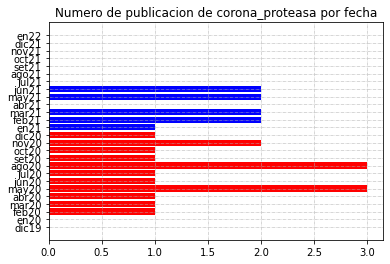


```python

```


```python
df_filtro_estudio["title"][0]
```


    'Tellurium: A Rare Element with Influence on Prokaryotic and Eukaryotic Biological Systems'


```python
print("corona_proteasa: ", df_filtro_estudio.shape[0])
```

    corona_proteasa:  28


##### molecular_docking_simulation


```python
filtros_estudio = {
    "molecular_docking_simulation":[
        "Molecular Docking Simulation",
        "Molecular Docking Simulations",
        "Molecular Docking",
        "Molecular Dockings",
        "Molecular Docking Analysis",
        "Molecular Docking Analyses"
    ],
    "molecular_dynamics_simulation":[
        "Molecular Dynamics Simulation",
        "Molecular Dynamics Simulations",
        "Molecular Dynamics",
        "Molecular Dynamic"
    ],
    "pharmacokinetics":[
        "Pharmacokinetics",
        "Drug Kinetics",
        "ADMET",
        "ADME-Tox",
        "Absorption, Distribution, Metabolism, Elimination, and Toxicology",
        "LADMER",
        #"potential"
    ]
}

```


```python
orden_filtros = {
    0:"molecular_docking_simulation",
    1:"molecular_dynamics_simulation",
    2:"pharmacokinetics"
}

filtro1_estudio = [0]
```


```python
for i,j in zip(filtros_estudio.keys(),list(map(lambda x: [i.lower() for i in x] , filtros_estudio.values()))):
    filtros_estudio[i]=j
```


```python
filtro_estudio_list = list(funcion_filtro_estudio(df_filtro_covid.body_x, df_filtro_covid.title, filtro1_estudio))  
filtro1_list_unzip = list(zip(*filtro_estudio_list))
df1 = dict()

df1["title"] = filtro1_list_unzip[1]
df_t = pd.DataFrame(df1)["title"]
df_filtro_estudio = pd.merge(df_t, df_filtro_covid)
df_filtro_estudio.shape

tabla = df_filtro_estudio
tabla_title = tabla[["title"]].value_counts().to_frame().reset_index()

title_unique = []

for i in range(tabla_title.shape[0]):
    aux_tabla = tabla[tabla["title"]==tabla_title.iloc[i,0]]

    len_aux_tabla = aux_tabla.shape[0]
    aux_tabla_comp = aux_tabla.iloc[0,:]

    count = 0

    for i in range(len_aux_tabla-1):
        if aux_tabla.iloc[i,:].equals(aux_tabla_comp):
            count+=1

    if count==(len_aux_tabla-1):
        title_unique.append(aux_tabla_comp)

df_filtro_estudio = pd.DataFrame(title_unique, columns=tabla.columns)
df_filtro_estudio.head()
```


<div>
<style scoped>
    .dataframe tbody tr th:only-of-type {
        vertical-align: middle;
    }

    .dataframe tbody tr th {
        vertical-align: top;
    }

    .dataframe thead th {
        text-align: right;
    }
</style>
<table border="1" class="dataframe">
  <thead>
    <tr style="text-align: right;">
      <th></th>
      <th>title</th>
      <th>license_x</th>
      <th>publish_time_x</th>
      <th>journal_x</th>
      <th>body_x</th>
      <th>source_x_y</th>
      <th>source_medline</th>
      <th>elsevier</th>
      <th>who</th>
      <th>biorxiv</th>
      <th>pmc</th>
      <th>arxiv</th>
      <th>medline</th>
    </tr>
  </thead>
  <tbody>
    <tr>
      <th>12</th>
      <td>1,2,3,4,6-Pentagalloyl Glucose, a RBD-ACE2 Bin...</td>
      <td>cc-by</td>
      <td>2021-03-04</td>
      <td>Front Pharmacol</td>
      <td>The worldwide pandemic Coronavirus disease 20...</td>
      <td>Medline; PMC</td>
      <td>Medline</td>
      <td>0</td>
      <td>0</td>
      <td>0</td>
      <td>1</td>
      <td>0</td>
      <td>1</td>
    </tr>
    <tr>
      <th>52</th>
      <td>Phytopharmaceuticals mediated Furin and TMPRSS...</td>
      <td>no-cc</td>
      <td>2020-10-28</td>
      <td>Phytomedicine</td>
      <td>The global data on severity and mortality of ...</td>
      <td>Elsevier; Medline; PMC</td>
      <td>Elsevier</td>
      <td>1</td>
      <td>0</td>
      <td>0</td>
      <td>1</td>
      <td>0</td>
      <td>1</td>
    </tr>
    <tr>
      <th>50</th>
      <td>Phytogenic Products and Phytochemicals as a Ca...</td>
      <td>cc-by</td>
      <td>2020-10-20</td>
      <td>Front Vet Sci</td>
      <td>Since the emergence of the recent surpassing ...</td>
      <td>Medline; PMC</td>
      <td>Medline</td>
      <td>0</td>
      <td>0</td>
      <td>0</td>
      <td>1</td>
      <td>0</td>
      <td>1</td>
    </tr>
    <tr>
      <th>48</th>
      <td>Phytoconstituents, In Vitro Anti-Infective Act...</td>
      <td>cc-by</td>
      <td>2021-04-12</td>
      <td>Front Pharmacol</td>
      <td>In spite of the great progress in the therape...</td>
      <td>Medline; PMC</td>
      <td>Medline</td>
      <td>0</td>
      <td>0</td>
      <td>0</td>
      <td>1</td>
      <td>0</td>
      <td>1</td>
    </tr>
    <tr>
      <th>37</th>
      <td>Phytocompounds of Rheum emodi, Thymus serpyllu...</td>
      <td>no-cc</td>
      <td>2021-07-15</td>
      <td>Curr Pharmacol Rep</td>
      <td>Introduction COVID-19 caused by a member of f...</td>
      <td>Medline; PMC</td>
      <td>Medline</td>
      <td>0</td>
      <td>0</td>
      <td>0</td>
      <td>1</td>
      <td>0</td>
      <td>1</td>
    </tr>
  </tbody>
</table>
</div>


```python
print("molecular_docking_simulation: ", df_filtro_estudio.shape[0])
```

    molecular_docking_simulation:  1829


```python

```


```python
df_filtro_covid_mes_dic = df_filtro_estudio[((df_filtro_estudio["publish_time_x"] >= datetime(2019,12,1)) & (df_filtro_estudio["publish_time_x"] <= datetime(2019,12,31)))]
df_filtro_covid_mes_dic.shape[0]

l_meses2020 = []

for i in range(1,13):
    try:
        l_meses2020.append([i, df_filtro_estudio[((df_filtro_estudio["publish_time_x"] >= datetime(2020,i,1)) & (df_filtro_estudio["publish_time_x"] <= datetime(2020,i,30)))].shape[0]])
    except:
        l_meses2020.append([i, df_filtro_estudio[((df_filtro_estudio["publish_time_x"] >= datetime(2020,i,1)) & (df_filtro_estudio["publish_time_x"] <= datetime(2020,i,27)))].shape[0]])

l_meses2021 = []

for i in range(1,13):
    try:
        l_meses2021.append([i, df_filtro_estudio[((df_filtro_estudio["publish_time_x"] >= datetime(2021,i,1)) & (df_filtro_estudio["publish_time_x"] <= datetime(2021,i,30)))].shape[0]])
    except:
        l_meses2021.append([i, df_filtro_estudio[((df_filtro_estudio["publish_time_x"] >= datetime(2021,i,1)) & (df_filtro_estudio["publish_time_x"] <= datetime(2021,i,27)))].shape[0]])

df_filtro_covid_mes_ene22 = df_filtro_estudio[((df_filtro_estudio["publish_time_x"] >= datetime(2022,1,1)) & (df_filtro_estudio["publish_time_x"] <= datetime(2022,1,31)))]
df_filtro_covid_mes_ene22.shape[0]

dd = [df_filtro_covid_mes_dic.shape[0]]
dd.extend(list(map(lambda x: x[1],l_meses2020)))
dd.extend(list(map(lambda x: x[1],l_meses2021)))
dd.append(df_filtro_covid_mes_ene22.shape[0])
dd

dict_fechas = {'value' : dd,
'fecha': ['dic19','en20','feb20','mar20','abr20','may20','jun20','jul20','ago20','set20','oct20','nov20','dic20'  ,'en21','feb21','mar21','abr21','may21','jun21','jul21','ago21','set21','oct21','nov21','dic21','en22']
}

df_dates_df = pd.DataFrame(dict_fechas)
df_dates_df.head()

df_dates_df.rename(index=df_dates_df.fecha, inplace=True)

color=['g','r','r','r','r','r','r','r','r','r','r','r','r','b','b','b','b','b','b','b','b','b','b','b','b','y']
fecha_ddf = ['dic19','en20','feb20','mar20','abr20','may20','jun20','jul20','ago20','set20','oct20','nov20','dic20'  ,'en21','feb21','mar21','abr21','may21','jun21','jul21','ago21','set21','oct21','nov21','dic21','en22']

for i ,j in zip(fecha_ddf, color):
    plt.barh(i,df_dates_df.loc[i,"value"],color=j)

plt.title("Numero de publicacion de molecular_docking_simulation por fecha")
plt.grid(True,linestyle="-.", linewidth=0.5)
#plt.xlabel("")
#plt.xticks(np.arange(0, 210, 15))
plt.plot()
```


    []


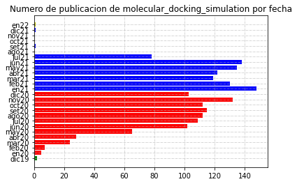


```python

```


```python

```


```python

```

##### molecular_dynamics_simulation


```python
orden_filtros = {
    0:"molecular_docking_simulation",
    1:"molecular_dynamics_simulation",
    2:"pharmacokinetics"
}

filtro1_estudio = [1]
```


```python
filtro_estudio_list = list(funcion_filtro_estudio(df_filtro_covid.body_x, df_filtro_covid.title, filtro1_estudio))  
filtro1_list_unzip = list(zip(*filtro_estudio_list))
df1 = dict()

df1["title"] = filtro1_list_unzip[1]
df_t = pd.DataFrame(df1)["title"]
df_filtro_estudio = pd.merge(df_t, df_filtro_covid)
df_filtro_estudio.shape

tabla = df_filtro_estudio
tabla_title = tabla[["title"]].value_counts().to_frame().reset_index()

title_unique = []

for i in range(tabla_title.shape[0]):
    aux_tabla = tabla[tabla["title"]==tabla_title.iloc[i,0]]

    len_aux_tabla = aux_tabla.shape[0]
    aux_tabla_comp = aux_tabla.iloc[0,:]

    count = 0

    for i in range(len_aux_tabla-1):
        if aux_tabla.iloc[i,:].equals(aux_tabla_comp):
            count+=1

    if count==(len_aux_tabla-1):
        title_unique.append(aux_tabla_comp)

df_filtro_estudio = pd.DataFrame(title_unique, columns=tabla.columns)
df_filtro_estudio
```


<div>
<style scoped>
    .dataframe tbody tr th:only-of-type {
        vertical-align: middle;
    }

    .dataframe tbody tr th {
        vertical-align: top;
    }

    .dataframe thead th {
        text-align: right;
    }
</style>
<table border="1" class="dataframe">
  <thead>
    <tr style="text-align: right;">
      <th></th>
      <th>title</th>
      <th>license_x</th>
      <th>publish_time_x</th>
      <th>journal_x</th>
      <th>body_x</th>
      <th>source_x_y</th>
      <th>source_medline</th>
      <th>elsevier</th>
      <th>who</th>
      <th>biorxiv</th>
      <th>pmc</th>
      <th>arxiv</th>
      <th>medline</th>
    </tr>
  </thead>
  <tbody>
    <tr>
      <th>5</th>
      <td>1,2,3,4,6-Pentagalloyl Glucose, a RBD-ACE2 Bin...</td>
      <td>cc-by</td>
      <td>2021-03-04</td>
      <td>Front Pharmacol</td>
      <td>The worldwide pandemic Coronavirus disease 20...</td>
      <td>Medline; PMC</td>
      <td>Medline</td>
      <td>0</td>
      <td>0</td>
      <td>0</td>
      <td>1</td>
      <td>0</td>
      <td>1</td>
    </tr>
    <tr>
      <th>21</th>
      <td>Plant Antimicrobial Peptides: State of the Art...</td>
      <td>cc-by-nc</td>
      <td>2020-09-02</td>
      <td>Bioinform Biol Insights</td>
      <td>Proteins and peptides play different roles de...</td>
      <td>Medline; PMC</td>
      <td>Medline</td>
      <td>0</td>
      <td>0</td>
      <td>0</td>
      <td>1</td>
      <td>0</td>
      <td>1</td>
    </tr>
    <tr>
      <th>22</th>
      <td>Phytopharmaceuticals mediated Furin and TMPRSS...</td>
      <td>no-cc</td>
      <td>2020-10-28</td>
      <td>Phytomedicine</td>
      <td>The global data on severity and mortality of ...</td>
      <td>Elsevier; Medline; PMC</td>
      <td>Elsevier</td>
      <td>1</td>
      <td>0</td>
      <td>0</td>
      <td>1</td>
      <td>0</td>
      <td>1</td>
    </tr>
    <tr>
      <th>20</th>
      <td>Phytochemicals from Selective Plants Have Prom...</td>
      <td>cc-by</td>
      <td>2020-10-13</td>
      <td>Biomed Res Int</td>
      <td>Coronaviruses have become a source of multipl...</td>
      <td>Medline; PMC</td>
      <td>Medline</td>
      <td>0</td>
      <td>0</td>
      <td>0</td>
      <td>1</td>
      <td>0</td>
      <td>1</td>
    </tr>
    <tr>
      <th>19</th>
      <td>Phytochemical Moieties From Indian Traditional...</td>
      <td>cc-by</td>
      <td>2021-05-07</td>
      <td>Front Med (Lausanne)</td>
      <td>A new respiratory infectious disease was repo...</td>
      <td>Medline; PMC</td>
      <td>Medline</td>
      <td>0</td>
      <td>0</td>
      <td>0</td>
      <td>1</td>
      <td>0</td>
      <td>1</td>
    </tr>
    <tr>
      <th>...</th>
      <td>...</td>
      <td>...</td>
      <td>...</td>
      <td>...</td>
      <td>...</td>
      <td>...</td>
      <td>...</td>
      <td>...</td>
      <td>...</td>
      <td>...</td>
      <td>...</td>
      <td>...</td>
      <td>...</td>
    </tr>
    <tr>
      <th>1368</th>
      <td>Exploration of Inhibitory Action of Azo imidaz...</td>
      <td>no-cc</td>
      <td>2020-08-31</td>
      <td>J Mol Struct</td>
      <td>After the outbreak of severe acute respirator...</td>
      <td>Elsevier; Medline; PMC</td>
      <td>Elsevier</td>
      <td>1</td>
      <td>0</td>
      <td>0</td>
      <td>1</td>
      <td>0</td>
      <td>1</td>
    </tr>
    <tr>
      <th>1367</th>
      <td>Exploiting Knowledge on Structure–Activity Rel...</td>
      <td>cc-by</td>
      <td>2021-06-07</td>
      <td>Biomedicines</td>
      <td>Endogenous peptides are important mediators o...</td>
      <td>Medline; PMC</td>
      <td>Medline</td>
      <td>0</td>
      <td>0</td>
      <td>0</td>
      <td>1</td>
      <td>0</td>
      <td>1</td>
    </tr>
    <tr>
      <th>1366</th>
      <td>Expanding the Structural Diversity of DNA Meth...</td>
      <td>cc-by</td>
      <td>2020-12-27</td>
      <td>Pharmaceuticals (Basel)</td>
      <td>Historically, the term "epigenetics" is roote...</td>
      <td>Medline; PMC</td>
      <td>Medline</td>
      <td>0</td>
      <td>0</td>
      <td>0</td>
      <td>1</td>
      <td>0</td>
      <td>1</td>
    </tr>
    <tr>
      <th>1365</th>
      <td>Excavating SARS‐coronavirus 2 genome for epito...</td>
      <td>no-cc</td>
      <td>2020-07-09</td>
      <td>J Cell Physiol</td>
      <td>flu-like coronavirus which caused the recent ...</td>
      <td>Medline; PMC</td>
      <td>Medline</td>
      <td>0</td>
      <td>0</td>
      <td>0</td>
      <td>1</td>
      <td>0</td>
      <td>1</td>
    </tr>
    <tr>
      <th>1453</th>
      <td>“What Doesn’t Kill You Makes You Stronger”: Fu...</td>
      <td>cc-by</td>
      <td>2020-11-11</td>
      <td>Molecules</td>
      <td>Misfolding and successive aggregation of pept...</td>
      <td>Medline; PMC</td>
      <td>Medline</td>
      <td>0</td>
      <td>0</td>
      <td>0</td>
      <td>1</td>
      <td>0</td>
      <td>1</td>
    </tr>
  </tbody>
</table>
<p>1454 rows × 13 columns</p>
</div>


```python
print("molecular_dynamics_simulation: ", df_filtro_estudio.shape[0])
```

    molecular_dynamics_simulation:  1454


```python
df_filtro_covid_mes_dic = df_filtro_estudio[((df_filtro_estudio["publish_time_x"] >= datetime(2019,12,1)) & (df_filtro_estudio["publish_time_x"] <= datetime(2019,12,31)))]
df_filtro_covid_mes_dic.shape[0]

l_meses2020 = []

for i in range(1,13):
    try:
        l_meses2020.append([i, df_filtro_estudio[((df_filtro_estudio["publish_time_x"] >= datetime(2020,i,1)) & (df_filtro_estudio["publish_time_x"] <= datetime(2020,i,30)))].shape[0]])
    except:
        l_meses2020.append([i, df_filtro_estudio[((df_filtro_estudio["publish_time_x"] >= datetime(2020,i,1)) & (df_filtro_estudio["publish_time_x"] <= datetime(2020,i,27)))].shape[0]])

l_meses2021 = []

for i in range(1,13):
    try:
        l_meses2021.append([i, df_filtro_estudio[((df_filtro_estudio["publish_time_x"] >= datetime(2021,i,1)) & (df_filtro_estudio["publish_time_x"] <= datetime(2021,i,30)))].shape[0]])
    except:
        l_meses2021.append([i, df_filtro_estudio[((df_filtro_estudio["publish_time_x"] >= datetime(2021,i,1)) & (df_filtro_estudio["publish_time_x"] <= datetime(2021,i,27)))].shape[0]])

df_filtro_covid_mes_ene22 = df_filtro_estudio[((df_filtro_estudio["publish_time_x"] >= datetime(2022,1,1)) & (df_filtro_estudio["publish_time_x"] <= datetime(2022,1,31)))]
df_filtro_covid_mes_ene22.shape[0]

dd = [df_filtro_covid_mes_dic.shape[0]]
dd.extend(list(map(lambda x: x[1],l_meses2020)))
dd.extend(list(map(lambda x: x[1],l_meses2021)))
dd.append(df_filtro_covid_mes_ene22.shape[0])
dd

dict_fechas = {'value' : dd,
'fecha': ['dic19','en20','feb20','mar20','abr20','may20','jun20','jul20','ago20','set20','oct20','nov20','dic20'  ,'en21','feb21','mar21','abr21','may21','jun21','jul21','ago21','set21','oct21','nov21','dic21','en22']
}

df_dates_df = pd.DataFrame(dict_fechas)
df_dates_df.head()

df_dates_df.rename(index=df_dates_df.fecha, inplace=True)

color=['g','r','r','r','r','r','r','r','r','r','r','r','r','b','b','b','b','b','b','b','b','b','b','b','b','y']
fecha_ddf = ['dic19','en20','feb20','mar20','abr20','may20','jun20','jul20','ago20','set20','oct20','nov20','dic20'  ,'en21','feb21','mar21','abr21','may21','jun21','jul21','ago21','set21','oct21','nov21','dic21','en22']

for i ,j in zip(fecha_ddf, color):
    plt.barh(i,df_dates_df.loc[i,"value"],color=j)

plt.title("Numero de publicacion de molecular_dynamics_simulation por fecha")
plt.grid(True,linestyle="-.", linewidth=0.5)
#plt.xlabel("")
#plt.xticks(np.arange(0, 210, 15))
plt.plot()
```


    []


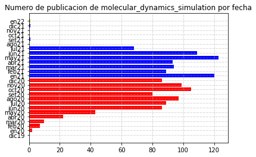


```python

```

##### pharmacokinetics


```python
filtro1_estudio = [2]

filtro_estudio_list = list(funcion_filtro_estudio(df_filtro_covid.body_x, df_filtro_covid.title, filtro1_estudio))  
filtro1_list_unzip = list(zip(*filtro_estudio_list))
df1 = dict()

df1["title"] = filtro1_list_unzip[1]
df_t = pd.DataFrame(df1)["title"]
df_filtro_estudio = pd.merge(df_t, df_filtro_covid)
df_filtro_estudio.shape

tabla = df_filtro_estudio
tabla_title = tabla[["title"]].value_counts().to_frame().reset_index()

title_unique = []

for i in range(tabla_title.shape[0]):
    aux_tabla = tabla[tabla["title"]==tabla_title.iloc[i,0]]

    len_aux_tabla = aux_tabla.shape[0]
    aux_tabla_comp = aux_tabla.iloc[0,:]

    count = 0

    for i in range(len_aux_tabla-1):
        if aux_tabla.iloc[i,:].equals(aux_tabla_comp):
            count+=1

    if count==(len_aux_tabla-1):
        title_unique.append(aux_tabla_comp)

df_filtro_estudio = pd.DataFrame(title_unique, columns=tabla.columns)
df_filtro_estudio
```


<div>
<style scoped>
    .dataframe tbody tr th:only-of-type {
        vertical-align: middle;
    }

    .dataframe tbody tr th {
        vertical-align: top;
    }

    .dataframe thead th {
        text-align: right;
    }
</style>
<table border="1" class="dataframe">
  <thead>
    <tr style="text-align: right;">
      <th></th>
      <th>title</th>
      <th>license_x</th>
      <th>publish_time_x</th>
      <th>journal_x</th>
      <th>body_x</th>
      <th>source_x_y</th>
      <th>source_medline</th>
      <th>elsevier</th>
      <th>who</th>
      <th>biorxiv</th>
      <th>pmc</th>
      <th>arxiv</th>
      <th>medline</th>
    </tr>
  </thead>
  <tbody>
    <tr>
      <th>1473</th>
      <td>1,2,4 triazolo[1,5-a] pyrimidin-7-ones as nove...</td>
      <td>no-cc</td>
      <td>2020-09-22</td>
      <td>Biophys Chem</td>
      <td>Affairs, the world economy could contract by ...</td>
      <td>Elsevier; Medline; PMC</td>
      <td>Elsevier</td>
      <td>1</td>
      <td>0</td>
      <td>0</td>
      <td>1</td>
      <td>0</td>
      <td>1</td>
    </tr>
    <tr>
      <th>34</th>
      <td>Pharmacogenomics and Pharmacogenetics: In Sili...</td>
      <td>cc-by-nc</td>
      <td>2020-10-13</td>
      <td>Pharmgenomics Pers Med</td>
      <td>Covid-19, an emergency all over the world, is...</td>
      <td>Medline; PMC</td>
      <td>Medline</td>
      <td>0</td>
      <td>0</td>
      <td>0</td>
      <td>1</td>
      <td>0</td>
      <td>1</td>
    </tr>
    <tr>
      <th>9</th>
      <td>Pharmacokinetic, Pharmacodynamic, and Drug-Int...</td>
      <td>cc-by-nc</td>
      <td>2021-03-30</td>
      <td>Clin Pharmacokinet</td>
      <td>A clinical dosing regimen for the treatment o...</td>
      <td>Medline; PMC</td>
      <td>Medline</td>
      <td>0</td>
      <td>0</td>
      <td>0</td>
      <td>1</td>
      <td>0</td>
      <td>1</td>
    </tr>
    <tr>
      <th>21</th>
      <td>Pharmacokinetic modelling to estimate intracel...</td>
      <td>no-cc</td>
      <td>2021-06-02</td>
      <td>J Antimicrob Chemother</td>
      <td>The urgent global public health threat posed ...</td>
      <td>Medline; PMC</td>
      <td>Medline</td>
      <td>0</td>
      <td>0</td>
      <td>0</td>
      <td>1</td>
      <td>0</td>
      <td>1</td>
    </tr>
    <tr>
      <th>14</th>
      <td>Pharmacokinetic interactions between the poten...</td>
      <td>no-cc</td>
      <td>2021-07-15</td>
      <td>J Zhejiang Univ Sci B</td>
      <td>The coronavirus disease 2019 (COVID-19) pande...</td>
      <td>Medline; PMC</td>
      <td>Medline</td>
      <td>0</td>
      <td>0</td>
      <td>0</td>
      <td>1</td>
      <td>0</td>
      <td>1</td>
    </tr>
    <tr>
      <th>...</th>
      <td>...</td>
      <td>...</td>
      <td>...</td>
      <td>...</td>
      <td>...</td>
      <td>...</td>
      <td>...</td>
      <td>...</td>
      <td>...</td>
      <td>...</td>
      <td>...</td>
      <td>...</td>
      <td>...</td>
    </tr>
    <tr>
      <th>1714</th>
      <td>Effect of Tenofovir Disoproxil Fumarate and Em...</td>
      <td>no-cc</td>
      <td>2021-06-27</td>
      <td>EClinicalMedicine</td>
      <td>Background: Tenofovir and emtricitabine inter...</td>
      <td>Elsevier; Medline; PMC</td>
      <td>Elsevier</td>
      <td>1</td>
      <td>0</td>
      <td>0</td>
      <td>1</td>
      <td>0</td>
      <td>1</td>
    </tr>
    <tr>
      <th>1720</th>
      <td>Effect of TLR agonist on infections bronchitis...</td>
      <td>no-cc</td>
      <td>2020-02-14</td>
      <td>Mol Immunol</td>
      <td>Avian infectious bronchitis (IB) is a highly ...</td>
      <td>Elsevier; Medline; PMC</td>
      <td>Elsevier</td>
      <td>1</td>
      <td>0</td>
      <td>0</td>
      <td>1</td>
      <td>0</td>
      <td>1</td>
    </tr>
    <tr>
      <th>1719</th>
      <td>Effect of Systemic Inflammatory Response to SA...</td>
      <td>medrxiv</td>
      <td>2020-07-07</td>
      <td>NaN</td>
      <td>The release of inflammatory cytokines such as...</td>
      <td>Medline; PMC</td>
      <td>Medline</td>
      <td>0</td>
      <td>0</td>
      <td>0</td>
      <td>1</td>
      <td>0</td>
      <td>1</td>
    </tr>
    <tr>
      <th>1718</th>
      <td>Effect of Antioxidant Therapy on Oxidative Str...</td>
      <td>cc-by</td>
      <td>2021-02-25</td>
      <td>Antioxidants (Basel)</td>
      <td>Over the last few decades, many efforts have ...</td>
      <td>Medline; PMC</td>
      <td>Medline</td>
      <td>0</td>
      <td>0</td>
      <td>0</td>
      <td>1</td>
      <td>0</td>
      <td>1</td>
    </tr>
    <tr>
      <th>602</th>
      <td>“Identification of potential antivirals agains...</td>
      <td>no-cc</td>
      <td>2021-02-10</td>
      <td>Inform Med Unlocked</td>
      <td>The Health Authority of China notified the Wo...</td>
      <td>Elsevier; Medline; PMC</td>
      <td>Elsevier</td>
      <td>1</td>
      <td>0</td>
      <td>0</td>
      <td>1</td>
      <td>0</td>
      <td>1</td>
    </tr>
  </tbody>
</table>
<p>1748 rows × 13 columns</p>
</div>


```python
print("pharmacokinetics: ", df_filtro_estudio.shape[0])
```

    pharmacokinetics:  1748


```python
df_filtro_covid_mes_dic = df_filtro_estudio[((df_filtro_estudio["publish_time_x"] >= datetime(2019,12,1)) & (df_filtro_estudio["publish_time_x"] <= datetime(2019,12,31)))]
df_filtro_covid_mes_dic.shape[0]

l_meses2020 = []

for i in range(1,13):
    try:
        l_meses2020.append([i, df_filtro_estudio[((df_filtro_estudio["publish_time_x"] >= datetime(2020,i,1)) & (df_filtro_estudio["publish_time_x"] <= datetime(2020,i,30)))].shape[0]])
    except:
        l_meses2020.append([i, df_filtro_estudio[((df_filtro_estudio["publish_time_x"] >= datetime(2020,i,1)) & (df_filtro_estudio["publish_time_x"] <= datetime(2020,i,27)))].shape[0]])

l_meses2021 = []

for i in range(1,13):
    try:
        l_meses2021.append([i, df_filtro_estudio[((df_filtro_estudio["publish_time_x"] >= datetime(2021,i,1)) & (df_filtro_estudio["publish_time_x"] <= datetime(2021,i,30)))].shape[0]])
    except:
        l_meses2021.append([i, df_filtro_estudio[((df_filtro_estudio["publish_time_x"] >= datetime(2021,i,1)) & (df_filtro_estudio["publish_time_x"] <= datetime(2021,i,27)))].shape[0]])

df_filtro_covid_mes_ene22 = df_filtro_estudio[((df_filtro_estudio["publish_time_x"] >= datetime(2022,1,1)) & (df_filtro_estudio["publish_time_x"] <= datetime(2022,1,31)))]
df_filtro_covid_mes_ene22.shape[0]

dd = [df_filtro_covid_mes_dic.shape[0]]
dd.extend(list(map(lambda x: x[1],l_meses2020)))
dd.extend(list(map(lambda x: x[1],l_meses2021)))
dd.append(df_filtro_covid_mes_ene22.shape[0])
dd

dict_fechas = {'value' : dd,
'fecha': ['dic19','en20','feb20','mar20','abr20','may20','jun20','jul20','ago20','set20','oct20','nov20','dic20'  ,'en21','feb21','mar21','abr21','may21','jun21','jul21','ago21','set21','oct21','nov21','dic21','en22']
}

df_dates_df = pd.DataFrame(dict_fechas)
df_dates_df.head()

df_dates_df.rename(index=df_dates_df.fecha, inplace=True)

color=['g','r','r','r','r','r','r','r','r','r','r','r','r','b','b','b','b','b','b','b','b','b','b','b','b','y']
fecha_ddf = ['dic19','en20','feb20','mar20','abr20','may20','jun20','jul20','ago20','set20','oct20','nov20','dic20'  ,'en21','feb21','mar21','abr21','may21','jun21','jul21','ago21','set21','oct21','nov21','dic21','en22']

for i ,j in zip(fecha_ddf, color):
    plt.barh(i,df_dates_df.loc[i,"value"],color=j)

plt.title("Numero de publicacion de pharmacokinetics por fecha")
plt.grid(True,linestyle="-.", linewidth=0.5)
#plt.xlabel("")
#plt.xticks(np.arange(0, 210, 15))
plt.plot()
```


    []


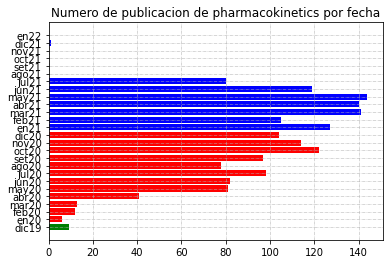


#### Gráficacion de los campos de estudio obtenido


```python
!pip install matplotlib==3.4.1
```


```python
import matplotlib
```


```python
matplotlib.__version__
```


    '3.4.1'


```python
import matplotlib.pyplot as plt
```


```python

```


```python
result_estudio_f = {
        "molecular_docking_simulation":  1829,
        "molecular_dynamics_simulation":  1454,
        "pharmacokinetics":  1748,
        "corona_proteasa": 28
    }

```


```python
import numpy as np
```


```python
result_estudio_f_df = pd.DataFrame(result_estudio_f.values(), columns=["Campos de filtro"] , index=result_estudio_f.keys())
result_estudio_f_df.head()
```


<div>
<style scoped>
    .dataframe tbody tr th:only-of-type {
        vertical-align: middle;
    }

    .dataframe tbody tr th {
        vertical-align: top;
    }

    .dataframe thead th {
        text-align: right;
    }
</style>
<table border="1" class="dataframe">
  <thead>
    <tr style="text-align: right;">
      <th></th>
      <th>Campos de filtro</th>
    </tr>
  </thead>
  <tbody>
    <tr>
      <th>molecular_docking_simulation</th>
      <td>1829</td>
    </tr>
    <tr>
      <th>molecular_dynamics_simulation</th>
      <td>1454</td>
    </tr>
    <tr>
      <th>pharmacokinetics</th>
      <td>1748</td>
    </tr>
    <tr>
      <th>corona_proteasa</th>
      <td>28</td>
    </tr>
  </tbody>
</table>
</div>


```python
ax = result_estudio_f_df.plot.barh(color='g')
ax.bar_label(ax.containers[0])

plt.title("Articulos obtenidos de CORD-19 luego de aplicar los filtros\n")
plt.grid(True,linestyle="-.", linewidth=0.5)
plt.xlabel("Articulos")
plt.xticks(np.arange(0, 2000, 200))
ax.set_xlim(0,2100)
plt.plot()
```


    []


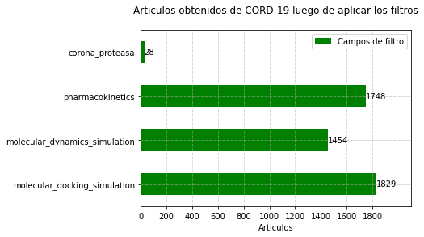


```python

```

# Diagrama de filtración


```python
from graphviz import Digraph
import graphviz
from IPython.display import display

pri = Digraph(format='png')

with pri.subgraph() as c:
    c.attr(rank='same')
    c.node('a', 'Total de estudios en formato json de CORD-19 (directorios /pdf_json y /pmc_json)', shape='box')
    c.node('b', 'Total de estudios de los articulos de CORD-19 (metadata.csv)', shape='box')
pri.node('c', '# de estudios que tuvieron como contenido cualquiera de las palabras y/o sinónimos de: \n corona_proteasa, molecular_docking_simulation, molecular_dynamics_simulation, machine_learning, deep_learning,  pharmacokinetics', shape='box')

#with pri.subgraph() as c:
#c.attr(rank='same')
pri.node('d', '# de estudios que tuvieron match entre los json y metadata', shape='box')
pri.node('e', '# de estudios publicados desde diciembre del 2019', shape='box')

#with pri.subgraph() as c:
pri.attr(rank='same')
pri.node('f', '# de estudios que tuvieron como contenido COVID-19', shape='box')
pri.node('g', '# de estudios que tuvieron que no contuvieran los terminos y/o sinónimos: \n machine_learning, deep_learning', shape='box')

#with pri.subgraph() as c:
#pri.attr(rank='same')
#pri.node('h', '# de estudios que tuvieron como contenido molecular_docking_simulation y/o sinónimos', shape='box')
#pri.node('i', '# de estudios que tuvieron como contenido molecular_dynamics_simulation y/o sinónimos', shape='box')
#pri.node('j', '# de estudios que tuvieron como contenido pharmacokinetics y/o sinónimos', shape='box')
pri.node('k', 'final # de estudios incluidos en el análisis', shape='box')

#pri.edges(['ac', 'bd', 'cd', 'de','ef','fg','gh','hi','ij'])
pri.edge('a', 'c', label="430975")#, constraint="true", style="invis")
pri.edge('b', 'd', label="740302")
pri.edge('c', 'd', label="19285")
pri.edge('d', 'e', label="10749")
pri.edge('e', 'f', label="4356")
pri.edge('f', 'g', label="3790")
pri.edge('g', 'k', label="3777")


#display(graphviz.Source(pri.source))
pri.render(view=True)
```


    'Digraph.gv.png'


```python
pri2 = Digraph(format='png')

pri2.node('h', '# de estudios que tuvieron como contenido \n molecular_docking_simulation y/o sinónimos', shape='box')
pri2.node('i', '# de estudios que tuvieron como contenido \n molecular_dynamics_simulation y/o sinónimos', shape='box')
pri2.node('j', '# de estudios que tuvieron como contenido \n pharmacokinetics y/o sinónimos', shape='box')
pri2.node('k', 'final # de estudios incluidos en el análisis', shape='box')

pri2.edge('k', 'h', label="1829")
pri2.edge('k', 'i', label="1454")
pri2.edge('k', 'j', label="1748")

pri2.render(view=True)
```


    'Digraph.gv.png'


```python

```


```python

```


```python
#l = glob("./**/*body_filtro2*.csv")
```


```python
#import re
```


```python
#reduce(lambda x,y: int(x)+int(y), list(map(lambda x: re.findall(r"(\d+\b).csv",x)[0],l)))
```


```python

```

## Métricas obtenidas

* gráfica de aceptados
* fechas de aceptados, recibidos y publicados
* Gráfica de paises y idioma
* Gráfica de afiliación a paises.
* Gráfica de autores
* Gráfica de citación por publicación

### Source


```python
df_filtro_final_filtro.elsevier.sum()
```


    737


```python
df_filtro_final_filtro.medline.sum()
```


    3535


```python
df_filtro_final_filtro.biorxiv.sum()
```


    9


```python
df_filtro_final_filtro.pmc.sum()
```


    3777


### journal


```python
df_journal = df_filtro_final_filtro.journal_x.value_counts()[df_filtro_final_filtro.journal_x.value_counts()>20]
df_journal
```


    Journal of biomolecular structure & dynamics    176
    Molecules                                       141
    Int J Mol Sci                                   116
    Front Pharmacol                                  95
    Viruses                                          66
    J Biomol Struct Dyn                              65
    Sci Rep                                          63
    Front Mol Biosci                                 48
    PLoS One                                         45
    Pharmaceuticals (Basel)                          45
    Front Immunol                                    37
    J Mol Struct                                     37
    Mol Divers                                       36
    Brief Bioinform                                  33
    Pharmaceutics                                    31
    Biomolecules                                     29
    Comput Biol Med                                  28
    bioRxiv                                          28
    Front Chem                                       27
    Comput Struct Biotechnol J                       25
    Vaccines (Basel)                                 24
    Name: journal_x, dtype: int64


```python
pd.DataFrame({"Publicación por Journal":df_journal})
```


<div>
<style scoped>
    .dataframe tbody tr th:only-of-type {
        vertical-align: middle;
    }

    .dataframe tbody tr th {
        vertical-align: top;
    }

    .dataframe thead th {
        text-align: right;
    }
</style>
<table border="1" class="dataframe">
  <thead>
    <tr style="text-align: right;">
      <th></th>
      <th>Publicación por Journal</th>
    </tr>
  </thead>
  <tbody>
    <tr>
      <th>Journal of biomolecular structure &amp; dynamics</th>
      <td>176</td>
    </tr>
    <tr>
      <th>Molecules</th>
      <td>141</td>
    </tr>
    <tr>
      <th>Int J Mol Sci</th>
      <td>116</td>
    </tr>
    <tr>
      <th>Front Pharmacol</th>
      <td>95</td>
    </tr>
    <tr>
      <th>Viruses</th>
      <td>66</td>
    </tr>
    <tr>
      <th>J Biomol Struct Dyn</th>
      <td>65</td>
    </tr>
    <tr>
      <th>Sci Rep</th>
      <td>63</td>
    </tr>
    <tr>
      <th>Front Mol Biosci</th>
      <td>48</td>
    </tr>
    <tr>
      <th>PLoS One</th>
      <td>45</td>
    </tr>
    <tr>
      <th>Pharmaceuticals (Basel)</th>
      <td>45</td>
    </tr>
    <tr>
      <th>Front Immunol</th>
      <td>37</td>
    </tr>
    <tr>
      <th>J Mol Struct</th>
      <td>37</td>
    </tr>
    <tr>
      <th>Mol Divers</th>
      <td>36</td>
    </tr>
    <tr>
      <th>Brief Bioinform</th>
      <td>33</td>
    </tr>
    <tr>
      <th>Pharmaceutics</th>
      <td>31</td>
    </tr>
    <tr>
      <th>Biomolecules</th>
      <td>29</td>
    </tr>
    <tr>
      <th>Comput Biol Med</th>
      <td>28</td>
    </tr>
    <tr>
      <th>bioRxiv</th>
      <td>28</td>
    </tr>
    <tr>
      <th>Front Chem</th>
      <td>27</td>
    </tr>
    <tr>
      <th>Comput Struct Biotechnol J</th>
      <td>25</td>
    </tr>
    <tr>
      <th>Vaccines (Basel)</th>
      <td>24</td>
    </tr>
  </tbody>
</table>
</div>


```python
df_journal.plot.barh(color="#9A0EEA")
plt.title("Publicaciones en Journals")
plt.grid(True,linestyle="-.", linewidth=0.5)
#plt.xlabel("")
plt.xticks(np.arange(0, 210, 15))
plt.plot()
```


    []


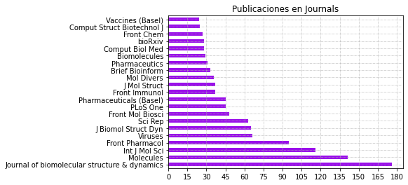


```python
df_journal.plot.bar()
```


    <AxesSubplot:>


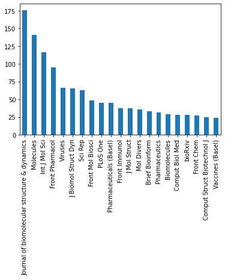


```python

```


```python

```

### idioma


```python

```


```python
!pip install langdetect
```

    Defaulting to user installation because normal site-packages is not writeable
    Requirement already satisfied: langdetect in /home/stevend/.local/lib/python3.8/site-packages (1.0.9)
    Requirement already satisfied: six in /usr/local/lib/python3.8/dist-packages (from langdetect) (1.15.0)


```python
from langdetect import detect
```


```python
def detect_lang(text):
    return detect(text)

df_filtro_final_filtro["lang"] = df_filtro_final_filtro["body_x"].apply(detect_lang)
```


```python
df_filtro_final_filtro.lang.value_counts()
```


    en    3769
    fr       8
    Name: lang, dtype: int64


```python
pd.DataFrame({"Lenguaje de articulos": df_filtro_final_filtro.lang.value_counts()})
```


<div>
<style scoped>
    .dataframe tbody tr th:only-of-type {
        vertical-align: middle;
    }

    .dataframe tbody tr th {
        vertical-align: top;
    }

    .dataframe thead th {
        text-align: right;
    }
</style>
<table border="1" class="dataframe">
  <thead>
    <tr style="text-align: right;">
      <th></th>
      <th>Lenguaje de articulos</th>
    </tr>
  </thead>
  <tbody>
    <tr>
      <th>en</th>
      <td>3769</td>
    </tr>
    <tr>
      <th>fr</th>
      <td>8</td>
    </tr>
  </tbody>
</table>
</div>


```python
ax = df_filtro_final_filtro.lang.value_counts().plot.bar(logy=True,color="#3100E9")
ax.bar_label(ax.containers[0])

plt.title("Lenguaje de articulos")
plt.grid(True,linestyle="-.", linewidth=0.5)
#plt.xlabel("")
#plt.xticks(np.arange(0, 210, 15))
plt.plot()
```


    []


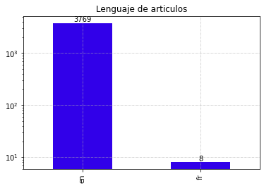


```python

```


```python

```


```python

```


```python
df_filtro_final_filtro.lang.value_counts().plot.bar(logy=True)
```


    <AxesSubplot:>


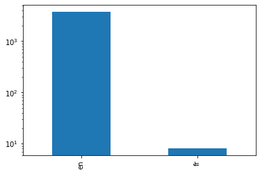


```python

```


```python

```

## Numero de publicacion de covid por fecha


```python
df_filtro_covid["publish_time_x"].max()
```


    Timestamp('2022-01-01 00:00:00')


```python
df_filtro_covid["publish_time_x"].min()
```


    Timestamp('2019-12-01 00:00:00')


```python

```


```python
df_filtro_covid.shape
```


    (3790, 13)


```python
df_filtro_covid.head()
```


<div>
<style scoped>
    .dataframe tbody tr th:only-of-type {
        vertical-align: middle;
    }

    .dataframe tbody tr th {
        vertical-align: top;
    }

    .dataframe thead th {
        text-align: right;
    }
</style>
<table border="1" class="dataframe">
  <thead>
    <tr style="text-align: right;">
      <th></th>
      <th>title</th>
      <th>license_x</th>
      <th>publish_time_x</th>
      <th>journal_x</th>
      <th>body_x</th>
      <th>source_x_y</th>
      <th>source_medline</th>
      <th>elsevier</th>
      <th>biorxiv</th>
      <th>who</th>
      <th>arxiv</th>
      <th>medline</th>
      <th>pmc</th>
    </tr>
  </thead>
  <tbody>
    <tr>
      <th>2231</th>
      <td>Tellurium: A Rare Element with Influence on Pr...</td>
      <td>cc-by</td>
      <td>2021-05-31</td>
      <td>Int J Mol Sci</td>
      <td>Tellurium (Te) is a member of the chalcogen g...</td>
      <td>Medline; PMC</td>
      <td>Medline</td>
      <td>0</td>
      <td>0</td>
      <td>0</td>
      <td>0</td>
      <td>1</td>
      <td>1</td>
    </tr>
    <tr>
      <th>116</th>
      <td>Potential therapeutic target identification in...</td>
      <td>cc-by</td>
      <td>2020-10-02</td>
      <td>Egypt J Med Hum Genet</td>
      <td>The first outburst of pneumonia cases with un...</td>
      <td>PMC</td>
      <td>PMC</td>
      <td>0</td>
      <td>0</td>
      <td>0</td>
      <td>0</td>
      <td>0</td>
      <td>1</td>
    </tr>
    <tr>
      <th>2889</th>
      <td>Antiviral Activity Exerted by Natural Products...</td>
      <td>cc-by</td>
      <td>2021-05-04</td>
      <td>Viruses</td>
      <td>A growing number of studies have shown the be...</td>
      <td>Medline; PMC</td>
      <td>Medline</td>
      <td>0</td>
      <td>0</td>
      <td>0</td>
      <td>0</td>
      <td>1</td>
      <td>1</td>
    </tr>
    <tr>
      <th>790</th>
      <td>Molecular targets for COVID-19 drug developmen...</td>
      <td>no-cc</td>
      <td>2020-07-09</td>
      <td>Biosaf Health</td>
      <td>There is little or no research initiated to e...</td>
      <td>Elsevier; Medline; PMC</td>
      <td>Elsevier</td>
      <td>1</td>
      <td>0</td>
      <td>0</td>
      <td>0</td>
      <td>1</td>
      <td>1</td>
    </tr>
    <tr>
      <th>3407</th>
      <td>Learning from the Past: Possible Urgent Preven...</td>
      <td>no-cc</td>
      <td>2020-02-25</td>
      <td>Chembiochem</td>
      <td>The 2019 novel coronavirus (2019-nCoV) is an ...</td>
      <td>Medline; PMC</td>
      <td>Medline</td>
      <td>0</td>
      <td>0</td>
      <td>0</td>
      <td>0</td>
      <td>1</td>
      <td>1</td>
    </tr>
  </tbody>
</table>
</div>


```python

```


```python
df_filtro_covid_mes_dic = df_filtro_covid[((df_filtro_covid["publish_time_x"] >= datetime(2019,12,1)) & (df_filtro_covid["publish_time_x"] <= datetime(2019,12,31)))]
df_filtro_covid_mes_dic.shape[0]
```


    11


```python
l_meses2020 = []

for i in range(1,13):
    try:
        l_meses2020.append([i, df_filtro_covid[((df_filtro_covid["publish_time_x"] >= datetime(2020,i,1)) & (df_filtro_covid["publish_time_x"] <= datetime(2020,i,30)))].shape[0]])
    except:
        l_meses2020.append([i, df_filtro_covid[((df_filtro_covid["publish_time_x"] >= datetime(2020,i,1)) & (df_filtro_covid["publish_time_x"] <= datetime(2020,i,27)))].shape[0]])
```


```python
l_meses2020
```


    [[1, 11],
     [2, 24],
     [3, 41],
     [4, 78],
     [5, 153],
     [6, 194],
     [7, 218],
     [8, 221],
     [9, 214],
     [10, 248],
     [11, 250],
     [12, 212]]


```python
l_meses2021 = []

for i in range(1,13):
    try:
        l_meses2021.append([i, df_filtro_covid[((df_filtro_covid["publish_time_x"] >= datetime(2021,i,1)) & (df_filtro_covid["publish_time_x"] <= datetime(2021,i,30)))].shape[0]])
    except:
        l_meses2021.append([i, df_filtro_covid[((df_filtro_covid["publish_time_x"] >= datetime(2021,i,1)) & (df_filtro_covid["publish_time_x"] <= datetime(2021,i,27)))].shape[0]])
```


```python
l_meses2021
```


    [[1, 291],
     [2, 252],
     [3, 274],
     [4, 263],
     [5, 300],
     [6, 281],
     [7, 166],
     [8, 0],
     [9, 1],
     [10, 0],
     [11, 0],
     [12, 1]]


```python
df_filtro_covid_mes_ene22 = df_filtro_covid[((df_filtro_covid["publish_time_x"] >= datetime(2022,1,1)) & (df_filtro_covid["publish_time_x"] <= datetime(2022,1,31)))]
df_filtro_covid_mes_ene22.shape[0]
```


    1


```python
dd = [df_filtro_covid_mes_dic.shape[0]]
dd.extend(list(map(lambda x: x[1],l_meses2020)))
dd.extend(list(map(lambda x: x[1],l_meses2021)))
dd.append(df_filtro_covid_mes_ene22.shape[0])
dd
```


    [11,
     11,
     24,
     41,
     78,
     153,
     194,
     218,
     221,
     214,
     248,
     250,
     212,
     291,
     252,
     274,
     263,
     300,
     281,
     166,
     0,
     1,
     0,
     0,
     1,
     1]


```python
dict_fechas = {'value' : dd,
'fecha': ['dic19','en20','feb20','mar20','abr20','may20','jun20','jul20','ago20','set20','oct20','nov20','dic20'  ,'en21','feb21','mar21','abr21','may21','jun21','jul21','ago21','set21','oct21','nov21','dic21','en22']
}
```


```python
df_dates_df = pd.DataFrame(dict_fechas)
df_dates_df.head()
```


<div>
<style scoped>
    .dataframe tbody tr th:only-of-type {
        vertical-align: middle;
    }

    .dataframe tbody tr th {
        vertical-align: top;
    }

    .dataframe thead th {
        text-align: right;
    }
</style>
<table border="1" class="dataframe">
  <thead>
    <tr style="text-align: right;">
      <th></th>
      <th>value</th>
      <th>fecha</th>
    </tr>
  </thead>
  <tbody>
    <tr>
      <th>0</th>
      <td>11</td>
      <td>dic19</td>
    </tr>
    <tr>
      <th>1</th>
      <td>11</td>
      <td>en20</td>
    </tr>
    <tr>
      <th>2</th>
      <td>24</td>
      <td>feb20</td>
    </tr>
    <tr>
      <th>3</th>
      <td>41</td>
      <td>mar20</td>
    </tr>
    <tr>
      <th>4</th>
      <td>78</td>
      <td>abr20</td>
    </tr>
  </tbody>
</table>
</div>


```python
df_dates_df.plot()
```


    <AxesSubplot:>


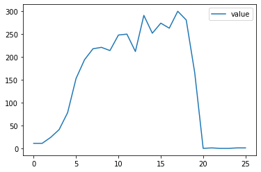


```python
df_dates_df.plot.bar(lw=2)
```


    <AxesSubplot:>


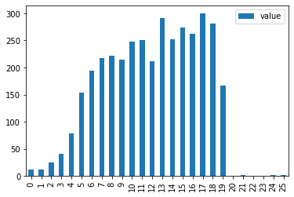


```python
df_dates_df.rename(index=df_dates_df.fecha).plot.bar(color=['g','r','r','r','r','r','r','r','r','r','r','r','r','b','b','b','b','b','b','b','b','b','b','b','b','y'])
```


    <AxesSubplot:>


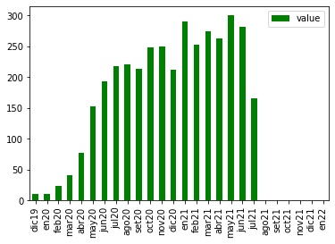


```python
df_dates_df.rename(index=df_dates_df.fecha, inplace=True)
```


```python
df_dates_df
```


<div>
<style scoped>
    .dataframe tbody tr th:only-of-type {
        vertical-align: middle;
    }

    .dataframe tbody tr th {
        vertical-align: top;
    }

    .dataframe thead th {
        text-align: right;
    }
</style>
<table border="1" class="dataframe">
  <thead>
    <tr style="text-align: right;">
      <th></th>
      <th>value</th>
      <th>fecha</th>
    </tr>
  </thead>
  <tbody>
    <tr>
      <th>dic19</th>
      <td>11</td>
      <td>dic19</td>
    </tr>
    <tr>
      <th>en20</th>
      <td>11</td>
      <td>en20</td>
    </tr>
    <tr>
      <th>feb20</th>
      <td>24</td>
      <td>feb20</td>
    </tr>
    <tr>
      <th>mar20</th>
      <td>41</td>
      <td>mar20</td>
    </tr>
    <tr>
      <th>abr20</th>
      <td>78</td>
      <td>abr20</td>
    </tr>
    <tr>
      <th>may20</th>
      <td>153</td>
      <td>may20</td>
    </tr>
    <tr>
      <th>jun20</th>
      <td>194</td>
      <td>jun20</td>
    </tr>
    <tr>
      <th>jul20</th>
      <td>218</td>
      <td>jul20</td>
    </tr>
    <tr>
      <th>ago20</th>
      <td>221</td>
      <td>ago20</td>
    </tr>
    <tr>
      <th>set20</th>
      <td>214</td>
      <td>set20</td>
    </tr>
    <tr>
      <th>oct20</th>
      <td>248</td>
      <td>oct20</td>
    </tr>
    <tr>
      <th>nov20</th>
      <td>250</td>
      <td>nov20</td>
    </tr>
    <tr>
      <th>dic20</th>
      <td>212</td>
      <td>dic20</td>
    </tr>
    <tr>
      <th>en21</th>
      <td>291</td>
      <td>en21</td>
    </tr>
    <tr>
      <th>feb21</th>
      <td>252</td>
      <td>feb21</td>
    </tr>
    <tr>
      <th>mar21</th>
      <td>274</td>
      <td>mar21</td>
    </tr>
    <tr>
      <th>abr21</th>
      <td>263</td>
      <td>abr21</td>
    </tr>
    <tr>
      <th>may21</th>
      <td>300</td>
      <td>may21</td>
    </tr>
    <tr>
      <th>jun21</th>
      <td>281</td>
      <td>jun21</td>
    </tr>
    <tr>
      <th>jul21</th>
      <td>166</td>
      <td>jul21</td>
    </tr>
    <tr>
      <th>ago21</th>
      <td>0</td>
      <td>ago21</td>
    </tr>
    <tr>
      <th>set21</th>
      <td>1</td>
      <td>set21</td>
    </tr>
    <tr>
      <th>oct21</th>
      <td>0</td>
      <td>oct21</td>
    </tr>
    <tr>
      <th>nov21</th>
      <td>0</td>
      <td>nov21</td>
    </tr>
    <tr>
      <th>dic21</th>
      <td>1</td>
      <td>dic21</td>
    </tr>
    <tr>
      <th>en22</th>
      <td>1</td>
      <td>en22</td>
    </tr>
  </tbody>
</table>
</div>


```python
import matplotlib.pyplot as plt
```


```python
color=['g','r','r','r','r','r','r','r','r','r','r','r','r','b','b','b','b','b','b','b','b','b','b','b','b','y']
fecha_ddf = ['dic19','en20','feb20','mar20','abr20','may20','jun20','jul20','ago20','set20','oct20','nov20','dic20'  ,'en21','feb21','mar21','abr21','may21','jun21','jul21','ago21','set21','oct21','nov21','dic21','en22']
```


```python
for i ,j in zip(fecha_ddf, color):
    plt.barh(i,df_dates_df.loc[i,"value"],color=j)

plt.title("Numero de publicacion de covid por fecha")
plt.grid(True,linestyle="-.", linewidth=0.5)
#plt.xlabel("")
#plt.xticks(np.arange(0, 210, 15))
plt.plot()
```


    []


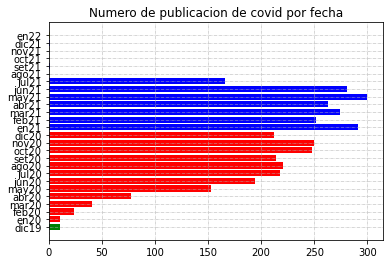


```python
plt.plot(df_dates_df.loc[:,"value"])
#plt.grid(True)
```


    [<matplotlib.lines.Line2D at 0x7fde39d75c10>]


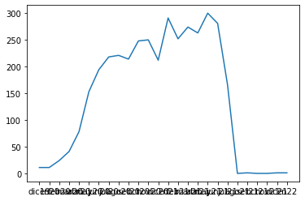


### Licence


```python
pd.DataFrame({"Licencias":df_filtro_covid.license_x.value_counts()})
```


<div>
<style scoped>
    .dataframe tbody tr th:only-of-type {
        vertical-align: middle;
    }

    .dataframe tbody tr th {
        vertical-align: top;
    }

    .dataframe thead th {
        text-align: right;
    }
</style>
<table border="1" class="dataframe">
  <thead>
    <tr style="text-align: right;">
      <th></th>
      <th>Licencias</th>
    </tr>
  </thead>
  <tbody>
    <tr>
      <th>no-cc</th>
      <td>1774</td>
    </tr>
    <tr>
      <th>cc-by</th>
      <td>1691</td>
    </tr>
    <tr>
      <th>cc-by-nc</th>
      <td>160</td>
    </tr>
    <tr>
      <th>cc-by-nc-nd</th>
      <td>82</td>
    </tr>
    <tr>
      <th>els-covid</th>
      <td>35</td>
    </tr>
    <tr>
      <th>biorxiv</th>
      <td>25</td>
    </tr>
    <tr>
      <th>cc-by-nc-sa</th>
      <td>16</td>
    </tr>
    <tr>
      <th>cc0</th>
      <td>4</td>
    </tr>
    <tr>
      <th>medrxiv</th>
      <td>2</td>
    </tr>
    <tr>
      <th>arxiv</th>
      <td>1</td>
    </tr>
  </tbody>
</table>
</div>


```python
df_filtro_covid.license_x.value_counts()[df_filtro_covid.license_x.value_counts()>50].plot.bar()
plt.title("Licencias usadas en mas de 50 publicaciones")
plt.grid(True,linestyle="-.", linewidth=0.5)
plt.plot()
```


    []


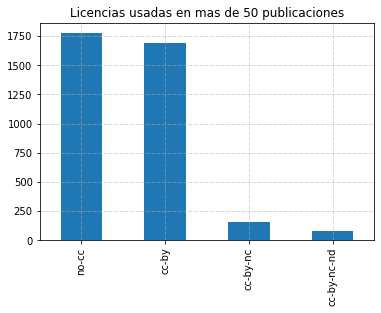


# NLP


```python
df_filtro_covid.head()
```


<div>
<style scoped>
    .dataframe tbody tr th:only-of-type {
        vertical-align: middle;
    }

    .dataframe tbody tr th {
        vertical-align: top;
    }

    .dataframe thead th {
        text-align: right;
    }
</style>
<table border="1" class="dataframe">
  <thead>
    <tr style="text-align: right;">
      <th></th>
      <th>title</th>
      <th>license_x</th>
      <th>publish_time_x</th>
      <th>journal_x</th>
      <th>body_x</th>
      <th>source_x_y</th>
      <th>source_medline</th>
      <th>elsevier</th>
      <th>biorxiv</th>
      <th>who</th>
      <th>arxiv</th>
      <th>medline</th>
      <th>pmc</th>
    </tr>
  </thead>
  <tbody>
    <tr>
      <th>2231</th>
      <td>Tellurium: A Rare Element with Influence on Pr...</td>
      <td>cc-by</td>
      <td>2021-05-31</td>
      <td>Int J Mol Sci</td>
      <td>Tellurium (Te) is a member of the chalcogen g...</td>
      <td>Medline; PMC</td>
      <td>Medline</td>
      <td>0</td>
      <td>0</td>
      <td>0</td>
      <td>0</td>
      <td>1</td>
      <td>1</td>
    </tr>
    <tr>
      <th>116</th>
      <td>Potential therapeutic target identification in...</td>
      <td>cc-by</td>
      <td>2020-10-02</td>
      <td>Egypt J Med Hum Genet</td>
      <td>The first outburst of pneumonia cases with un...</td>
      <td>PMC</td>
      <td>PMC</td>
      <td>0</td>
      <td>0</td>
      <td>0</td>
      <td>0</td>
      <td>0</td>
      <td>1</td>
    </tr>
    <tr>
      <th>2889</th>
      <td>Antiviral Activity Exerted by Natural Products...</td>
      <td>cc-by</td>
      <td>2021-05-04</td>
      <td>Viruses</td>
      <td>A growing number of studies have shown the be...</td>
      <td>Medline; PMC</td>
      <td>Medline</td>
      <td>0</td>
      <td>0</td>
      <td>0</td>
      <td>0</td>
      <td>1</td>
      <td>1</td>
    </tr>
    <tr>
      <th>790</th>
      <td>Molecular targets for COVID-19 drug developmen...</td>
      <td>no-cc</td>
      <td>2020-07-09</td>
      <td>Biosaf Health</td>
      <td>There is little or no research initiated to e...</td>
      <td>Elsevier; Medline; PMC</td>
      <td>Elsevier</td>
      <td>1</td>
      <td>0</td>
      <td>0</td>
      <td>0</td>
      <td>1</td>
      <td>1</td>
    </tr>
    <tr>
      <th>3407</th>
      <td>Learning from the Past: Possible Urgent Preven...</td>
      <td>no-cc</td>
      <td>2020-02-25</td>
      <td>Chembiochem</td>
      <td>The 2019 novel coronavirus (2019-nCoV) is an ...</td>
      <td>Medline; PMC</td>
      <td>Medline</td>
      <td>0</td>
      <td>0</td>
      <td>0</td>
      <td>0</td>
      <td>1</td>
      <td>1</td>
    </tr>
  </tbody>
</table>
</div>


```python
df_filtro_covid.shape
```


    (3790, 13)


```python
!pip install matplotlib pandas nltk textblob
```

    Defaulting to user installation because normal site-packages is not writeable
    Requirement already satisfied: matplotlib in /usr/local/lib/python3.8/dist-packages (3.3.3)
    Requirement already satisfied: pandas in /usr/local/lib/python3.8/dist-packages (1.2.0)
    Requirement already satisfied: nltk in /home/stevend/.local/lib/python3.8/site-packages (3.6.2)
    Requirement already satisfied: textblob in /home/stevend/.local/lib/python3.8/site-packages (0.15.3)
    Requirement already satisfied: cycler>=0.10 in /usr/local/lib/python3.8/dist-packages (from matplotlib) (0.10.0)
    Requirement already satisfied: numpy>=1.15 in /usr/local/lib/python3.8/dist-packages (from matplotlib) (1.19.4)
    Requirement already satisfied: pyparsing!=2.0.4,!=2.1.2,!=2.1.6,>=2.0.3 in /usr/local/lib/python3.8/dist-packages (from matplotlib) (2.4.7)
    Requirement already satisfied: pillow>=6.2.0 in /usr/lib/python3/dist-packages (from matplotlib) (7.0.0)
    Requirement already satisfied: python-dateutil>=2.1 in /usr/local/lib/python3.8/dist-packages (from matplotlib) (2.8.1)
    Requirement already satisfied: kiwisolver>=1.0.1 in /usr/local/lib/python3.8/dist-packages (from matplotlib) (1.3.1)
    Requirement already satisfied: pytz>=2017.3 in /usr/local/lib/python3.8/dist-packages (from pandas) (2020.5)
    Requirement already satisfied: joblib in /home/stevend/.local/lib/python3.8/site-packages (from nltk) (1.0.0)
    Requirement already satisfied: tqdm in /home/stevend/.local/lib/python3.8/site-packages (from nltk) (4.62.2)
    Requirement already satisfied: regex in /home/stevend/.local/lib/python3.8/site-packages (from nltk) (2021.8.27)
    Requirement already satisfied: click in /home/stevend/.local/lib/python3.8/site-packages (from nltk) (8.0.1)
    Requirement already satisfied: six in /usr/local/lib/python3.8/dist-packages (from cycler>=0.10->matplotlib) (1.15.0)


#### NLTK: Natural Language Tooklit

[Natural Language Toolkit](https://www.nltk.org/) is the basis for a lot of text analysis done in Python. It's old and terrible and slow, but it's just been used for so long and does so many things that it's generally the default when people get into text analysis. The new kid on the block is [spaCy](https://spacy.io/) (but it doesn't do sentiment analysis out of the box so we're leaving it out of this).

When you first run NLTK, you need to download some datasets to make sure it will be able to do everything you want.


```python
import nltk
nltk.download('vader_lexicon')
nltk.download('movie_reviews')
nltk.download('punkt')
```

    [nltk_data] Downloading package vader_lexicon to
    [nltk_data]     /home/stevend/nltk_data...
    [nltk_data]   Package vader_lexicon is already up-to-date!
    [nltk_data] Downloading package movie_reviews to
    [nltk_data]     /home/stevend/nltk_data...
    [nltk_data]   Package movie_reviews is already up-to-date!
    [nltk_data] Downloading package punkt to /home/stevend/nltk_data...
    [nltk_data]   Package punkt is already up-to-date!


    True


```python
from nltk.sentiment.vader import SentimentIntensityAnalyzer as SIA

sia = SIA()
sia.polarity_scores("This restaurant was great, but I'm not sure if I'll go there again.")
```


    {'neg': 0.153, 'neu': 0.688, 'pos': 0.159, 'compound': 0.0276}


Asking `SentimentIntensityAnalyzer` for the `polarity_score` gave us four values in a dictionary:

- **negative:** the negative sentiment in a sentence
- **neutral:** the neutral sentiment in a sentence
- **positive:** the postivie sentiment in the sentence
- **compound:** the aggregated sentiment.

Seems simple enough!


```python
text = "I just got a call from my boss - does he realise it's Saturday?"
sia.polarity_scores(text), type(sia.polarity_scores(text))
```


    ({'neg': 0.0, 'neu': 1.0, 'pos': 0.0, 'compound': 0.0}, dict)


```python
def df_filtro_covid_def_pol(f):
    return sia.polarity_scores(f)

df_filtro_covid["polarity"] = df_filtro_covid.body_x.apply(df_filtro_covid_def_pol)
```


```python
df_filtro_covid.head()
```


<div>
<style scoped>
    .dataframe tbody tr th:only-of-type {
        vertical-align: middle;
    }

    .dataframe tbody tr th {
        vertical-align: top;
    }

    .dataframe thead th {
        text-align: right;
    }
</style>
<table border="1" class="dataframe">
  <thead>
    <tr style="text-align: right;">
      <th></th>
      <th>title</th>
      <th>license_x</th>
      <th>publish_time_x</th>
      <th>journal_x</th>
      <th>body_x</th>
      <th>source_x_y</th>
      <th>source_medline</th>
      <th>elsevier</th>
      <th>biorxiv</th>
      <th>who</th>
      <th>arxiv</th>
      <th>medline</th>
      <th>pmc</th>
      <th>polarity</th>
    </tr>
  </thead>
  <tbody>
    <tr>
      <th>2231</th>
      <td>Tellurium: A Rare Element with Influence on Pr...</td>
      <td>cc-by</td>
      <td>2021-05-31</td>
      <td>Int J Mol Sci</td>
      <td>Tellurium (Te) is a member of the chalcogen g...</td>
      <td>Medline; PMC</td>
      <td>Medline</td>
      <td>0</td>
      <td>0</td>
      <td>0</td>
      <td>0</td>
      <td>1</td>
      <td>1</td>
      <td>{'neg': 0.045, 'neu': 0.902, 'pos': 0.053, 'co...</td>
    </tr>
    <tr>
      <th>116</th>
      <td>Potential therapeutic target identification in...</td>
      <td>cc-by</td>
      <td>2020-10-02</td>
      <td>Egypt J Med Hum Genet</td>
      <td>The first outburst of pneumonia cases with un...</td>
      <td>PMC</td>
      <td>PMC</td>
      <td>0</td>
      <td>0</td>
      <td>0</td>
      <td>0</td>
      <td>0</td>
      <td>1</td>
      <td>{'neg': 0.023, 'neu': 0.899, 'pos': 0.079, 'co...</td>
    </tr>
    <tr>
      <th>2889</th>
      <td>Antiviral Activity Exerted by Natural Products...</td>
      <td>cc-by</td>
      <td>2021-05-04</td>
      <td>Viruses</td>
      <td>A growing number of studies have shown the be...</td>
      <td>Medline; PMC</td>
      <td>Medline</td>
      <td>0</td>
      <td>0</td>
      <td>0</td>
      <td>0</td>
      <td>1</td>
      <td>1</td>
      <td>{'neg': 0.074, 'neu': 0.85, 'pos': 0.076, 'com...</td>
    </tr>
    <tr>
      <th>790</th>
      <td>Molecular targets for COVID-19 drug developmen...</td>
      <td>no-cc</td>
      <td>2020-07-09</td>
      <td>Biosaf Health</td>
      <td>There is little or no research initiated to e...</td>
      <td>Elsevier; Medline; PMC</td>
      <td>Elsevier</td>
      <td>1</td>
      <td>0</td>
      <td>0</td>
      <td>0</td>
      <td>1</td>
      <td>1</td>
      <td>{'neg': 0.052, 'neu': 0.875, 'pos': 0.073, 'co...</td>
    </tr>
    <tr>
      <th>3407</th>
      <td>Learning from the Past: Possible Urgent Preven...</td>
      <td>no-cc</td>
      <td>2020-02-25</td>
      <td>Chembiochem</td>
      <td>The 2019 novel coronavirus (2019-nCoV) is an ...</td>
      <td>Medline; PMC</td>
      <td>Medline</td>
      <td>0</td>
      <td>0</td>
      <td>0</td>
      <td>0</td>
      <td>1</td>
      <td>1</td>
      <td>{'neg': 0.042, 'neu': 0.892, 'pos': 0.066, 'co...</td>
    </tr>
  </tbody>
</table>
</div>


```python
df_filtro_covid["pol_neg"] = df_filtro_covid.polarity.apply(lambda x: x["neg"])
df_filtro_covid["pol_neu"] = df_filtro_covid.polarity.apply(lambda x: x["neu"])
df_filtro_covid["pol_pos"] = df_filtro_covid.polarity.apply(lambda x: x["pos"])
```


```python
df_filtro_covid["pol_neg"][df_filtro_covid["pol_neg"]>0.5].count()
```


    0


```python
df_filtro_covid["pol_neu"][df_filtro_covid["pol_neu"]>0.5].count()
```


    3790


```python
df_filtro_covid["pol_pos"][df_filtro_covid["pol_pos"]>0.5].count()
```


    0


```python

```


```python
df_filtro_covid.title[0]
```


    'Molecular modeling of potent novel sulfonamide derivatives as non-peptide small molecule anti-COVID 19 agents'


```python

```


```python

```


```python

```


```python

```


```python

```


```python

```


```python

```


```python

```


```python

```


```python

```


```python

```


```python

```


```python

```


```python

```


```python

```


```python

```


